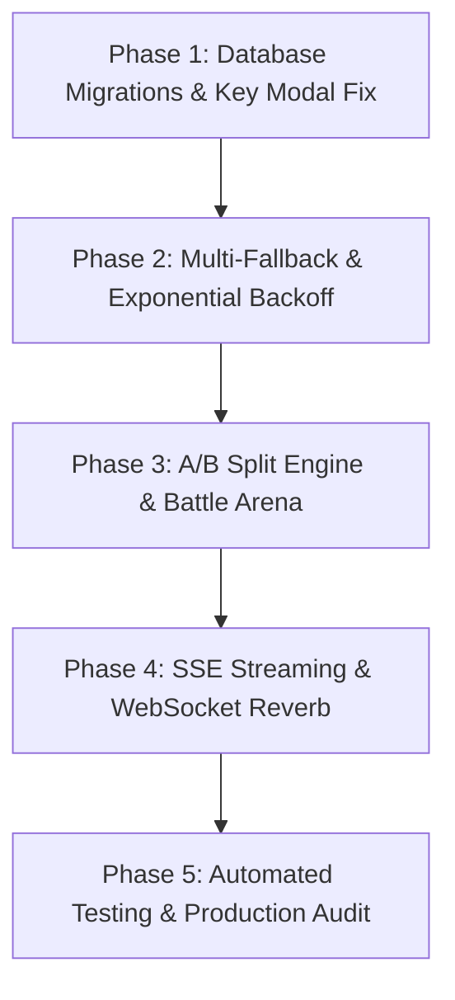

# 🚀 AI Models Hub — Master Completion & Production-Readiness Plan

> **Project:** Nexus v3 (Laravel 13 Monolith)  
> **Core Location:** `/www/wwwroot/Nexus/core/Nexus3`  
> **Target Endpoint:** `https://n.soulyeg.online/hub/models` (`/hub/models`)  
> **Author:** Antigravity AI Pair Programmer  
> **Status:** Production Remediation & Full Feature Implementation Blueprint  

---

## 📋 Executive Summary

The **AI Models Hub** is the central intelligence router and universal AI gateway for Nexus v3. While the architectural foundation (Universal Adapter, Encrypted Key Storage, Intent Routing Engine, and Circuit Breaker) is conceptually strong, a forensic audit revealed critical frontend placeholders, unhandled JavaScript exceptions, static mockups without backend bindings, single-provider fallback limitations, and key-level accounting gaps.

This document outlines an exhaustive, step-by-step action plan to resolve **every defect**, complete **every missing implementation**, wire **every UI component**, and elevate the AI Models Hub to a bulletproof, enterprise-ready system usable both internally by Nexus agents/tasks and externally via public REST APIs.

---

## 🔍 Section 1: Detailed Defect & Gap Analysis Matrix

| Module | Location / File | Current Status & Defect | Target End-State |
| :--- | :--- | :--- | :--- |
| **API Keys Modal** | [`add-key.blade.php`](file:///www/wwwroot/Nexus/core/Nexus3/resources/views/hubs/partials/ai-hub/api-keys/modals/add-key.blade.php) | 🔴 Empty placeholder containing text `"Wizard steps would go here."`. Zero input fields. | Full interactive modal with Provider Selector, Key Name, Plaintext Input (encrypted on submit), Expiry Picker, Priority, and AJAX handler. |
| **Dashboard Telemetry** | [`dashboard/index.blade.php`](file:///www/wwwroot/Nexus/core/Nexus3/resources/views/hubs/partials/ai-hub/dashboard/index.blade.php) | 🔴 Uncaught JS `SyntaxError` when API returns non-JSON or 500 HTML error. Column name mismatch in `getTelemetry()` (`created_at` vs `timestamp`). | Wrapped in robust `try...catch` with loading skeletons, fallback states, and aligned SQL query indexes on `timestamp`. |
| **Multi-Provider Fallback** | [`IntentRoutingEngine.php`](file:///www/wwwroot/Nexus/core/Nexus3/app/Services/AiModelsHub/IntentRoutingEngine.php), [`IntentRouting.php`](file:///www/wwwroot/Nexus/core/Nexus3/app/Models/IntentRouting.php) | 🟡 Single fallback provider supported (`fallback_provider_id`). Cannot configure a sequential chain of 3+ fallbacks. | Extended DB schema to `fallback_chain (JSON)` supporting ordered multi-provider failover (e.g. OpenAI → Gemini → Groq → Local Ollama). |
| **A/B Traffic Split** | [`ab-traffic-split.blade.php`](file:///www/wwwroot/Nexus/core/Nexus3/resources/views/hubs/partials/ai-hub/intent-routing/ab-traffic-split.blade.php) | 🔴 Pure static HTML mockup with hardcoded 70%/30% progress bars. Zero backend API or DB schema. | Fully dynamic A/B Experiment Engine with DB migration, live traffic distribution algorithm, percentage sliders, and analytics. |
| **Model Battle Arena** | [`model-battle.blade.php`](file:///www/wwwroot/Nexus/core/Nexus3/resources/views/hubs/partials/ai-hub/playground/model-battle.blade.php) | 🔴 Static placeholder card with a non-functional `Start a Battle` button. | Interactive side-by-side prompt testing arena executing dual requests concurrently and displaying comparative token costs/latencies. |
| **Model Table Actions** | [`models-table.blade.php`](file:///www/wwwroot/Nexus/core/Nexus3/resources/views/hubs/partials/ai-hub/models/models-table.blade.php) | 🟡 Static icon buttons (`fa-chart-line`, `fa-ellipsis-vertical`) with no click events or modal bindings. | Wired action buttons opening Model Analytics Modal, Edit Model Parameters Drawer, and Quick Test Trigger. |
| **Key-Level Analytics** | [`usage_logs` migration](file:///www/wwwroot/Nexus/core/Nexus3/database/migrations/2026_05_19_000005_create_usage_logs_table.php), [`UsageTracker.php`](file:///www/wwwroot/Nexus/core/Nexus3/app/Services/AiModelsHub/UsageTracker.php) | 🟡 `usage_logs` table lacks `api_key_id`. Cannot report token usage or cost breakdown per individual API key. | Added `api_key_id` FK to `usage_logs`. Key usage reports, individual key status pings, and key-level budget caps. |
| **Key Cooldown Logic** | [`EncryptedApiKeyStorage.php`](file:///www/wwwroot/Nexus/core/Nexus3/app/Services/AiModelsHub/EncryptedApiKeyStorage.php) | 🟡 Fixed cooldown duration on HTTP 429 Rate Limits. | Exponential Backoff algorithm (cooldown doubles on consecutive failures per key). |
| **Scheduler Integration** | [`routes/console.php`](file:///www/wwwroot/Nexus/core/Nexus3/routes/console.php) | 🟡 Key rotation command `ai-hub:rotate-keys` is not registered in the Laravel Scheduler. | Registered daily cron job `Schedule::command('ai-hub:rotate-keys')->daily();`. |
| **SSE Streaming** | [`DynamicRestProvider.php`](file:///www/wwwroot/Nexus/core/Nexus3/app/Services/AiModelsHub/DynamicRestProvider.php) | 🟡 Only supports synchronous HTTP POST requests. | Implemented `generateTextStream()` supporting Server-Sent Events (SSE) for token-by-token streaming responses. |
| **Realtime Telemetry** | [`models.blade.php`](file:///www/wwwroot/Nexus/core/Nexus3/resources/views/hubs/models.blade.php) | 🟡 Top Health Ribbon TPM and Active Requests counters require page refresh. | Connected to Laravel Reverb Echo Channel (`Echo.channel('ai-hub-telemetry')`) for live UI updates. |

---

## 🛠️ Section 2: Database Schema & Migration Blueprint

To support key-level reporting, multi-provider fallback chains, and live A/B experiments, the following database migrations will be executed:

### Migration 1: Add `api_key_id` to `usage_logs` Table
```php
Schema::table('usage_logs', function (Blueprint $table) {
    if (!Schema::hasColumn('usage_logs', 'api_key_id')) {
        $table->uuid('api_key_id')->nullable()->after('model_id')->index();
        $table->foreign('api_key_id')->references('id')->on('ai_api_keys')->onDelete('set null');
    }
    // Rename or align timestamp indexing
    if (Schema::hasColumn('usage_logs', 'timestamp')) {
        $table->index(['created_at', 'timestamp']);
    }
});
```

### Migration 2: Support `fallback_chain` in `intent_routings` Table
```php
Schema::table('intent_routings', function (Blueprint $table) {
    if (!Schema::hasColumn('intent_routings', 'fallback_chain')) {
        $table->json('fallback_chain')->nullable()->after('fallback_model_id');
    }
});
```

### Migration 3: Create `ai_ab_experiments` Table
```php
Schema::create('ai_ab_experiments', function (Blueprint $table) {
    $table->uuid('id')->primary();
    $table->string('name');
    $table->string('intent_name')->index();
    $table->uuid('model_a_id');
    $table->uuid('model_b_id');
    $table->integer('weight_a')->default(50); // Percentage for A
    $table->integer('weight_b')->default(50); // Percentage for B
    $table->string('goal_metric')->default('lowest_cost'); // lowest_cost, lowest_latency, highest_success
    $table->boolean('is_active')->default(true);
    $table->timestamps();

    $table->foreign('model_a_id')->references('id')->on('ai_models')->onDelete('cascade');
    $table->foreign('model_b_id')->references('id')->on('ai_models')->onDelete('cascade');
});
```

---

## 📐 Section 3: Architecture & Service Layer Refactoring Plan

### 3.1 `UniversalAiGatewayService.php`
- **Multi-Fallback Execution:** Update `executeWithAgent()` and `routeRequest()` to read `fallback_chain` array from `intent_routings`.
- Iterate through fallback providers sequentially when `CircuitBreaker` throws `ProviderUnreachableException` or `RateLimitException`.
- Record exact attempt index and failed provider IDs in `AiAuditTrail` metadata.

### 3.2 `EncryptedApiKeyStorage.php`
- Add **Exponential Backoff**:
  ```php
  public function markKeyFailed(string $keyId): void
  {
      $key = AIApiKey::find($keyId);
      if ($key) {
          $key->increment('error_count');
          $backoffMinutes = pow(2, min($key->error_count, 6)) * 5; // 10m, 20m, 40m, 80m...
          $key->update(['cooldown_until' => now()->addMinutes($backoffMinutes)]);
      }
  }
  ```

### 3.3 `DynamicRestProvider.php` (SSE Streaming Engine)
- Add `generateTextStream(string $prompt, array $options, callable $onToken): void` using Guzzle HTTP `stream => true` or Laravel `Http::withOptions(['stream' => true])`.
- Parse Server-Sent Event `data: { "choices": [...] }` lines and invoke `$onToken($tokenChunk)`.

---

## 🎨 Section 4: Frontend UI & Modal Reconstruction Specs

### 4.1 Rebuilding [`add-key.blade.php`](file:///www/wwwroot/Nexus/core/Nexus3/resources/views/hubs/partials/ai-hub/api-keys/modals/add-key.blade.php)
Create a comprehensive 2-step modal wizard:
- **Step 1: Provider Selection & Meta**
  - Dropdown selecting active `AIProvider` records.
  - Input field for Key Name (e.g. `Production OpenAI Key #2`).
  - Priority numerical input (Default: `1`).
  - Workspace selector dropdown.
- **Step 2: Key Credentials & Security**
  - Textarea/Input for Plaintext API Key (with show/hide toggle).
  - Expiry Date Picker (`expires_at`).
  - Checkbox for "Set as Default Key for Provider".
- **AJAX Handler:** Submit via POST to `route('hub.models.api-keys.store')`, show toast notifications, and reload keys datatable asynchronously without page refresh.

### 4.2 Rebuilding A/B Traffic Split Component ([`ab-traffic-split.blade.php`](file:///www/wwwroot/Nexus/core/Nexus3/resources/views/hubs/partials/ai-hub/intent-routing/ab-traffic-split.blade.php))
- Replace static HTML with dynamic Vue/Alpine or jQuery interactive controls.
- Add live range sliders for model weights (e.g. 70% Model A / 30% Model B).
- Connect `+` / `-` buttons to update weights via AJAX POST `/hub/models/ab-experiments/{id}/update-weights`.
- Fetch real experiment metrics from `usage_logs` comparing cost per request and avg latency between Model A and Model B.

### 4.3 Rebuilding Model Battle Arena ([`model-battle.blade.php`](file:///www/wwwroot/Nexus/core/Nexus3/resources/views/hubs/partials/ai-hub/playground/model-battle.blade.php))
- Implement dual model selection dropdowns (Model A vs Model B).
- Single prompt input box with a `Launch Battle` trigger.
- Concurrent AJAX execution against `/hub/models/playground/battle`.
- Dual side-by-side response panels showing live token generation streaming, total execution time (ms), token consumption, and cost comparison badge.

### 4.4 Wiring Model Table Action Buttons ([`models-table.blade.php`](file:///www/wwwroot/Nexus/core/Nexus3/resources/views/hubs/partials/ai-hub/models/models-table.blade.php))
- Wire `fa-chart-line` to launch Model Analytics Drawer showing 30-day token usage, cost trend, and error rate.
- Wire `fa-ellipsis-vertical` to launch Model Parameter Drawer for editing `context_window`, `quality_tier`, `input_cost_per_m`, and `output_cost_per_m`.

---

## 🌐 Section 5: Public & Internal API Endpoints Specification

| Method | Endpoint Route | Controller & Action | Functionality |
| :--- | :--- | :--- | :--- |
| `GET` | `/hub/models` | `HubController@models` | Renders Hub View with enriched provider/key datasets |
| `GET` | `/hub/models/telemetry` | `AiHubController@telemetry` | Returns JSON telemetry stats, cache hit rates, and token timelines |
| `POST` | `/hub/models/providers` | `AiHubController@storeProvider` | Creates or updates an AI Provider config |
| `POST` | `/hub/models/providers/ping` | `AiHubController@pingProvider` | Executes live network ping and measures response latency |
| `POST` | `/hub/models/providers/{id}/sync` | `AiHubController@syncModels` | Dispatches background model auto-discovery job |
| `POST` | `/hub/models/api-keys` | `AiHubController@storeApiKey` | Encrypts (AES-256) and stores a new API key |
| `POST` | `/hub/models/api-keys/{id}/ping` | `AiHubController@pingApiKey` | Tests connection specifically for an individual API Key |
| `DELETE` | `/hub/models/api-keys/{id}` | `AiHubController@revokeApiKey` | Deactivates and revokes an API Key |
| `POST` | `/hub/models/routing` | `AiHubController@storeRoutingRule` | Stores or updates intent routing matrix rules |
| `POST` | `/hub/models/ab-experiments` | `AiHubController@storeAbExperiment` | Creates a new A/B traffic split experiment |
| `POST` | `/hub/models/playground/chat` | `AiHubController@simulateChat` | Executes test prompt against selected model |
| `POST` | `/hub/models/playground/battle` | `AiHubController@simulateBattle` | Concurrent dual-model battle prompt execution |
| `POST` | `/api/v1/ai-models/route` | `AiRouteController@route` | Central Gateway API for Nexus Agents & external REST callers |
| `POST` | `/api/v1/ai-models/stream` | `AiRouteController@stream` | SSE Token streaming endpoint for real-time applications |

---

## 📅 Section 6: Phased Implementation Roadmap



### Phase 1: Core Database & Critical Modal Fixes (Immediate)
1. Create and run migrations for `usage_logs.api_key_id`, `intent_routings.fallback_chain`, and `ai_ab_experiments`.
2. Completely rewrite `resources/views/hubs/partials/ai-hub/api-keys/modals/add-key.blade.php` with full input fields, validation, and AJAX binding.
3. Fix JS telemetry error handling in `dashboard/index.blade.php` and align `getTelemetry()` SQL indexes.
4. Register `ai-hub:rotate-keys` in `routes/console.php`.

### Phase 2: Multi-Provider Fallback Chain & Key-Level Accounting
1. Update `IntentRoutingEngine.php` and `UniversalAiGatewayService.php` to iterate through sequential `fallback_chain` arrays.
2. Implement Exponential Backoff for failed keys in `EncryptedApiKeyStorage.php`.
3. Add `pingApiKey` endpoint and UI button to test individual keys.
4. Update `UsageTracker.php` to persist `api_key_id` in `usage_logs`.

### Phase 3: A/B Experiment Engine & Model Battle Arena
1. Build `AbExperimentController` and backend traffic distribution logic in `IntentRoutingEngine.php`.
2. Connect `ab-traffic-split.blade.php` sliders to update experiment weights dynamically.
3. Implement `simulateBattle` in `AiHubController.php` and build dual-panel UI in `model-battle.blade.php`.
4. Wire all static action buttons in `models-table.blade.php`.

### Phase 4: Streaming & Real-Time Telemetry
1. Add `generateTextStream()` method in `DynamicRestProvider.php` using SSE.
2. Expose `/api/v1/ai-models/stream` endpoint for external callers.
3. Connect `models.blade.php` top health ribbon to `Echo.channel('ai-hub-telemetry')`.

### Phase 5: Verification & Quality Assurance
1. Write and execute PHPUnit test suites:
   - `tests/Feature/MultiProviderFallbackTest.php`
   - `tests/Feature/ApiKeyIndividualPingTest.php`
   - `tests/Feature/AbExperimentEngineTest.php`
   - `tests/Feature/SseStreamGatewayTest.php`
2. Run Laravel Pint for PSR-12 code style compliance.
3. Perform end-to-end browser walkthrough across all tabs on `https://n.soulyeg.online/hub/models`.

---

## 🎯 Verification Standards & Commands

All code changes will be validated using concrete empirical test execution commands:

```bash
# 1. Run all AI Models Hub unit & feature test suites
php -d memory_limit=512M artisan test --filter=Ai

# 2. Check route registration for new API endpoints
php artisan route:list --path=hub/models

# 3. Verify Laravel Pint code formatting
vendor/bin/pint --format agent
```

---
*Status: Plan Approved & Ready for Immediate Implementation.*
