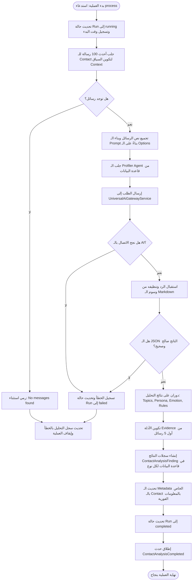

إليك شرحٌ وتفصيلٌ كامل لملف `ContactIntelligenceExtractionPipeline.php` مقسماً حسب أسئلتك:

---

## 1. ما هو الناقص في هذا الملف ويحتاج إلى بناء أو تعديل؟

بالنظر إلى الكود ومقارنته بمتطلبات المشروع ونظام الـ Contacts Hub:

1. **عدم استخراج حقول أساسية من المتطلبات:**
    - بناءً على مستند المتطلبات (`Requirements.md` البند 2.2)، يجب أن يستخرج التحليل الذكي الحقول التالية:
        - تفضيلات الاتصال (Communication preferences).
        - نوع العلاقة (Relationship type).
    - **النقص:** هذا الملف لا يطلب من الذكاء الاصطناعي استخراج هذين الحقلين في الـ Prompt، ولا يحتوي على معالجة أو تخزين لهما في مصفوفة النتائج (`findingTypes`).

2. **عشوائية تحديد الأدلة (Static Evidence references):**
    - **الوضع الحالي:** يتم أخذ أول 5 رسائل بشكل افتراضي وتقطيعها كأدلة (`evidence_references`) لـ **جميع** أنواع النتائج (سواء موضوع، وسام، أو حالة عاطفية).
    - **التعديل المطلوب:** يجب على الذكاء الاصطناعي نفسه أن يعيد معرفات الرسائل الفعلية (`message_ids`) التي اعتمد عليها كدليل لكل نتيجة، بدلاً من ترميز أول 5 رسائل بشكل صلب في الكود.

3. **درجات ثقة افتراضية ومثبتة (Hardcoded Confidence Scores):**
    - **الوضع الحالي:** كود الثقة يعتمد على مصفوفة افتراضية ثابتة (`topics => 0.85`, `persona => 0.90` إلخ).
    - **التعديل المطلوب:** يجب تعديل الـ Prompt ليقوم الذكاء الاصطناعي بتقدير درجة الثقة (Confidence score) لكل حقل مستخرج بشكل ديناميكي، ويتم تخزينها كما يعيدها النموذج.

4. **غياب التحقق من بنية البيانات الصادرة عن الذكاء الاصطناعي (JSON Validation):**
    - **الوضع الحالي:** يكتفي الكود بفك ترميز الـ JSON، وإذا فشل يرمي استثناءً. ولكن لا توجد عملية تحقق (Validation) للتأكد من بنية الحقول (مثال: التأكد من أن `topics` هي مصفوفة نصوص وليست نصاً واحداً).

5. **تحديث ملف العميل (Contact Metadata) جزئياً فقط:**
    - **الوضع الحالي:** الكود يقوم بتحديث حقول `persona` و `emotional_baseline` داخل حقل الـ `metadata` في جدول الـ `Contact`.
    - **النقص:** لا يقوم بتحديث الجداول المخصصة للمواضيع (`ContactTopic` / `ContactTopicMention`) أو القواعد المقترحة (`ContactReplyRule`) لربطها بالعميل مباشرة لتسهيل استعلامات الفلترة والبحث.

---

## 2. مخطط سير العمل (Workflow Diagram)

الرسم البياني التالي يوضح بالتفصيل آلية معالجة المحادثة وتحليلها خطوة بخطوة:



---

## 3. شرح دوال الملف (Functions Breakdown)

يحتوي الملف على دالتين رئيسيتين:

### أ. الدالة البنائية `__construct`

```php
public function __construct(
    protected LogService $logService,
    protected UniversalAiGatewayService $aiGateway
) {}
```

- **الوظيفة:** تقوم بحقن التبعيات (Dependency Injection) اللازمة لتشغيل الأنبوب:
    - `LogService`: لتسجيل الأخطاء والعمليات الناجحة في ملفات السجل الخاصة بـ Laravel.
    - `UniversalAiGatewayService`: البوابة الموحدة للاتصال بنماذج الذكاء الاصطناعي (مثل Google Gemini أو OpenAI) وإرسال الاستعلامات إليها.
- **الميزة:** تستخدم ميزة PHP 8 Constructor Property Promotion لتعريف وتعيين الخصائص تلقائياً.

---

### ب. دالة المعالجة الأساسية `process`

```php
public function process(ContactAnalysisRun $run): void
```

- **الوظيفة:** هي المحرك الرئيسي لكامل الأنبوب (Pipeline). تستقبل كائن `ContactAnalysisRun` (الذي يمثل جلسة التحليل الحالية لعميل معين) وتقوم بالخطوات التالية:
    1. **إعداد حالة الجلسة:** تبدأ فوراً بتحديث حالة السجل في قاعدة البيانات إلى `running` وتسجيل وقت البدء.
    2. **جمع سياق المحادثة:** تجلب آخر 100 رسالة للعميل، وترتبها تنازلياً، ثم تعكسها لتبدو كحوار مرتب زمنياً. يتم دمجها في نص واحد يبين اتجاه الرسالة (صادرة أو واردة).
    3. **بناء طلب الذكاء الاصطناعي (Prompt Construction):** تقوم بصياغة التعليمات البرمجية بناءً على الخيارات المفعّلة في الطلب (مثل استخراج المواضيع، تحليل الشخصية، تحديد المشاعر العاطفية، واقتراح القواعد).
    4. **استدعاء الذكاء الاصطناعي وفك الاستجابة:**
        - تبحث عن Agent مخصص للـ profiling.
        - ترسل الطلب للبوابة الذكية.
        - تقوم بعمل تنظيف للاستجابة للتخلص من حاصرات الكود (Markdown JSON Wrapper ` ```json `).
        - تحول النص إلى مصفوفة (Array) عبر `json_decode`.
    5. **حفظ النتائج التراكمية (Storing Findings):**
        - تدور حول النتائج الأربعة المستخرجة.
        - تقوم بإنشاء أداة إثبات (Evidence Reference) تحتوي على مقتطفات من الرسائل لتأكيد التحليل.
        - تنشئ لكل حقل سجل في جدول `contact_analysis_findings`.
    6. **إثراء ملف العميل الفوري (Immediate Enrichment):**
        - تحدث حقل الـ `metadata` الخاص بالعميل بقيم الشخصية والخلفية العاطفية المحدثة فوراً.
    7. **إنهاء وتوثيق النجاح:**
        - تحدث حالة الـ Run إلى `completed`.
        - تطلق حدث `ContactAnalysisCompleted` لتنبيه النظام بالاكتمال.
    8. **معالجة الاستثناءات والأخطاء (Exception Handling):**
        - في حال حدوث أي خطأ في الاتصال أو التحليل، يتم التقاط الخطأ وتحديث حالة الـ Run إلى `failed` وتوثيق نص الخطأ البرمي لمنع تجميد الطوابير (Queue Blocking).
