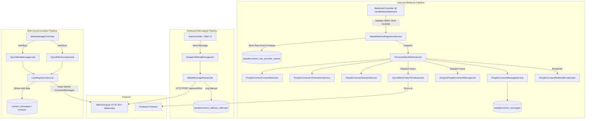

# PeopleConnect & WAHA (WhatsApp Hub) Integration Architecture

> [!IMPORTANT]
> **Code Reality Notice**: This document reflects the **actual working codebase** inside Nexus3 as discovered via source code audit. It supersedes previous aspirational documentation.

---

## 1. Executive Summary & Architectural Overview

The **PeopleConnect** integration within Nexus3 connects WhatsApp messaging (via the **WAHA** - WhatsApp HTTP API engine) with Nexus3's CRM contacts, conversation management, AI analysis engine, and Firebase Firestore realtime synchronization.

### System Architecture Diagram



---

## 2. Inbound Webhook & Processing Pipeline

### 2.1 Security & Ingestion
- **Endpoint**: `POST /api/webhooks/waha` (`WebhookController@handleWahaWebhook`)
- **Security Validation**:
  - `X-Waha-Secret` header or `secret` query parameter checked against `config('services.waha.webhook_secret')`.
  - `x-hmac-sha512256` or `X-Waha-Signature` verified via HMAC-SHA512/256 signature algorithm against raw request body.
- **Deduplication**: `WahaWebhookIngestionService` computes payload hash (`sha256`) and logs event to `peopleconnect_raw_provider_events`. If payload hash already exists, request is skipped.
- **Dispatch**: Valid events trigger `ProcessWahaWebhookJob` on the default queue.

### 2.2 Processing & State Machine (`ProcessWahaWebhookJob`)
1. **Contact Resolution**: `PeopleConnectContactResolver` acquires an atomic Redis lock (`contact_resolve_{phone}`) to prevent race conditions, queries `ContactIdentityResolver`, or creates a new `Contact` record linked with `whatsapp` identifier type.
2. **Conversation Resolution**: `PeopleConnectConversationService` resolves or creates a `PeopleConnectConversation` record.
3. **Session Management**: `PeopleConnectSessionService` gets an open `PeopleConnectSession` or creates a new session. Sessions auto-close after 2 hours of inactivity.
4. **Message Persistence**: `PeopleConnectMessageService` validates against duplicate `waha_message_id` or `provider_payload_hash` before writing to `peopleconnect_messages`.
5. **Post-Processing Actions**:
   - Updates `last_message_at` and `last_message_preview` on `PeopleConnectConversation`.
   - Dispatches `AnalyzePeopleConnectMessageJob` (NLP, intent, sentiment).
   - Triggers `GenerateContactReplyDraftJob` if conversation reply mode is `assisted` or `autopilot`.
   - Dispatches `SyncWahaChatsToFirebaseJob` to sync chat payload to Firestore.
   - Broadcasts `MessageReceived` via `PeopleConnectRealtimeBroadcaster` over WebSockets (Reverb).

---

## 3. Outbound Messaging & AI Reply Pipeline

### 3.1 Manual Outbound
- **UI Action**: User sends message from PeopleConnect Hub interface.
- **Direct Dispatch**: Dispatches `DispatchWahaMessageJob`.
- **Dispatcher**: `WahaMessageDispatcher` posts HTTP payload to `{WAHA_URL}/api/sendText`.
- **Delivery Logging**: Records execution in `peopleconnect_delivery_attempts` table. Updates message status to `delivered` or `failed`.

### 3.2 AI Reply & Draft Generation (`GenerateContactReplyDraftJob`)
- **Context Assembly**: `PeopleConnectContextAssembler` builds a token-budgeted payload (default 8,000 tokens) snapshot saved to `peopleconnect_context_snapshots`.
- **Reply Mode Check**: `PeopleConnectReplyModeService` resolves effective mode (`manual`, `assisted`, or `autopilot`). Checks safety rate limits (max 5 messages per 5 minutes for autopilot).
- **Agent Generation**: Calls `PeopleConnectAgentReplyService` which communicates with the AgentsHub endpoint (`route('agents.run')`).
- **Draft Creation**: Creates a record in `peopleconnect_reply_drafts`.
- **Autopilot Send**: If mode is `autopilot` and safety checks pass, dispatches `DispatchWahaMessageJob` automatically.

---

## 4. Comprehensive Component & Service Matrix

| Component / Class | File Location | Real Status | Actual Behavior & Findings |
| :--- | :--- | :--- | :--- |
| `WebhookController@handleWahaWebhook` | `app/Http/Controllers/WebhookController.php` | ✅ Implemented | Validates HMAC signature and delegates to `WahaWebhookIngestionService`. |
| `WahaWebhookIngestionService` | `app/Services/PeopleConnect/WahaWebhookIngestionService.php` | ✅ Implemented | Stores raw events in `peopleconnect_raw_provider_events` & dispatches processing job. |
| `ProcessWahaWebhookJob` | `app/Jobs/ProcessWahaWebhookJob.php` | ✅ Implemented | Core message ingestion orchestrator for single webhook events. |
| `PeopleConnectContactResolver` | `app/Services/PeopleConnect/PeopleConnectContactResolver.php` | ✅ Implemented | Thread-safe contact resolution using Redis locks and `ContactIdentityResolver`. |
| `PeopleConnectConversationService` | `app/Services/PeopleConnect/PeopleConnectConversationService.php` | ✅ Implemented | Resolves or creates `PeopleConnectConversation` records. |
| `PeopleConnectSessionService` | `app/Services/PeopleConnect/PeopleConnectSessionService.php` | ✅ Implemented | Handles 2-hour sliding window session lifecycle in `peopleconnect_sessions`. |
| `PeopleConnectMessageService` | `app/Services/PeopleConnect/PeopleConnectMessageService.php` | ✅ Implemented | Enforces deduplication and stores messages in `peopleconnect_messages`. |
| `PeopleConnectContextAssembler` | `app/Services/PeopleConnect/PeopleConnectContextAssembler.php` | ✅ Implemented | Assembles token-budgeted prompt context into `peopleconnect_context_snapshots`. |
| `PeopleConnectAgentReplyService` | `app/Services/PeopleConnect/PeopleConnectAgentReplyService.php` | ✅ Implemented | Calls internal `agents.run` API route to generate draft replies. |
| `PeopleConnectReplyModeService` | `app/Services/PeopleConnect/PeopleConnectReplyModeService.php` | ✅ Implemented | Evaluates global/contact reply mode (`manual`, `assisted`, `autopilot`) and rate limits. |
| `WahaMessageDispatcher` | `app/Services/PeopleConnect/WahaMessageDispatcher.php` | ✅ Implemented | Sends outbound HTTP requests to WAHA `/api/sendText` and records attempts. |
| `FirestoreSyncService` | `app/Services/PeopleConnect/FirestoreSyncService.php` | ✅ Implemented | Uses Kreait Firebase SDK to sync sessions, contacts, chats, and messages. |
| `SyncWahaChatsToFirebaseJob` | `app/Jobs/SyncWahaChatsToFirebaseJob.php` | ✅ Implemented | Fetches chats overview from WAHA and updates Firestore + local DB. |
| `WahaManageController` | `app/Http/Controllers/WahaManageController.php` | ✅ Implemented | Provides REST endpoints for WAHA sync processes and management. |
| `WahaAnalysisService` | `app/Services/PeopleConnect/WahaAnalysisService.php` | ⚠️ Bugged | Uses invalid column name `confidence_score` instead of `confidence` on `contact_preferences`. |
| `HubController@triggerWahaSync` | `app/Http/Controllers/Web/HubController.php` | ⚠️ Bugged | Dispatches legacy mock jobs (`App\Jobs\SyncWahaContactsJob`) instead of `App\Jobs\PeopleConnect\*`. |
| `LiveMsgsSyncService` | `app/Services/PeopleConnect/LiveMsgsSyncService.php` | ⚠️ Discrepancy | Writes bulk historical sync data to `contact_messages` instead of `peopleconnect_messages`. |
| `ProcessWahaMessageChunkJob` | `app/Jobs/ProcessWahaMessageChunkJob.php` | ⚠️ Discrepancy | Writes historical chunk data to `contact_messages` instead of `peopleconnect_messages`. |
| `PeopleConnectAnalysisService` | `app/Services/PeopleConnect/PeopleConnectAnalysisService.php` | 🟡 Stub | Stores hardcoded neutral sentiment/intent values (`unknown`/`neutral`). |
| `ReconcileWahaDeliveryStatusJob` | `app/Jobs/PeopleConnect/ReconcileWahaDeliveryStatusJob.php` | 🟡 Stub | Empty `handle()` method. Unimplemented delivery status reconciliation. |
| `App\Jobs\SyncWahaContactsJob` (Root) | `app/Jobs/SyncWahaContactsJob.php` | 🛑 Mock / Dead | Sleeps for 1s and broadcasts fake progress updates. Dispatched by HubController UI button. |
| `App\Jobs\SyncWahaMessagesJob` (Root) | `app/Jobs/SyncWahaMessagesJob.php` | 🛑 Mock / Dead | Sleeps for 1s and broadcasts fake progress updates. Dispatched by HubController UI button. |

---

## 5. Database Schema & Dual Store Mapping

Nexus3 contains two parallel sets of messaging tables due to ongoing migration:

### 5.1 Primary PeopleConnect Tables (`peopleconnect_` prefix)
Used by Webhook Ingestion, AI Reply Pipeline, Context Assembler, and PeopleConnect Hub UI:
- `peopleconnect_conversations`: Holds channel (`whatsapp`), provider (`waha`), `provider_conversation_id`, `reply_mode_effective`, `unread_count`.
- `peopleconnect_messages`: Holds `conversation_id`, `session_id`, `contact_id`, `sender_type` (`contact`/`agent`/`system`), `direction` (`inbound`/`outbound`), `body`, `waha_message_id`, `provider_payload_hash`.
- `peopleconnect_sessions`: Manages session windows (`open`/`closed`, `opened_at`, `closed_at`).
- `peopleconnect_reply_drafts`: Stores AI generated draft replies (`draft_text`, `status`, `agent_id`).
- `peopleconnect_raw_provider_events`: Audit log for incoming raw webhook HTTP payloads and hashes.
- `peopleconnect_processing_logs`: Deduplication logs, autopilot block logs, and system error events.
- `peopleconnect_context_snapshots`: Token-budgeted JSON context snapshots used for LLM prompting.
- `peopleconnect_delivery_attempts`: Logs outbound HTTP dispatch attempts and provider responses.

### 5.2 Legacy CRM Messaging Tables
Used by bulk historical sync (`LiveMsgsSyncService` & `WahaManageController`):
- `contacts`: Central CRM contact entity (`waha_contact_id`, `firebase_uid`, `phone`, `name`).
- `contact_messages`: Legacy message store (`waha_message_id`, `contact_id`, `direction`, `content`/`body`, `source`).

> [!WARNING]
> **Data Discrepancy**: Bulk historical sync processes store messages in `contact_messages`, whereas the PeopleConnect Hub reads exclusively from `peopleconnect_messages`. Historical messages bulk-synced from WAHA API are currently invisible in the PeopleConnect Hub UI.

---

## 6. Scheduled Background Tasks

Configured in `routes/console.php`:

```php
// PeopleConnect Scheduled Jobs
Schedule::job(new \App\Jobs\PeopleConnect\SyncWahaContactsJob, null, 'peopleconnect')->hourly();
Schedule::job(new \App\Jobs\PeopleConnect\SyncWahaConversationsJob, null, 'peopleconnect')->hourly();
Schedule::job(new \App\Jobs\PeopleConnect\SyncWahaMessagesJob, null, 'peopleconnect')->hourly();
Schedule::job(new \App\Jobs\SyncWahaChatsToFirebaseJob, null, 'peopleconnect')->hourly();
Schedule::job(new \App\Jobs\PeopleConnect\ReconcileWahaDeliveryStatusJob, null, 'peopleconnect')->hourly(); // Currently empty stub
Schedule::job(new \App\Jobs\PeopleConnect\CloseInactivePeopleConnectSessionsJob, null, 'peopleconnect')->everyFifteenMinutes();
```
