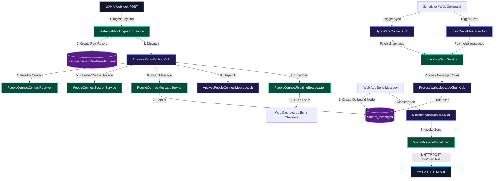
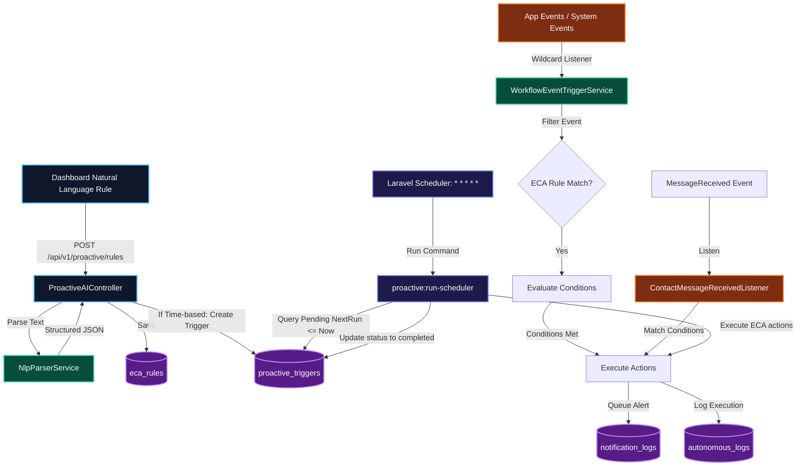

WAHA and Proactive AI Architectural Report
This report provides an extensive, production-grade technical breakdown of the WAHA (WhatsApp HTTP API) Integration and the Proactive AI Engine within the Nexus3 system. It details the runtime execution, message lifecycle, natural language parsing, and API endpoints for both subsystems, supported by architectural diagrams and file mappings.
---
1. WAHA Engine Orchestration
The WAHA integration forms the communications core of the Nexus PeopleConnect subsystem. It manages real-time synchronization, historical data backfills, and AI-driven personality/preference extraction from WhatsApp conversations.
1.1 Architecture & Message Flow
The diagram below illustrates how inbound events are received from WAHA, processed through the webhook pipeline, and how outbound messages are sent.

1.2 Running & Bootstrapping WAHA
The WAHA WhatsApp integration requires a running instance of the WhatsApp HTTP API server (typically running in a Docker container).
Default Port & Endpoint: The WAHA server operates on port `3333` (as checked by the startup scripts) or port `3000` (development fallback).
Startup Verification:


On Windows local deployments, the start-services.bat script verifies if WAHA is responding on port `3333`. If not, it warns that the Docker container must be manually initialized.


Engine Service Binding: The Laravel application registers the WAHA service in AppServiceProvider.php as a singleton:


    ```php
    $this->app->singleton('nexus.whatsapp', function ($app) {
        return new WAHAService($app['config']);
    });
    ```


Configuration & Credentials:

WAHA settings are evaluated at runtime by checking the `Setting` model 

(cached via `SettingCacheService`) and 


API URL:
 `Setting::get('waha_url')` -> Falls back to `config('services.waha.api_url')` or `http://localhost:3333`.

API Token / Key: `Setting::get('waha_api_key')` -> Falls back to `config('services.waha.api_token')`.


Session Name: Defaults to `'default'`.

1.3 Core Ingestion & Synchronization Mechanics

WAHA coordinates two distinct synchronization paradigms:

Real-time Webhook Ingestion and Batch Jobs.


A. Real-time Inbound Flow (Webhook Ingestion)
Ingestion Point: `POST /api/webhooks/waha` 

routes payloads to `WebhookController@handleWahaWebhook`.

Raw Persistence & Deduplication: WahaWebhookIngestionService checks `PeopleConnectRawProviderEvent` to prevent processing identical message payloads twice. 

It creates a `pending` raw event and dispatches the background worker.


Entity Resolution: ProcessWahaWebhookJob executes asynchronously to:

Strip phone number suffixes (`@c.us`).

Resolve or create the `Contact` using the phone number and pushname.

Link the message to a `PeopleConnectConversation` and a `PeopleConnectSession`.
Insert the record into the `contact_messages` database table.


Downstream AI & Web Actions:
Launches `AnalyzePeopleConnectMessageJob` to perform semantic tagging.

Triggers the `PeopleConnectRealtimeBroadcaster` to broadcast via Laravel Echo (`message.received` event).


B. Outbound Delivery Flow
When an agent or user posts a message via the dashboard, it is stored as `outbound` in the `contact_messages` table.


DispatchWahaMessageJob is dispatched to process delivery.

WahaMessageDispatcher issues an HTTP POST to `{$wahaUrl}/api/sendText` with the payload:
    ```json
    {
      "session": "default",
      "chatId": "123456789@c.us",
      "text": "Message body here"
    }
    ```


The delivery attempt status is logged in `people_connect_delivery_attempts`.
C. Bulk Historical Synchronization


Sync Contacts: SyncWahaContactsJob queries `GET /api/contacts/all?session=default`.
It identifies contacts present in WAHA but missing in Nexus and inserts them.


Sync Messages: SyncWahaMessagesJob iterates through synced contacts and requests `GET /api/chats/{chatId}/messages?session=default&limit=100`.


Single Contact Sync: SyncSingleContactMessagesJob fetches the full history for a particular contact. It chunks historical message arrays (500 per chunk) and runs ProcessWahaMessageChunkJob in parallel for high-speed insertion.

> [!WARNING]
> Historical message synchronization using `/api/chats/{chatId}/messages` or `/api/default/chats/{chatId}/messages` requires the **WAHA Plus** (commercial) edition. In the core edition, these endpoints return `404 Not Found`, which is caught and logged as a warning.
---
1.4 WAHA Endpoint Reference
Below is a detailed map of the API endpoints exposed by the WAHA integration subsystem.
HTTP Method	Route Endpoint	Controller Action	Description	Parameters / Payload

POST	`/api/v1/webhooks/waha`	`WebhookController@handleWahaWebhook`	Ingests real-time events from the WAHA service	JSON Webhook body containing event, session, and message payload


POST	`/api/v1/contacts/import/whatsapp/waha`	`ContactImportController@importWaha`	Imports contacts directly from WAHA list	Query parameters or upload settings


GET	`/api/v1/settings/waha/webhook-url`	`SettingController@getWahaWebhookUrl`	Resolves the external endpoint URL of the application webhook	None (uses URL generation service)


POST	`/api/v1/settings/waha/test-connection`	`SettingController@testWahaConnection`	Pings the WAHA API server to check status and latency	None


POST	`/api/v1/settings/waha/test-webhook`	`SettingController@testWahaWebhook`	Simulates a webhook delivery to verify handling chain	Mock webhook payload structure
GET	`/api/v1/settings/waha-manage/status`	`WahaManageController@status`	Returns metrics about synced records and active synchronization jobs	None
GET	`/api/v1/settings/waha-manage/contacts`	`WahaManageController@contacts`	Retrieves a paginated list of contacts synced from WAHA	`limit` (default 50), `offset` (default 0)

POST	`/api/v1/settings/waha-manage/sync/start`	`WahaManageController@startSync`	

Launches a background job to synchronize contacts or messages	`type` (string: `sync_contacts` or `sync_messages`)


POST	`/api/v1/settings/waha-manage/sync/contact/{id}`	`WahaManageController@startContactMessageSync`	Triggers single-contact message synchronization	`id` (integer, Contact ID)


POST	`/api/v1/settings/waha-manage/sync/{id}/pause`	`WahaManageController@pauseSync`	Pauses an active, running sync process	`id` (integer, Process ID)


POST	`/api/v1/settings/waha-manage/analyze/start`	`WahaManageController@startAnalysis`	Initiates an AI batch profile analysis on selected contacts	`agent_id`, `model_id`, `message_limit`, `contact_ids`, `extract_preferences` (boolean), `extract_personality` (boolean), `extract_topics` (boolean)
---
1.5 WAHA File Mapping
The table below maps every file in the codebase dedicated to the WhatsApp integration.
File Path	Component Category	Technical Description
`config/services.php`	Configuration	Defines default WAHA config keys (`url`, `api_key`, `api_token`, `webhook_secret`).
`app/Services/WhatsApp/WAHAService.php`	Core Service	Main client wrapper using Laravel Http client. Holds basic interaction methods.
`app/Services/PeopleConnect/LiveMsgsSyncService.php`	Synchronization	Coordinates batch API calls, loops over datasets, handles paused jobs, and dispatches insertion processes.
`app/Services/PeopleConnect/WahaWebhookIngestionService.php`	Ingestion	Receives raw webhook payloads, logs them for audit trails, handles duplicates, and queues the job.
`app/Services/PeopleConnect/WahaMessageDispatcher.php`	Delivery	Invokes WAHA `POST /api/sendText` to send chat responses and updates delivery logs.
`app/Services/PeopleConnect/WahaAnalysisService.php`	AI Analysis	Iterates over contact histories, feeds messages to models, and extracts traits.
`app/Http/Controllers/WahaManageController.php`	API Controller	Interfaces the dashboard settings tab with the background synchronization operations.
`app/Http/Controllers/WebhookController.php`	Webhook Gateway	Route endpoint that handles incoming POST webhook requests.
`app/Jobs/PeopleConnect/SyncWahaContactsJob.php`	Queue Job	Job wrapper that executes the contact list synchronization.
`app/Jobs/PeopleConnect/SyncWahaMessagesJob.php`	Queue Job	Job wrapper that executes historical message downloads.
`app/Jobs/PeopleConnect/SyncSingleContactMessagesJob.php`	Queue Job	Job wrapper that synchronizes history for one specific contact.
`app/Jobs/ProcessWahaMessageChunkJob.php`	Queue Job	Bulk inserts 500-message arrays to databases, handles metadata extraction, and triggers Laravel Echo progress indicators.
`app/Jobs/ProcessWahaWebhookJob.php`	Queue Job	Dissect webhook payload, resolves models, links records, and triggers the AI analysis worker.
`app/Jobs/PeopleConnect/DispatchWahaMessageJob.php`	Queue Job	Dispatcher wrapper executing outbound message delivery attempts.
`app/Jobs/PeopleConnect/WahaBatchAnalyzeJob.php`	Queue Job	Trigger for batch AI parsing on user records.
`app/Jobs/PeopleConnect/SyncWahaConversationsJob.php`	Queue Job	Staged job for chat thread synchronization.
`app/Jobs/PeopleConnect/ReconcileWahaDeliveryStatusJob.php`	Queue Job	Staged job for tracking message delivery statuses.
`resources/views/hubs/waha.blade.php`	User Interface	Control panel interface showing sync status, terminal logger output, and paginated contact views.
---
---
2. Proactive AI (ECA) Engine
The Proactive AI Engine provides autonomous behavior capabilities to the Nexus agent ("Souly"). It implements an Event-Condition-Action (ECA) framework allowing the system to react to events or execute scheduled actions.
2.1 Engine Architecture
The architecture of the Proactive AI engine is built around a centralized condition evaluator and an execution loop.

2.2 Natural Language Parsing
At the heart of rule creation is the NlpParserService. It parses user-defined natural language rules into JSON schemas.
Time-Based Extraction (e.g. "Remind me tomorrow at 3 PM about X"):
Identifies trigger keywords (`remind me`, `send a message to`, `notify me`).
Extracts timestamps relative to `Carbon::now()` using strings like `tomorrow` or regex queries like `/at (\d+)\s*(am/pm)?/i`.
Builds a `time_based` rule with `next_run_at` filled.
Generates a notification message from substrings following `about`.
Event-Based Extraction (e.g. "If Mohamed contacts me regarding X, reply with Y, and then notify me"):
Detects event prefixes (`if`, `when`).
Sets `event_type = 'ContactMessageReceived'`.
Extracts filters:
`contact_name` from `/if (.*?) contacts me/i`.
`topic` from `/regarding (.*?)(?:,|$)/i`.
Extracts actions:
`reply` content from `/reply with (.*?)(?:,|$)/i`.
`notify` action if `notify me` is present.
Example Parsed Output:
```json
{
  "type": "event_based",
  "event_type": "ContactMessageReceived",
  "conditions": {
    "contact_name": "Mohamed",
    "topic": "X"
  },
  "actions": {
    "reply": { "message": "Y" },
    "notify": { "message": "Autonomous action completed based on rule." }
  }
}
```
2.3 Condition & Action Execution Loops
A. The Event-Based Loop
Event-based execution runs in response to application events.
Wildcard Hook: WorkflowEventTriggerService registers a wildcard listener `Event::listen('*')` that intercepts all application events (excluding framework defaults).
Explicit Listening: ContactMessageReceivedListener listens for message events.
Condition Matching: The listener queries active rules matching `event_type` and evaluates the conditions:
    ```php
    // Checks if the rule contact name matches the incoming message sender
    if (isset($conditions['contact_name']) && strtolower($conditions['contact_name']) !== strtolower($contactName)) {
        $match = false;
    }
    // Checks if the incoming message text contains the target topic
    if (isset($conditions['topic']) && ! Str::contains(strtolower($topic), strtolower($conditions['topic']))) {
        $match = false;
    }
    ```
Action Execution: If `$match` is true:
It initiates simulated replies (logged via system outputs).
Inserts notification requests into `notification_logs` (processed by `NotificationHub`).
Records execution metadata in the `autonomous_logs` database table.
B. The Time-Based Loop (Scheduler Command)
Time-based actions run in the background via cron.
Cron Trigger: Laravel Scheduler runs `php artisan proactive:run-scheduler` every minute.
Command Execution: ProactiveSchedulerCommand runs:
    ```php
    $triggers = DB::table('proactive_triggers')
        ->where('status', 'pending')
        ->where('next_run_at', '<=', Carbon::now())
        ->get();
    ```
ECA Evaluation: For each trigger, it fetches the corresponding active `eca_rule`.
System Notifications: Dispatches pending notification logs to `notification_logs`.
Audit Trail Logging: Inserts execution outcomes into `autonomous_logs` and marks the trigger as `completed` (or `failed` in case of errors).
---
2.4 Proactive AI Endpoint Reference
Below is a detailed map of the API endpoints exposed by the Proactive AI subsystem.
HTTP Method	Route Endpoint	Controller Action	Description	Request Payload	Response JSON
GET	`/api/v1/proactive/rules`	`ProactiveAIController@indexRules`	Lists all active and inactive ECA rules	None	`{"success": true, "data": [...]}`
POST	`/api/v1/proactive/rules`	`ProactiveAIController@storeRule`	Compiles a natural language rule and deploys it	`{"natural_language_rule": "text", "name": "name"}`	`{"success": true, "data": {...}}` (201 Created)
PATCH	`/api/v1/proactive/rules/{id}/toggle`	`ProactiveAIController@toggleRule`	Toggles the active status of an ECA rule	None	`{"success": true, "is_active": true/false}`
DELETE	`/api/v1/proactive/rules/{id}`	`ProactiveAIController@destroyRule`	Deletes a rule and cancels any pending triggers	None	`{"success": true}`
GET	`/api/v1/proactive/triggers`	`ProactiveAIController@indexTriggers`	Fetches the list of pending, completed, or failed triggers	None	`{"success": true, "data": [...]}`
GET	`/api/v1/proactive/logs`	`ProactiveAIController@indexLogs`	Returns a history of all executed autonomous actions	None	`{"success": true, "data": [...]}`
POST	`/api/v1/proactive-ai/suggestions/{id}/approve`	(Closure in routes/api.php)	Approves an AI-generated optimization suggestion	None	`{"message": "Suggestion approved."}`
POST	`/api/v1/proactive-ai/suggestions/{id}/dismiss`	(Closure in routes/api.php)	Dismisses an AI-generated optimization suggestion	None	`{"message": "Suggestion dismissed."}`
---
2.5 Proactive AI File Mapping
The table below maps every file in the codebase dedicated to the Proactive AI engine.
File Path	Component Category	Technical Description
`app/Services/Proactive/NlpParserService.php`	Core Engine	Contains the semantic translation logic that extracts triggers, conditions, and actions from natural language input.
`app/Console/Commands/ProactiveSchedulerCommand.php`	Artisan Console	Evaluates time-based rules, fires notification payloads, and records logs.
`app/Http/Controllers/ProactiveAIController.php`	API Controller	Exposes endpoints to manage rules, inspect triggers, and view logs.
`app/Listeners/ContactMessageReceivedListener.php`	Event Listener	Listens for messages, matches sender/topic filters, and executes the rule actions.
`app/Services/Workflows/WorkflowEventTriggerService.php`	Event Hook	Uses a wildcard listener to inspect all application events and trigger matching rules.
`app/Models/EcaRule.php`	Eloquent Model	Represents an ECA rule (`eca_rules` table), casting JSON fields.
`app/Models/ProactiveTrigger.php`	Eloquent Model	Tracks triggers (`proactive_triggers` table) for time-based scheduling.
`app/Models/AutonomousLog.php`	Eloquent Model	Stores the history of autonomous executions.
`database/migrations/2026_05_24_233351_create_proactive_ai_tables.php`	Database	Defines the tables for `eca_rules`, `proactive_triggers`, and `autonomous_logs`.
`resources/views/hubs/proactive-ai.blade.php`	User Interface	UI dashboard to view rules, pending triggers, action logs, and add new rules.
