# 01. WAHA Webhook Ingestion & Deduplication Security

When an incoming WhatsApp message reaches the **Nexus3 PeopleConnect** infrastructure, it originates as an HTTP POST webhook payload dispatched by **WAHA** (WhatsApp HTTP API - powered by core engines such as `NOWEB` or `Wwebjs`). 

Before any linguistic analysis, session slicing, or contact resolution can occur, the payload must cross the system's external boundary through a fortified ingestion layer designed to protect the internal domain from duplicate events and network replay storms.

---

## 1. Architectural Sequence Flow

```mermaid
sequenceDiagram
    autonumber
    actor WhatsApp as WAHA Node (Container)
    participant Route as Laravel API / Webhook Router
    participant Service as WahaWebhookIngestionService
    participant DB as MySQL (peopleconnect_raw_provider_events)
    participant Queue as Laravel Horizon / Redis Queue

    WhatsApp->>Route: POST /api/v1/webhooks/waha (JSON Payload)
    Route->>Service: ingest(array $payload)
    
    rect rgb(20, 28, 45)
        note over Service: 1. Structural Payload Validation
        Service->>Service: Check $payload['session'] & $payload['payload']['id']
        alt Missing Session or ID (except 'session.status')
            Service-->>Route: Abort & Log Warning (200 OK to prevent retries)
        end
    end

    rect rgb(35, 20, 45)
        note over Service, DB: 2. Raw Event Deduplication (JSON Query)
        Service->>DB: SELECT EXISTS WHERE session_name=? AND payload->payload->id=?
        alt Duplicate Detected
            Service-->>Route: Abort & Log Info (Skip duplicate execution)
        end
    end

    rect rgb(20, 45, 35)
        note over Service, Queue: 3. Persistence & Asynchronous Hand-off
        Service->>DB: INSERT INTO peopleconnect_raw_provider_events (status: 'pending')
        Service->>Queue: Dispatch ProcessWahaWebhookJob(payload, rawEventId)
        Service-->>Route: Return 200 OK (Acknowledge receipt to WAHA)
    end
```



---

## 2. Core Purpose of the Ingestion Layer

The fundamental design goal of the ingestion pipeline is **decoupling HTTP webhooks from database-heavy asynchronous tasks**. Because external providers like WhatsApp require rapid HTTP 200 acknowledgments (often within `< 5 seconds`) to prevent continuous webhook retries, `WahaWebhookIngestionService` never executes complex logic synchronously. 

Instead, it functions as a lightweight **Audit & Gatekeeping Engine** with three primary obligations:
1. **Structural Sanity Verification:** Ensuring the incoming data structure conforms to WAHA specification.
2. **Deterministic Deduplication:** Guarding against identical event retransmissions caused by transient network glitches or webhook retries.
3. **Immutable Raw Audit Logging:** Recording the verbatim JSON payload into persistent storage before invoking background workers, guaranteeing total replayability and disaster recovery.

---

## 3. Deep-Dive Source Code Analysis

The ingestion engine is encapsulated within `App\Services\PeopleConnect\WahaWebhookIngestionService`. Below is an annotated breakdown of its operational logic:

### 3.1 Validation & Extraction
```php
public function ingest(array $payload): void
{
    $session = $payload['session'] ?? null;
    $event = $payload['event'] ?? 'unknown';
    $messageId = $payload['payload']['id'] ?? null;

    if (! $session) {
        Log::warning('WAHA Webhook Ingestion: Missing session', ['payload' => $payload]);
        return;
    }

    // Ignore missing IDs only if the event is a lifecycle status notification
    if (! $messageId && $event !== 'session.status') {
        Log::warning('WAHA Webhook Ingestion: Missing payload id', ['payload' => $payload]);
        return;
    }
```
> [!NOTE]
> Why does the method terminate silently with `return;` rather than throwing an exception? Throwing an unhandled HTTP 500 error would force WAHA into a retrial cycle, flooding the server with malformed payloads. By logging a warning and terminating peacefully, Nexus returns an HTTP 200 acknowledgment, cleaning out the provider's retry queue.

---

### 3.2 JSON-Path Deduplication Architecture
One of the most robust reliability features in PeopleConnect is its SQL JSON-Path deduplication engine:

```php
    // Deduplication check at raw event level
    if ($messageId) {
        $existing = PeopleConnectRawProviderEvent::where('session_name', $session)
            ->where('payload->payload->id', '=', $messageId)
            ->exists();

        if ($existing) {
            Log::info('WAHA Webhook Ingestion: Duplicate payload detected, skipping.', [
                'session' => $session, 
                'message_id' => $messageId
            ]);

            return;
        }
    }
```
> [!IMPORTANT]
> Notice the usage of Laravel Eloquent JSON arrow syntax: `where('payload->payload->id', '=', $messageId)`. This generates a MySQL JSON extraction query (`JSON_EXTRACT(payload, "$.payload.id")`). Even if WAHA transmits the same message twice across different HTTP connections, the second request is immediately halted before ever hitting the conversation tables or triggering AI processing.

---

### 3.3 Raw Event Creation & Queue Handoff
Once verified and deduplicated, the service writes the raw payload to MySQL and hands off execution to **Laravel Horizon**:

```php
    // Store raw provider event
    $rawEvent = PeopleConnectRawProviderEvent::create([
        'event_type' => $payload['event'] ?? 'unknown',
        'payload' => $payload,
        'session_name' => $session,
        'received_at' => now(),
        'processing_status' => 'pending', // Awaiting background worker
    ]);

    ProcessWahaWebhookJob::dispatch($payload, $rawEvent->id);
}
```
> [!TIP]
> Notice that `ProcessWahaWebhookJob::dispatch` is passed both `$payload` and `$rawEvent->id`. When the background worker successfully finishes processing the webhook, it updates `processing_status` from `'pending'` to `'completed'`. If an exception occurs during background execution, it transitions to `'failed'`, enabling developers to inspect exactly which raw payloads caused downstream bugs.

---

## 4. Database Schema: `peopleconnect_raw_provider_events`

This table acts as the system's "Black Box flight recorder," storing every raw event entering from external messaging providers.

| Column Name | Type | Modifiers | Engineering Purpose |
| :--- | :--- | :--- | :--- |
| `id` | `BIGINT UNSIGNED` | `PRIMARY KEY, AUTO_INCREMENT` | Unique internal identifier for the raw provider event. |
| `event_type` | `VARCHAR(255)` | `NOT NULL, INDEX` | Event category (e.g., `message`, `message.any`, `session.status`). |
| `session_name` | `VARCHAR(255)` | `NOT NULL, INDEX` | WAHA session identifier (e.g., `default`, `sales_support`). |
| `payload` | `JSON` | `NOT NULL` | The full, uncompressed JSON blob received from WAHA. |
| `processing_status`| `ENUM(...)` | `DEFAULT 'pending', INDEX` | State tracking: `'pending'`, `'processing'`, `'completed'`, `'failed'`. |
| `received_at` | `TIMESTAMP` | `NOT NULL` | Precise timestamp of initial HTTP reception. |
| `created_at` | `TIMESTAMP` | `NULL` | Laravel standard audit timestamps. |
| `updated_at` | `TIMESTAMP` | `NULL` | Laravel standard audit timestamps. |

---

## 5. Summary & Next Steps in Pipeline

Once `ProcessWahaWebhookJob` is dispatched to Redis, the immediate HTTP response completes in microseconds. The heavy lifting now shifts to the background queue worker, where **Task 5 (Atomic Redis Locking & Contact Resolution)** takes over to map the raw WhatsApp phone number to an active Nexus contact without triggering concurrency race conditions.
