# 02. Atomic Redis Locking & Contact Resolution

Once an incoming WAHA webhook passes the ingestion and deduplication gates, `ProcessWahaWebhookJob` begins processing the payload asynchronously inside a queue worker. The very first operational challenge in high-throughput messaging pipelines is **Identity Resolution**: determining whether the incoming phone number corresponds to an existing customer or a brand new lead.

In high-concurrency environments (such as marketing blasts or automated chatbots), a user might transmit multiple WhatsApp messages within fractions of a second. Without concurrency governance, multiple queue workers attempting to resolve the same unfamiliar number simultaneously will result in **Race Condition Duplication**—creating conflicting, redundant records in the `contacts` table.

---

## 1. Concurrency Defense Architecture (Redis Atomic Locks)

To eliminate identity fragmentation and database deadlocks, Nexus utilizes an atomic mutual-exclusion locking pipeline powered by **Redis** (`Cache::lock`).

```mermaid
sequenceDiagram
    autonumber
    actor WorkerA as Queue Worker #1 (Msg 1)
    actor WorkerB as Queue Worker #2 (Msg 2 - Simultaneous)
    participant Resolver as PeopleConnectContactResolver
    participant Redis as Redis Cache Cluster
    participant Identity as ContactIdentityResolver
    participant DB as MySQL (contacts & contact_identifiers)

    WorkerA->>Resolver: resolve(chatId, "20100000000", "Ahmed")
    WorkerB->>Resolver: resolve(chatId, "20100000000", "Ahmed")
    
    rect rgb(35, 20, 45)
        note over WorkerA, Redis: Worker #1 Acquires Atomic Lock
        Resolver->>Redis: SETNX contact_resolve_20100000000 (TTL 10s)
        Redis-->>WorkerA: Lock Acquired Successfully!
    end

    rect rgb(45, 20, 20)
        note over WorkerB, Redis: Worker #2 Blocked by Concurrency Lock
        Resolver->>Redis: SETNX contact_resolve_20100000000 (TTL 10s)
        Redis-->>WorkerB: Lock Busy -> Worker #2 blocks up to 5s waiting...
    end

    rect rgb(20, 45, 35)
        note over WorkerA, DB: Worker #1 Executes Identity Resolution & Creation
        Resolver->>Identity: resolve([whatsapp: 20100000000, phone: 20100000000])
        Identity->>DB: SELECT FROM contact_identifiers WHERE value="20100000000"
        DB-->>Identity: null (Not Found)
        Resolver->>DB: INSERT INTO contacts (name: "Ahmed", phone: "20100000000", type: "lead")
        Resolver->>DB: INSERT INTO contact_identifiers (type: "whatsapp", value: "20100000000")
        Resolver->>Redis: RELEASE Lock (contact_resolve_20100000000)
    end

    rect rgb(20, 35, 45)
        note over WorkerB, DB: Worker #2 Unblocked -> Safe Re-verification
        Redis-->>WorkerB: Lock Acquired (Transferred from Worker #1)
        Resolver->>Identity: resolve([whatsapp: 20100000000, phone: 20100000000])
        Identity->>DB: SELECT FROM contact_identifiers WHERE value="20100000000"
        DB-->>Identity: Contact #104 Found! (Created by Worker #1)
        Resolver->>Redis: RELEASE Lock (contact_resolve_20100000000)
        Resolver-->>WorkerB: Return existing Contact #104 (No Duplicate Created!)
    end
```



---

## 2. Deep-Dive Source Code Analysis

The logic responsible for identity resolution lives in `App\Services\PeopleConnect\PeopleConnectContactResolver`. Below is a meticulous technical breakdown of its implementation:

### 2.1 Atomic Lock Acquisition
```php
public function resolve(string $chatId, string $phone, string $displayName = ''): Contact
{
    // ISSUE RESOLVED: Resolved Contact Identity Resolution Race Condition.
    // We use Cache::lock() (Redis atomic locks) based on the phone number to serialize resolution.
    // Concurrent requests block and wait up to 5 seconds.
    $lock = Cache::lock("contact_resolve_{$phone}", 10);

    try {
        $lock->block(5);
```
> [!IMPORTANT]
> Notice the two distinct timeout values: `Cache::lock("contact_resolve_{$phone}", 10)` sets a **Maximum Lock Lifetime (TTL) of 10 seconds**. This acts as a deadlock prevention mechanism; even if a queue worker crashes unexpectedly or encounters a lethal PHP fatal error inside the block, Redis will forcibly evaporate the lock after 10 seconds. Conversely, `$lock->block(5)` commands concurrent workers to **pause execution for up to 5 seconds** waiting for the lock before throwing a `LockTimeoutException` and retrying the job.

---

### 2.2 Multi-Identifier Matching Engine
Instead of executing simplistic searches against a bare `contacts.phone` column, Nexus abstracts identity routing through a unified identity broker (`ContactIdentityResolver`):

```php
        // 1. Try to resolve using ContactIdentityResolver
        $identifiers = [
            ['type' => 'whatsapp', 'value' => $phone],
            ['type' => ContactIdentifier::TYPE_PHONE, 'value' => $phone],
        ];

        $contact = $this->identityResolver->resolve($identifiers);
```
> [!TIP]
> Why check both `'whatsapp'` and `'phone'` identifier types? Because a customer might have originally entered the ecosystem via a web form or CRM import (registered under `TYPE_PHONE`), having never interacted via WhatsApp. By checking both identifier schemas, PeopleConnect successfully links incoming WhatsApp streams to pre-existing omnichannel profiles without generating duplicate guest identities.

---

### 2.3 Intelligent Placeholder Upgrade & Self-Healing
When an existing contact is identified, the service executes two self-healing routines before exiting:

```php
        if ($contact) {
            // Ensure the whatsapp identifier is linked if it wasn't
            $this->identityResolver->linkIdentifier($contact, 'whatsapp', $phone, false);

            // Update placeholder contact name if real display name is provided
            if (! empty($displayName) && (
                empty($contact->name) || 
                str_starts_with($contact->name, 'WAHA Contact') || 
                str_starts_with($contact->name, 'WhatsApp User') || 
                $contact->name === $phone
            )) {
                $contact->update(['name' => $displayName, 'display_name' => $displayName]);
            }

            return $contact;
        }
```
> [!NOTE]
> Often, initial leads enter the system without a human name, inheriting temporary placeholders like `'WAHA Contact 9421'` or `'WhatsApp User'`. When the user finally broadcasts a WAHA `pushname` (e.g., in a status update or new chat), the resolver intercepts this and silently upgrades their primary `name` and `display_name` fields in real-time.

---

### 2.4 New Lead Provisioning & Hub Synchronization
If no matching profile is discovered across any identifier table, a new Lead profile is provisioned and immediately piped into the central Contact Hub:

```php
        // 2. Not found, create new Contact
        $contactName = ! empty($displayName) ? $displayName : 'WAHA Contact '.substr($phone, -4);

        $contact = Contact::create([
            'name' => $contactName,
            'phone' => $phone,
            'whatsapp_number' => $phone,
            'type' => 'lead',
            'is_active' => true,
        ]);

        // Link the identifiers for future immediate resolution
        $this->identityResolver->linkIdentifier($contact, ContactIdentifier::TYPE_PHONE, $phone, true);
        $this->identityResolver->linkIdentifier($contact, 'whatsapp', $phone, false);

        // Run sync contact details via Hub
        $this->contactHubService->syncContactDetails($contact);

        return $contact;
    } finally {
        $lock->release();
    }
}
```
> [!CAUTION]
> Notice that `$lock->release()` is situated firmly within a `finally` block. Regardless of whether identity resolution succeeds, triggers an Eloquent database validation exception, or encounters a networking timeout in `ContactHubService`, the Redis lock is guaranteed to be unlocked immediately upon method exit, maintaining high pipeline throughput.

---

## 3. Database Architecture: Identity Schema

To support polymorphic identifier mapping across messaging channels, PeopleConnect relies on a decoupled relational structure between core contacts and their identifying properties.

### `contacts` (Core Entity Table)
| Column Name | Type | Modifiers | Engineering Purpose |
| :--- | :--- | :--- | :--- |
| `id` | `BIGINT UNSIGNED` | `PRIMARY KEY, AUTO_INCREMENT` | Unique profile identifier. |
| `name` | `VARCHAR(255)` | `NOT NULL` | Full display name (upgradable from placeholders). |
| `phone` | `VARCHAR(50)` | `NULL, INDEX` | Primary default telephone number. |
| `whatsapp_number` | `VARCHAR(50)` | `NULL, INDEX` | Dedicated WhatsApp network target number. |
| `type` | `VARCHAR(50)` | `DEFAULT 'lead', INDEX` | CRM segmentation state (`lead`, `customer`, `vip`). |
| `is_active` | `BOOLEAN` | `DEFAULT true` | Toggles whether automated rules and agents can engage this entity. |

### `contact_identifiers` (Polymorphic Routing Table)
| Column Name | Type | Modifiers | Engineering Purpose |
| :--- | :--- | :--- | :--- |
| `id` | `BIGINT UNSIGNED` | `PRIMARY KEY, AUTO_INCREMENT` | Internal routing record ID. |
| `contact_id` | `BIGINT UNSIGNED` | `FOREIGN KEY (contacts.id), INDEX` | Relational pointer to core profile. |
| `type` | `VARCHAR(50)` | `NOT NULL, INDEX` | Channel type: `'whatsapp'`, `'phone'`, `'telegram'`, `'email'`. |
| `value` | `VARCHAR(255)` | `NOT NULL, INDEX` | Cleaned identifier value (e.g., bare international digits `20100000000`). |
| `is_primary` | `BOOLEAN` | `DEFAULT false` | Designates primary contact vehicle for automated outgoing broadcasts. |

---

## 4. Summary & Next Steps in Pipeline

With the contact identity deterministically resolved without duplicate ghost records, `ProcessWahaWebhookJob` proceeds to manage the conversational context. In **Task 6 (Temporal Session Management & 2-Hour Window Slicing)**, we examine how PeopleConnect dynamically divides endless WhatsApp chat threads into clean 2-hour conversational sessions to prevent LLM context-window exhaustion and prompt drift.
