# 03. Temporal Session Management & 2-Hour Window Slicing

In classical messaging architectures like WhatsApp, conversation streams are practically eternal. Two users might chat continuously across months or even years within a single persistent timeline (`provider_conversation_id`). While this boundless thread architecture works seamlessly for human operators, it creates critical systemic bottlenecks for **Autonomous AI Agents** and **Large Language Models (LLMs)**.

If an AI Agent is tasked with answering an incoming customer question, feeding it an unbounded multi-year conversation history induces two catastrophic engineering failures:
1. **Token Window Overlap & Financial Exhaustion:** Rapidly saturating modern LLM token boundaries (8k, 32k, 128k), driving up latency, API costs, and triggering memory truncation faults.
2. **Context Drift & Semantic Hallucination:** An LLM presented with hundreds of historic chats will frequently conflate an ancient support issue from eight months ago with a completely unrelated purchase inquiry received five minutes ago.

To neutralize these bottlenecks, PeopleConnect introduces **Temporal Session Slicing**: an intelligent conversation segmentation layer that slices continuous messaging streams into discrete, high-relevance interaction episodes governed by a **2-Hour Inactivity Threshold**.

---

## 1. Architectural Session Slicing Sequence

```mermaid
sequenceDiagram
    autonumber
    actor Worker as Queue Worker (ProcessWahaWebhookJob)
    participant ConvSvc as PeopleConnectConversationService
    participant SessSvc as PeopleConnectSessionService
    participant DB as MySQL Database

    Worker->>ConvSvc: resolveOrCreate(contactId=104, channel='whatsapp', chatId='20100000000@c.us')
    ConvSvc->>DB: SELECT * FROM peopleconnect_conversations WHERE contact_id=104 AND provider='waha'
    alt Conversation Exists
        DB-->>ConvSvc: Return Conv #55 (last_message_at: 2026-08-02 08:00:00)
    else Conversation Not Found
        ConvSvc->>DB: INSERT INTO peopleconnect_conversations (reply_mode_effective: 'manual', status: 'active')
        DB-->>ConvSvc: Return newly minted Conv #55
    end

    Worker->>SessSvc: resolveOrOpen(conv=#55, messageTime: 2026-08-02 11:30:00)
    SessSvc->>DB: SELECT * FROM peopleconnect_sessions WHERE conversation_id=55 AND status='open'
    DB-->>SessSvc: Session #890 Found (opened_at: 2026-08-02 07:50:00)

    rect rgb(45, 20, 20)
        note over SessSvc, DB: Inactivity Rule Check: Has > 2 Hours Elapsed Since Last Msg?
        SessSvc->>SessSvc: check: last_message_at (08:00) + 2 Hours < current_message (11:30) == TRUE!
        SessSvc->>DB: UPDATE peopleconnect_sessions SET status='closed', closed_at='11:30:00', closed_reason='inactivity' WHERE id=890
        note right of DB: Historic session sealed. AI Context Window resets to clean slate!
    end

    rect rgb(20, 45, 35)
        note over SessSvc, DB: Spawning Fresh Conversational Session
        SessSvc->>DB: INSERT INTO peopleconnect_sessions (conversation_id: 55, contact_id: 104, status: 'open', message_count: 0)
        DB-->>SessSvc: Return pristine Session #891
    end
    SessSvc-->>Worker: Return active Session #891 for downstream AI ingestion
```



---

## 2. Conversation Resolution (`PeopleConnectConversationService`)

Before evaluating session rules, the messaging worker binds the raw WhatsApp target to a permanent conversational root inside `PeopleConnectConversationService::resolveOrCreate()`:

```php
public function resolveOrCreate(int $contactId, string $channel, string $chatId): PeopleConnectConversation
{
    $provider = 'waha'; // Targeted transport provider

    $conversation = PeopleConnectConversation::where('contact_id', $contactId)
        ->where('channel', $channel)
        ->where('provider', $provider)
        ->first();

    // Fallback: search by provider target ID if contact binding shifted
    if (! $conversation) {
        $conversation = PeopleConnectConversation::where('provider_conversation_id', $chatId)->first();
    }
```
> [!NOTE]
> Why does the service search by (`contact_id`, `channel`, `provider`) first before falling back to `provider_conversation_id`? Because a customer's WhatsApp ID might occasionally appear with differing suffixes (e.g., bare digits vs `@c.us` or Linked Device IDs `@lid`). Searching primary foreign keys first guarantees identity consistency across channel migrations.

When existing threads are recovered, the service performs real-time target rectification, automatically appending missing WAHA domain syntax:
```php
    if ($conversation) {
        $updates = [];
        if ($conversation->contact_id !== $contactId) {
            $updates['contact_id'] = $contactId;
        }
        // Upgrade stripped IDs to fully operational @c.us transmission endpoints
        if (empty($conversation->provider_conversation_id) || ($chatId && str_contains($chatId, '@c.us'))) {
            $updates['provider_conversation_id'] = $chatId;
        }
        if (! empty($updates)) {
            $conversation->update($updates);
        }

        return $conversation;
    }
```
If the interaction represents a first-time contact, a fresh root record is established with an initial `reply_mode_effective` default of `'manual'`:
```php
    return PeopleConnectConversation::create([
        'contact_id' => $contactId,
        'channel' => $channel,
        'provider' => $provider,
        'provider_conversation_id' => $chatId,
        'status' => 'active',
        'unread_count' => 0,
        'reply_mode_effective' => 'manual', // Requires explicit opt-in to 'copilot' or 'autopilot'
    ]);
}
```

---

## 3. The 2-Hour Temporal Slicing Engine (`PeopleConnectSessionService`)

Once the parent conversation is secured, control transfers to `PeopleConnectSessionService::resolveOrOpen()`, where the core temporal slicing rules are enforced:

```php
public function resolveOrOpen(PeopleConnectConversation $conv, Carbon $messageTime): PeopleConnectSession
{
    $openSession = $conv->sessions()->where('status', 'open')->first();

    if ($openSession) {
        $lastMessageAt = $conv->last_message_at;

        // If more than 2 hours have passed since the last message, close the session
        if ($lastMessageAt && $lastMessageAt->copy()->addHours(2)->lt($messageTime)) {
            $openSession->update([
                'status' => 'closed',
                'closed_at' => $messageTime,
                'closed_reason' => 'inactivity',
            ]);
            $openSession = null; // Sever handle to force regeneration
        }
    }
```
> [!IMPORTANT]
> Observe the conditional logic: `$lastMessageAt->copy()->addHours(2)->lt($messageTime)`. Why evaluate against `$conv->last_message_at` instead of `$openSession->opened_at`? If we evaluated against `opened_at`, an active, highly engaging customer interaction would be arbitrarily severed every two hours right in the middle of a discussion! By benchmarking against `last_message_at`, **sessions stay open indefinitely as long as active messaging continues**. A session only terminates when *silence* stretches across a complete two-hour duration.

If no open session exists (or if the active session was just terminated due to inactivity), a fresh session boundary is forged:

```php
    if (! $openSession) {
        $openSession = $conv->sessions()->create([
            'contact_id' => $conv->contact_id,
            'status' => 'open',
            'opened_at' => $messageTime,
            'message_count' => 0,
        ]);
    }

    return $openSession;
}
```
> [!TIP]
> **Pro-Active Cron Sweeping:** In addition to real-time webhook slicing, the codebase operates a scheduled background task (`CloseInactivePeopleConnectSessionsJob`). This job acts as a proactive sweep mechanism, scanning MySQL every hour for abandoned open sessions and transitioning them to `status = 'closed'` with `closed_reason = 'inactivity'`, maintaining analytical hygiene even if the user never replies again.

---

## 4. Database Architecture: Conversation & Session Schema

The two-tiered relationship between continuous chats and sliced interaction episodes is codified across two primary tables:

### `peopleconnect_conversations` (Eternal Thread Matrix)
| Column Name | Type | Modifiers | Engineering Purpose |
| :--- | :--- | :--- | :--- |
| `id` | `BIGINT UNSIGNED` | `PRIMARY KEY, AUTO_INCREMENT` | Internal conversation handle. |
| `contact_id` | `BIGINT UNSIGNED` | `FOREIGN KEY (contacts.id), INDEX` | Primary owner linkage. |
| `channel` | `VARCHAR(50)` | `NOT NULL, INDEX` | Messaging medium (e.g., `'whatsapp'`, `'telegram'`). |
| `provider` | `VARCHAR(50)` | `NOT NULL` | Routing provider engine (e.g., `'waha'`). |
| `provider_conversation_id` | `VARCHAR(255)` | `NOT NULL, INDEX` | Target transport address (e.g., `20100000000@c.us`). |
| `reply_mode_effective`| `ENUM(...)` | `DEFAULT 'manual', INDEX` | AI control governance: `'manual'`, `'copilot'`, `'autopilot'`. |
| `status` | `VARCHAR(50)` | `DEFAULT 'active', INDEX` | Operational thread state (`active`, `archived`, `blocked`). |
| `last_message_preview`| `TEXT` | `NULL` | Truncated text snippet of the latest message for UI sidebar rendering. |
| `last_message_at` | `TIMESTAMP` | `NULL, INDEX` | Temporal anchor utilized by the 2-Hour Slicing Engine. |
| `unread_count` | `INT UNSIGNED` | `DEFAULT 0` | Real-time pending acknowledgment counter. |

### `peopleconnect_sessions` (Temporal Episode Slices)
| Column Name | Type | Modifiers | Engineering Purpose |
| :--- | :--- | :--- | :--- |
| `id` | `BIGINT UNSIGNED` | `PRIMARY KEY, AUTO_INCREMENT` | Discrete session slice identifier. |
| `conversation_id` | `BIGINT UNSIGNED` | `FOREIGN KEY, INDEX` | Parent thread ownership pointer. |
| `contact_id` | `BIGINT UNSIGNED` | `FOREIGN KEY, INDEX` | Secondary relational index for analytics. |
| `status` | `ENUM(...)` | `DEFAULT 'open', INDEX` | Active episode state: `'open'`, `'closed'`, `'handoff'`. |
| `message_count` | `INT UNSIGNED` | `DEFAULT 0` | Volume counter tracked within this temporal window. |
| `opened_at` | `TIMESTAMP` | `NOT NULL` | Precise epoch timestamp of initial interaction in slice. |
| `closed_at` | `TIMESTAMP` | `NULL` | Termination timestamp when slice is sealed. |
| `closed_reason` | `VARCHAR(100)` | `NULL` | Termination classification (e.g., `'inactivity'`, `'resolved'`, `'agent_handoff'`). |

---

## 5. Summary & Next Steps in Pipeline

With the conversation thread confirmed and an active session boundary successfully resolved, the system is finally prepared to persist the incoming payload. In **Task 7 (Database Persistence & Unread Counters)**, we analyze how `PeopleConnectMessageService` commits the message to storage, updates interaction metrics, and initiates real-time UI propagation.
