# 04. Database Persistence & Unread Counters

With the sender's identity resolved and an active conversational temporal slice established, `ProcessWahaWebhookJob` progresses to its core relational data task: committing the incoming message to permanent MySQL storage.

Because messaging infrastructure is notoriously prone to network duplicate deliveries (such as delayed TCP ACKs causing WAHA to re-transmit identical webhook payloads), inserting messages straight into an Eloquent ORM table without secondary cryptographic validation can result in duplicate chat entries. To prevent database clutter, PeopleConnect enforces a **Dual-Tier Relational Deduplication Firewall** inside `PeopleConnectMessageService::insert()`.

---

## 1. Architectural Persistence & Counters Sequence

```mermaid
sequenceDiagram
    autonumber
    actor Worker as Queue Worker (ProcessWahaWebhookJob)
    participant MsgSvc as PeopleConnectMessageService
    participant DB as MySQL (peopleconnect_messages)
    participant LogDB as MySQL (peopleconnect_processing_logs)
    participant ConvDB as MySQL (peopleconnect_conversations)
    participant SessDB as MySQL (peopleconnect_sessions)

    Worker->>MsgSvc: insert([conv_id: 55, body: "Salam", waha_message_id: "true_id_99", hash: "a8f3..."])
    
    rect rgb(35, 20, 45)
        note over MsgSvc, DB: Tier 1 Verification: WAHA Message ID Lookup
        MsgSvc->>DB: SELECT EXISTS WHERE conversation_id=55 AND waha_message_id="true_id_99"
        alt Duplicate by waha_message_id Detected
            MsgSvc->>LogDB: INSERT INTO processing_logs (event_type: "dedup_skipped", reason: "waha_message_id")
            MsgSvc-->>Worker: Throw DuplicateMessageException (Halt Pipeline)
        end
    end

    rect rgb(45, 30, 20)
        note over MsgSvc, DB: Tier 2 Verification: Cryptographic Payload Hash Lookup
        MsgSvc->>DB: SELECT EXISTS WHERE conversation_id=55 AND provider_payload_hash="a8f3..."
        alt Duplicate by SHA-256 Hash Detected
            MsgSvc->>LogDB: INSERT INTO processing_logs (event_type: "dedup_skipped", reason: "provider_payload_hash")
            MsgSvc-->>Worker: Throw DuplicateMessageException (Halt Pipeline)
        end
    end

    rect rgb(20, 45, 35)
        note over MsgSvc, DB: Successful Atomic Persistence
        MsgSvc->>DB: INSERT INTO peopleconnect_messages (status: "delivered", body: "Salam")
        DB-->>MsgSvc: Return newly persisted Message #4401
        MsgSvc-->>Worker: Return Message #4401
    end

    rect rgb(20, 35, 45)
        note over Worker, ConvDB: Real-Time Conversation Preview & Unread Increment
        Worker->>ConvDB: UPDATE conversations SET last_message_at=NOW(), last_message_preview="Salam", unread_count=unread_count+1
        Worker->>SessDB: UPDATE sessions SET message_count = message_count + 1 WHERE id=891
    end
```



---

## 2. Dual-Tier Deduplication Engine (`PeopleConnectMessageService`)

While `WahaWebhookIngestionService` provides primary deduplication at the initial HTTP webhook receiving level, a secondary cryptographic inspection takes place inside `PeopleConnectMessageService::insert()`, protecting against internal worker retries or cross-session payload migrations:

### 2.1 Tier 1: Provider ID Inspection
```php
public function insert(array $data): PeopleConnectMessage
{
    $conversationId = $data['conversation_id'];
    $wahaMessageId = $data['waha_message_id'] ?? null;
    $hash = $data['provider_payload_hash'] ?? null;

    // Dedup check 1: waha_message_id
    if ($wahaMessageId) {
        $exists = PeopleConnectMessage::where('conversation_id', $conversationId)
            ->where('waha_message_id', $wahaMessageId)
            ->exists();

        if ($exists) {
            $this->logDedup($conversationId, $wahaMessageId, 'waha_message_id');
            throw new DuplicateMessageException("Duplicate message detected by waha_message_id: {$wahaMessageId}");
        }
    }
```

### 2.2 Tier 2: Cryptographic Payload Hash Inspection
What happens if an external messaging bridge malfunctions and broadcasts an identical text message with an empty or dynamically mutating `message_id`? To protect against this vulnerability, `ProcessWahaWebhookJob` computes a complete **SHA-256 cryptographic hash** of the incoming raw JSON payload before calling `insert()`:

```php
// Inside ProcessWahaWebhookJob:
'provider_payload_hash' => hash('sha256', json_encode($this->payload)),
```
The service evaluates this hash directly against existing records within the thread:
```php
    // Dedup check 2: provider_payload_hash
    if ($hash) {
        $exists = PeopleConnectMessage::where('conversation_id', $conversationId)
            ->where('provider_payload_hash', $hash)
            ->exists();

        if ($exists) {
            $this->logDedup($conversationId, $wahaMessageId, 'provider_payload_hash');
            throw new DuplicateMessageException("Duplicate message detected by hash: {$hash}");
        }
    }
```
> [!IMPORTANT]
> When a duplicate is trapped at either tier, instead of silently aborting, the service triggers `$this->logDedup()`, writing an immutable telemetry record into `peopleconnect_processing_logs` with `event_type = 'dedup_skipped'`. This provides administrators with visual verification of exactly how many duplicate messages were intercepted during high-load periods without polluting user-facing chat logs.

---

### 2.3 Message Insertion & Direction Mapping
Once verified against both deduplication tiers, the record is committed to the relational database:
```php
    $message = PeopleConnectMessage::create([
        'conversation_id' => $conversationId,
        'session_id' => $data['session_id'] ?? null,
        'contact_id' => $data['contact_id'],
        'sender_type' => $data['sender_type'], // 'user' if fromMe, else 'contact'
        'direction' => $data['direction'],     // 'outbound' if fromMe, else 'inbound'
        'body' => $data['body'],
        'status' => $data['status'] ?? 'delivered',
        'waha_message_id' => $wahaMessageId,
        'provider_payload_hash' => $hash,
        'delivered_at' => $data['delivered_at'] ?? now(),
    ]);

    return $message;
}
```

---

## 3. Multibyte Truncation & Unread Counter Arithmetic

Immediately following relational storage, `ProcessWahaWebhookJob` synchronizes parent entities so dashboard sidebar views display real-time activity without querying millions of underlying message records:

```php
// Inside ProcessWahaWebhookJob::handle():
try {
    $message = $messageService->insert([ ... ]);

    // Update conversation last message preview
    $conversation->update([
        'last_message_at' => Carbon::createFromTimestamp($timestamp),
        'last_message_preview' => mb_substr($body, 0, 100),
        'unread_count' => $conversation->unread_count + 1,
    ]);

    // Update active temporal session message volume
    $session->increment('message_count');

} catch (DuplicateMessageException $e) {
    Log::info('ProcessWahaWebhookJob: Duplicate message skipped', ['error' => $e->getMessage()]);
}
```
> [!TIP]
> **Multibyte Character Safety (`mb_substr`):** Notice the explicit use of `mb_substr($body, 0, 100)` rather than traditional PHP `substr()`. Why is this vital? In multilingual CRM environments handling Arabic text or complex UTF-8 compound emojis (e.g., family avatars or flags), traditional byte-level slicing (`substr`) frequently fractures multibyte characters in half at the 100-byte mark, resulting in garbled replacement character diamonds () rendering inside the frontend UI sidebar. Using `mb_substr` ensures string splitting occurs cleanly at full UTF-8 character boundaries.

---

## 4. Database Architecture: Message & Audit Schema

The structural integrity of message persistence is underpinned by strict indices and type constraints across two tables:

### `peopleconnect_messages` (Chat Data Matrix)
| Column Name | Type | Modifiers | Engineering Purpose |
| :--- | :--- | :--- | :--- |
| `id` | `BIGINT UNSIGNED` | `PRIMARY KEY, AUTO_INCREMENT` | Internal message sequence ID. |
| `conversation_id` | `BIGINT UNSIGNED` | `FOREIGN KEY, INDEX` | Parent conversation thread pointer. |
| `session_id` | `BIGINT UNSIGNED` | `FOREIGN KEY, NULL, INDEX` | Temporal session slice association. |
| `contact_id` | `BIGINT UNSIGNED` | `FOREIGN KEY, INDEX` | Author / receiver entity linkage. |
| `sender_type` | `VARCHAR(50)` | `NOT NULL` | Author classification (`contact`, `user`, `agent`, `system`). |
| `direction` | `VARCHAR(50)` | `NOT NULL, INDEX` | Transmission vector (`inbound`, `outbound`). |
| `body` | `TEXT` | `NOT NULL` | Raw Unicode textual content of the message. |
| `status` | `VARCHAR(50)` | `DEFAULT 'delivered', INDEX` | Delivery tracking (`sending`, `sent`, `delivered`, `read`, `failed`). |
| `waha_message_id` | `VARCHAR(255)` | `NULL, INDEX` | WAHA transmission engine reference ID. |
| `provider_payload_hash`| `VARCHAR(64)` | `NULL, INDEX` | SHA-256 integrity hash for Tier 2 deduplication. |
| `delivered_at` | `TIMESTAMP` | `NULL` | Precise epoch marker of provider confirmed receipt. |

### `peopleconnect_processing_logs` (Audit Telemetry Table)
| Column Name | Type | Modifiers | Engineering Purpose |
| :--- | :--- | :--- | :--- |
| `id` | `BIGINT UNSIGNED` | `PRIMARY KEY, AUTO_INCREMENT` | Internal audit ID. |
| `conversation_id` | `BIGINT UNSIGNED` | `FOREIGN KEY, NULL, INDEX` | Associated conversation thread, if resolved. |
| `event_type` | `VARCHAR(100)` | `NOT NULL, INDEX` | Telemetry categorization (e.g., `'dedup_skipped'`, `'ai_fallback'`). |
| `description` | `TEXT` | `NOT NULL` | Human-readable explanation of pipeline mitigation action. |
| `payload` | `JSON` | `NULL` | Contextual diagnostic data payload. |

---

## 5. Summary & Next Steps in Pipeline

With the message securely written to MySQL, unread counters incremented, and duplicates filtered out, the relational architecture update is complete. However, waiting for frontend clients to make repetitive HTTP polling requests to check for database updates causes severe network latency. In **Task 8 (Zero-Latency Firestore Synchronization)**, we explore how PeopleConnect injects message payloads directly into **Google Firebase Firestore** to trigger immediate, zero-latency reactive UI renders in open browser sessions.
