# 05. Zero-Latency Firestore Synchronization

In traditional web applications, displaying real-time message feeds relies heavily on intermittent polling, where frontend clients transmit HTTP requests every few seconds asking MySQL if new records exist. Across thousands of connected users, polling induces database lock contention and delays visual message rendering by several seconds.

To eliminate latency and decouple read-heavy frontend rendering from transactional MySQL databases, PeopleConnect enforces a **Dual-Write Synchronization Architecture**. As soon as an inbound message is persisted locally, `ProcessWahaWebhookJob` utilizes `FirestoreSyncService` to transmit structured document payloads directly into **Google Firebase Firestore**. Connected client interfaces subscribed to Firestore document streams experience zero-latency updates without issuing database polling queries.

---

## 1. Architectural Firestore Synchronization Flow

```mermaid
sequenceDiagram
    autonumber
    actor Worker as Queue Worker (ProcessWahaWebhookJob)
    participant Sync as FirestoreSyncService
    participant Auth as Google OAuth (ServiceAccount)
    participant Cloud as Google Firestore REST API
    actor UI as Vue / Blade Client (Live OnSnapshot Subscription)

    Worker->>Sync: syncConversationOverview("20100000000@c.us", [name: "Ahmed", unreadCount: 1, ...])
    
    rect rgb(20, 28, 45)
        note over Sync: 1. Environment & Test Execution Safeguard
        Sync->>Sync: Check: app()->runningUnitTests()? (Skip HTTP calls if running tests!)
    end

    rect rgb(35, 20, 45)
        note over Sync, Auth: 2. OAuth Datastore Token Acquisition
        Sync->>Auth: fetchAuthToken(scope: 'https://www.googleapis.com/auth/datastore')
        Auth-->>Sync: Return temporary JWT Bearer access_token
    end

    rect rgb(45, 30, 20)
        note over Sync: 3. Recursive Data Type Transformation (PHP -> Firestore Fields)
        Sync->>Sync: convertToFirestoreFields() -> transform to stringValue, integerValue, mapValue
        Sync->>Sync: Generate URL parameters: ?updateMask.fieldPaths=name&updateMask.fieldPaths=unreadCount...
    end

    rect rgb(20, 45, 35)
        note over Sync, Cloud: 4. Atomic REST Document Mutation (PATCH)
        Sync->>Cloud: PATCH https://firestore.googleapis.com/v1/projects/{proj}/databases/(default)/documents/chats/20100000000@c.us
        Cloud-->>Sync: 200 OK (Document Updated)
    end

    Worker->>Sync: syncMessage("20100000000@c.us", "true_id_99", [body: "Salam", timestamp: 1722590000000...])
    Sync->>Cloud: PATCH documents/chats/20100000000@c.us/messages/true_id_99
    Cloud-->>Sync: 200 OK (Nested Message Document Persisted)

    rect rgb(20, 35, 45)
        note over Cloud, UI: 5. Real-Time Client Push
        Cloud-->>UI: WebSocket Document Push -> UI Reactive Sidebar & Chat Window updates instantly!
    end
```



---

## 2. Direct REST API Architecture vs. Heavy SDKs

A defining engineering characteristic of `FirestoreSyncService` is its conscious decision to bypass massive third-party PHP Firebase SDK packages. Instead, it interfaces directly with **Google Cloud REST Endpoints** using native Laravel HTTP capabilities and lightweight `ServiceAccountCredentials`:

```php
public function __construct()
{
    try {
        $serviceAccountPath = config('services.firebase.service_account', 
            base_path('nexus-c9155-firebase-adminsdk-fbsvc-be5bcfadde.json'));

        if (file_exists($serviceAccountPath)) {
            $content = file_get_contents($serviceAccountPath);
            if ($content !== false) {
                $this->serviceAccount = json_decode($content, true);
                $this->projectId = $this->serviceAccount['project_id'] ?? null;
                if ($this->projectId) {
                    $this->baseUrl = "https://firestore.googleapis.com/v1/projects/{$this->projectId}/databases/(default)/documents";
                }
            }
        }
    } catch (\Throwable $e) {
        Log::warning('FirestoreSyncService initialization fallback: '.$e->getMessage());
        $this->baseUrl = null;
    }
}
```
> [!NOTE]
> Why avoid external Firebase SDK packages? Because traditional PHP Firebase libraries rely heavily on complex gRPC extensions and long-lived socket processes that frequently fail across containerized server environments (e.g., lightweight Alpine Docker images or serverless workers). Using direct HTTPS REST calls via `Illuminate\Support\Facades\Http` ensures universal platform portability.

---

## 3. Deep-Dive Source Code Analysis

### 3.1 Automated Test Safeguards & Token Routing
When background queue workers execute test suites or unit assessments, firing live network transactions to Google servers would destabilize continuous integration (CI/CD) pipelines. Notice how `writeDocument()` automatically shields against execution during testing:

```php
protected function writeDocument(string $path, array $data): bool
{
    if (! $this->isConfigured()) {
        return false;
    }

    // Avoid polluting Firestore or making network calls during PHPUnit test runs
    if (app()->runningUnitTests()) {
        return true;
    }

    $token = $this->getAccessToken();
    if (! $token) {
        return false;
    }
```

---

### 3.2 Field Update Mask Optimization
When updating an existing chat document in Firestore, overwriting the entire document via a conventional PUT command would erase metadata written directly by other microservices. To prevent data destruction, the service leverages Google Cloud **Update Masks**:

```php
    try {
        $fields = $this->convertToFirestoreFields($data);
        $queryParams = [];
        foreach (array_keys($data) as $field) {
            $queryParams[] = 'updateMask.fieldPaths='.urlencode((string) $field);
        }

        $url = $this->baseUrl.'/'.ltrim($path, '/').'?'.implode('&', $queryParams);

        $response = Http::withToken($token)->patch($url, [
            'fields' => $fields,
        ]);
```
> [!IMPORTANT]
> Observe the generated query parameter string: `?updateMask.fieldPaths=lastMessage&updateMask.fieldPaths=unreadCount`. By executing a REST `PATCH` combined with explicit field path targets, Firestore only updates the specified attributes while preserving any surrounding document keys.

---

### 3.3 Recursive Type Conversion Engine
Unlike traditional document databases that accept untyped JSON, Google Firestore requires explicit syntax type labeling for every individual field value (e.g., `stringValue`, `integerValue`, `mapValue`). To handle this without manual boilerplate, `FirestoreSyncService` implements a recursive type translation engine:

```php
protected function convertValue(mixed $value): array
{
    if (is_null($value)) {
        return ['nullValue' => 'NULL_VALUE'];
    }
    if (is_bool($value)) {
        return ['booleanValue' => $value];
    }
    if (is_int($value)) {
        // Firestore REST API requires integers to be encapsulated as string literals
        return ['integerValue' => (string) $value];
    }
    if (is_float($value)) {
        return ['doubleValue' => $value];
    }
    if (is_array($value)) {
        if (empty($value) || array_is_list($value)) {
            $values = [];
            foreach ($value as $item) {
                $values[] = $this->convertValue($item);
            }
            return ['arrayValue' => ['values' => $values]];
        }

        return ['mapValue' => ['fields' => $this->convertToFirestoreFields($value)]];
    }

    return ['stringValue' => (string) $value];
}
```
> [!TIP]
> **Why are integers converted to string literals?** Notice line 126: `'integerValue' => (string) $value`. In JavaScript and traditional 32-bit computing environments, 64-bit timestamps or large integer IDs (like WhatsApp message numbers) can easily exceed `Number.MAX_SAFE_INTEGER`, leading to precision loss. Google Firestore enforces string-encoded representation for all 64-bit integer values over REST to prevent numeric corruption during JSON serialization.

---

## 4. Firestore NoSQL Document Schema Matrix

The synchronization service exposes four dedicated public entry methods, mapping directly to a standardized hierarchical NoSQL document collection architecture:

| PHP Method Execution | Target Firestore Document Path | Payload Structure | Engineering Function |
| :--- | :--- | :--- | :--- |
| `syncSession(...)` | `sessions/{sessionName}` | `name`, `status`, `engine.state`, `me.pushName`, `updatedAt` | Tracks live WAHA container connection status and device authentication metadata. |
| `syncContact(id, data)` | `contacts/{id}` | `name`, `phone`, `whatsapp_number`, `type`, `avatar_url` | Synchronizes CRM profile identity details for global client lookups. |
| `syncConversationOverview(...)` | `chats/{chatId}` | `id`, `name`, `picture`, `unreadCount`, `lastMessage.body`, `timestamp` | Directly powers the live interactive dashboard chat selector list without SQL queries. |
| `syncMessage(chatId, msgId, ...)`| `chats/{chatId}/messages/{msgId}`| `id`, `body`, `timestamp`, `fromMe`, `hasMedia`, `type`, `ack` | Persistent message record rendered directly inside the chat discussion box. |

---

## 5. Summary & Next Steps in Pipeline

While Firestore synchronization provides real-time document streaming to external browser sessions, internal application components—such as administrative background screens, notification hubs, and autonomous workflows—rely on native event architectures within Laravel itself. In **Task 9 (Laravel Reverb WebSocket Broadcasting)**, we investigate how `PeopleConnectRealtimeBroadcaster` broadcasts zero-latency WebSockets across Reverb channels and dispatches system event listeners.
