# 06. Laravel Reverb WebSocket Broadcasting

The final step in the PeopleConnect Inbound Messaging Pipeline is real-time event broadcasting and system signaling. While Firestore synchronization pushes document updates directly to cloud-connected clients, internal enterprise modules—such as master administration screens, live agent dashboards, and background automation workflows—rely entirely on native Laravel events streamed over **Laravel Reverb WebSockets**.

To guarantee zero-latency delivery without creating single points of failure in database transaction workers, PeopleConnect implements a **Fault-Tolerant, Dual-Cast WebSocket Broadcasting Engine** governed by `PeopleConnectRealtimeBroadcaster`.

---

## 1. Architectural Reverb Broadcasting Sequence

```mermaid
sequenceDiagram
    autonumber
    actor Worker as Queue Worker (ProcessWahaWebhookJob)
    participant Broadcaster as PeopleConnectRealtimeBroadcaster
    participant Event as MessageReceived (ShouldBroadcastNow)
    participant Reverb as Laravel Reverb WebSocket Server
    participant Listeners as Internal ECA / Workflow Listeners
    actor Echo as Frontend Client (Laravel Echo)

    Worker->>Broadcaster: messageReceived(Message #4401)
    
    rect rgb(35, 20, 45)
        note over Broadcaster, Event: 1. Resilient Event Dispatch (safeBroadcast)
        Broadcaster->>Broadcaster: Open Try/Catch Protection Shield
        Broadcaster->>Event: Instantiate new MessageReceived(#4401)
        Broadcaster->>Event: dispatch() [ShouldBroadcastNow + ShouldQueueAfterCommit]
    end

    rect rgb(20, 45, 35)
        note over Event, Reverb: 2. Zero-Latency Reverb Transmission (Bypass Queue)
        Event->>Reverb: POST /apps/{app_id}/events (Payload: "message.received")
        note right of Reverb: Target Channels:<br/>1. private-peopleconnect.conversation.55<br/>2. private-peopleconnect.hub
        Reverb-->>Event: 200 OK (Event Broadcasted)
    end

    rect rgb(20, 35, 45)
        note over Reverb, Echo: 3. Instant Client WebSocket Propagation
        Reverb-->>Echo: WebSocket Push -> Laravel Echo listens to '.message.received'
        Echo->>Echo: Render chat animation and sound alert instantly!
    end

    rect rgb(45, 30, 20)
        note over Event, Listeners: 4. Post-Commit Internal Workflow Signaling
        Event-->>Listeners: Trigger Listeners ONLY after MySQL DB Transaction Commit!
    end
```



---

## 2. Fault-Tolerant Dispatching (`PeopleConnectRealtimeBroadcaster`)

A devastating pattern in naive WebSocket implementations occurs when an external socket daemon (like Reverb or Pusher) suffers a transient network disconnection or port exhaustion. In standard implementations, if `event(new MessageReceived($message))` encounters a socket connection failure, PHP throws a fatal runtime exception, crashing the surrounding Horizon job and causing database rollbacks after the message has already arrived from WhatsApp!

To isolate storage reliability from ephemeral socket networking, `PeopleConnectRealtimeBroadcaster` wraps all broadcasts inside a dedicated protective method (`safeBroadcast`):

```php
public function messageReceived(PeopleConnectMessage $message): void
{
    $this->safeBroadcast(new MessageReceived($message), 'MessageReceived');
}

protected function safeBroadcast(object $event, string $eventName): void
{
    try {
        event($event);
    } catch (Throwable $e) {
        Log::warning("PeopleConnect realtime broadcast failed for [{$eventName}]: {$e->getMessage()}");
    }
}
```
> [!CAUTION]
> **Why consume exceptions via `Log::warning`?** Because real-time broadcasting is considered an enhancement layer, whereas database message storage is a critical data requirement. If the Reverb socket cluster is briefly inaccessible during an infrastructure reboot, `safeBroadcast` traps the networking exception and records a diagnostic warning in standard application logs. The underlying queue worker finishes execution successfully without dropping incoming customer communications!

---

## 3. Deep-Dive: Event Design & Hybrid Interfaces

The underlying broadcast event classes—exemplified by `App\Events\PeopleConnect\MessageReceived`—implement an advanced architectural contract utilizing dual interfaces:

```php
class MessageReceived implements ShouldBroadcastNow, ShouldQueueAfterCommit
{
    use Dispatchable, InteractsWithSockets, SerializesModels;

    public bool $deleteWhenMissingModels = true;

    public function __construct(public PeopleConnectMessage $message) {}
```
> [!IMPORTANT]
> Observe the combination of `ShouldBroadcastNow` and `ShouldQueueAfterCommit`:
> 1. **`ShouldBroadcastNow`:** Forces Laravel's broadcast driver to skip enqueuing the job back into Redis Horizon. Instead, it immediately communicates with the Laravel Reverb REST daemon over HTTP within the current executing loop, cutting out up to 500 milliseconds of queue serialization delays!
> 2. **`ShouldQueueAfterCommit`:** While external WebSockets go out immediately, any internal queued backend listeners attached to this event (such as CRM notification rules or ECA workflows) are instructed to pause execution until any active SQL transactions commit completely. This prevents classic timing bugs where background automation listeners attempt to SELECT a newly arrived message before the surrounding database transaction closes!

---

### 3.1 Multi-Cast Channel Routing
To service both fine-grained chat windows and system-wide monitoring feeds, the event routes payloads concurrently to two authenticated private channels:

```php
public function broadcastOn(): array
{
    return [
        new PrivateChannel('peopleconnect.conversation.'.$this->message->conversation_id),
        new PrivateChannel('peopleconnect.hub'),
    ];
}
```
- `private-peopleconnect.conversation.{id}`: Consumed directly by customer service representatives viewing a specific WhatsApp thread.
- `private-peopleconnect.hub`: Consumed by general dashboard views, sound alert monitors, and floating unread badge indicators across the entire workspace.

---

### 3.2 Namespace Shielding & Payload Optimization
Rather than serializing entire Eloquent model instances over WebSocket connections (which can reveal confidential internal relational timestamps or cause excessive bandwidth consumption), the event standardizes its outgoing schema via explicit formatting hooks:

```php
public function broadcastAs(): string
{
    // Shields PHP namespace internals, exposing clean JavaScript-friendly identifiers
    return 'message.received';
}

public function broadcastWith(): array
{
    return [
        'message_id' => $this->message->id,
        'conversation_id' => $this->message->conversation_id,
        'contact_id' => $this->message->contact_id,
        'body' => $this->message->body,
        'direction' => $this->message->direction,
        'sender_type' => $this->message->sender_type,
        'status' => $this->message->status,
        'delivered_at' => $this->message->delivered_at?->toIso8601String(),
    ];
}
```
> [!TIP]
> **ISO 8601 Serialization:** Notice line 44: `$this->message->delivered_at?->toIso8601String()`. When passing temporal data over WebSockets to browsers operating across diverse time zones, sending plain MySQL timestamp strings (`2026-08-02 14:30:00`) induces date parsing ambiguity in JavaScript engines. Transforming directly to strict ISO 8601 UTC format guarantees flawless client rendering using standard web utilities like `dayjs` or `Intl.DateTimeFormat`.

---

## 4. Complete Real-Time Event Matrix

The `PeopleConnectRealtimeBroadcaster` exposes eight standardized signaling triggers, forming the complete real-time messaging vocabulary of the platform:

| Broadcaster Method Trigger | Outgoing Event Class Name | Broadcast Alias (`broadcastAs`) | Target Broadcast Channels | Primary UI Action Triggered |
| :--- | :--- | :--- | :--- | :--- |
| `messageReceived($msg)` | `MessageReceived` | `message.received` | `conversation.{id}`, `hub` | Renders inbound bubble, increments sidebar unread badge. |
| `messageAnalyzed($msg, $an)` | `MessageAnalyzed` | `message.analyzed` | `conversation.{id}`, `hub` | Displays real-time sentiment flags and intent tag chips on messages. |
| `messageDelivered($msg)` | `MessageDelivered` | `message.delivered` | `conversation.{id}`, `hub` | Updates outbound UI status indicator to double checkmarks. |
| `messageFailed($msg, $reason)`| `MessageFailed` | `message.failed` | `conversation.{id}`, `hub` | Highlights message in red and renders error toast diagnostic message. |
| `sessionOpened($session)` | `SessionOpened` | `session.opened` | `conversation.{id}`, `hub` | Illuminates UI status ring showing active temporal AI interaction window. |
| `sessionClosed($session)` | `SessionClosed` | `session.closed` | `conversation.{id}`, `hub` | Logs visual indicator showing conversational episode termination. |
| `replyDraftCreated($draft)`| `ReplyDraftCreated` | `reply-draft.created` | `conversation.{id}`, `hub` | Injects AI Copilot recommended reply directly into operator text area. |
| `autopilotBlocked($id, $err)`| `AutopilotBlocked` | `autopilot.blocked` | `conversation.{id}`, `hub` | Emits visual system warning warning that AI safety thresholds stopped automated response. |

---

## 5. Summary of Phase 2 (Inbound Messaging Pipeline)

With the successful execution of Reverb WebSocket broadcasting, **Phase 2 (The Inbound Messaging Pipeline)** is officially concluded. We have comprehensively audited the entire path of an incoming message—from initial WAHA deduplication gates, atomic Redis contact resolution, and 2-hour temporal session slicing, to relational storage, zero-latency Firestore dual-writing, and resilient Reverb broadcasting.

In **Phase 3 (Outbound Messaging Pipeline)**, we pivot direction to examine how messages originate from dashboard human operators and automated system engines to transit outward to external messaging infrastructures, starting with **Task 10 (Manual Dashboard Transmission Architecture)**.
