# 07. Manual Dashboard Transmission Architecture

When a human customer support operator or general user interacts with the PeopleConnect Hub dashboard, sending a manual reply directly from the neon-glass UI involves an orchestrated synchronous pipeline. Unlike inbound messaging, which relies entirely on asynchronous background queues to process arbitrary webhooks from WAHA, dashboard outbound transmission must execute instantaneously to provide immediate visual confirmation and error diagnostics to the operator.

To adhere to enterprise Laravel best practices and maintain clean separation of concerns, outbound message routing entirely avoids bloated controller actions. Instead, it routes through strict Form Request validation layers into a dedicated Single-Action business execution architecture (`SendContactMessageAction`).

---

## 1. Architectural Outbound UI Sequence

```mermaid
sequenceDiagram
    autonumber
    actor Operator as Dashboard Operator (Browser)
    participant Ctrl as HubController::sendContactMessage
    participant Req as SendPeopleConnectMessageRequest
    participant Action as SendContactMessageAction
    participant Cache as SettingCacheService
    participant WAHA as External WAHA API Container
    participant DB as MySQL (messages & conversations)
    participant Cloud as Google Firestore REST API
    participant Reverb as Laravel Reverb WebSockets

    Operator->>Ctrl: POST /hub/people-connect/send-message (Payload: [waha_chat_id, content])
    Ctrl->>Req: Authorize & Validate Request Schema
    Req-->>Ctrl: Pass validated input array
    Ctrl->>Action: execute($request->validated())

    rect rgb(35, 20, 45)
        note over Action: 1. Target Normalization & Suffix Resolution
        Action->>Action: Verify suffix: If raw digits (20100...), automatically append '@c.us'
        Action->>Action: If only contact_id provided -> SELECT phone FROM contacts -> append '@c.us'
    end

    rect rgb(20, 35, 45)
        note over Action, WAHA: 2. Synchronous Transmission & Graceful Timeout Shield
        Action->>Cache: Fetch live runtime configs (waha_url, waha_session, waha_api_key)
        Action->>WAHA: POST http://waha:3000/api/sendText [Timeout: 5s]
        alt WAHA Responds 200 OK
            WAHA-->>Action: Transmission Confirmed -> status = 'delivered'
        else Network Timeout / Non-200 Status
            WAHA-->>Action: Exception / Timeout -> Trap exception -> status = 'sent' (Prevent Crash!)
        end
    end

    rect rgb(20, 45, 35)
        note over Action, DB: 3. Relational Storage & Session Synchronization
        Action->>DB: INSERT INTO peopleconnect_messages (direction: 'outbound', sender_type: 'agent', status: $status)
        Action->>DB: UPDATE conversations SET last_message_at = NOW()
    end

    rect rgb(45, 30, 20)
        note over Action, Reverb: 4. Dual Real-Time Propagation
        Action->>Reverb: messageReceived(Message #4402) -> Push WebSockets to secondary operator windows
        Action->>Cloud: PATCH chats/{id}/messages/out_4402 -> Instant Firestore reactive frontend refresh
    end
    Action-->>Ctrl: Return ['success' => true, 'message' => Message #4402]
    Ctrl-->>Operator: 200 OK (JSON Response)
```



---

## 2. Clean Architecture: Controller & Validation Layer

A vital mandate in the Nexus engineering guidelines is that **controllers must strictly route HTTP requests without containing business logic or manual database validation**. Notice how cleanly `HubController::sendContactMessage` enforces this boundary:

```php
public function sendContactMessage(
    SendPeopleConnectMessageRequest $request,
    SendContactMessageAction $sendAction
) {
    try {
        $result = $sendAction->execute($request->validated());

        return response()->json($result);
    } catch (\InvalidArgumentException $e) {
        return response()->json(['success' => false, 'message' => $e->getMessage()], 400);
    } catch (\RuntimeException $e) {
        return response()->json(['success' => false, 'message' => $e->getMessage()], 500);
    } catch (\Throwable $e) {
        Log::error('Send contact message exception', ['error' => $e->getMessage()]);

        return response()->json(['success' => false, 'message' => 'An unexpected error occurred.'], 500);
    }
}
```

The accompanying Form Request class (`SendPeopleConnectMessageRequest`) defines explicit structural validation rules before the controller method executes:
```php
public function rules(): array
{
    return [
        'content' => ['required', 'string'],
        'contact_id' => ['nullable', 'numeric'],
        'waha_chat_id' => ['nullable', 'string'],
    ];
}
```

---

## 3. Deep-Dive: `SendContactMessageAction` Execution Pipeline

Once input validity is assured, control transfers to `App\Services\PeopleConnect\SendContactMessageAction::execute()`, which coordinates four core operational steps:

### 3.1 Endpoint Normalization & Suffix Resolution
In real-world CRM scenarios, human operators might initiate messages using bare international digits (e.g., `20100000000`) or internal CRM profile IDs rather than fully formatted WhatsApp routing targets (`@c.us` or `@lid`). The action executes an intelligent normalization pass:

```php
$chatId = null;
$contact = null;

if (! empty($validated['waha_chat_id'])) {
    $chatId = $validated['waha_chat_id'];
    // Guarantee proper WhatsApp targeting syntax
    if (! str_ends_with($chatId, '@c.us') && ! str_ends_with($chatId, '@g.us') && ! str_ends_with($chatId, '@lid')) {
        $chatId .= '@c.us';
    }
    $phone = preg_replace('/@(c\.us|g\.us|lid|broadcast|s\.whatsapp\.net)$/i', '', $chatId);
    $contact = $this->contactResolver->resolve($chatId, $phone, $phone);
} elseif (! empty($validated['contact_id'])) {
    $contact = Contact::findOrFail($validated['contact_id']);
    $phone = $contact->phone;
    if (empty($phone)) {
        throw new \InvalidArgumentException('Contact does not have a valid phone number.');
    }
    $chatId = $phone;
    if (! str_ends_with($chatId, '@c.us') && ! str_ends_with($chatId, '@g.us') && ! str_ends_with($chatId, '@lid')) {
        $chatId .= '@c.us';
    }
} else {
    throw new \InvalidArgumentException('Either waha_chat_id or contact_id is required.');
}
```
> [!NOTE]
> Why does the code explicitly preserve `@lid` suffixes without overwriting them? WhatsApp Linked IDs (`@lid`) represent modern multi-device infrastructure routing paths. If an operator is conversing via a linked device endpoint, overriding the suffix to `@c.us` would trigger a massive 500 routing failure in WAHA! Checking for all three suffixes (`@c.us`, `@g.us`, `@lid`) ensures complete multi-device compatibility.

---

### 3.2 Dynamic Configuration & Graceful Network Shielding
Rather than hardcoding endpoint domains or relying solely on static `.env` parameters that require container reboots to change, the action retrieves operational settings dynamically via `SettingCacheService`:

```php
$settings = app(SettingCacheService::class);
$wahaUrl = rtrim((string) $settings->get('waha_url', 
    config('waha.api_url', config('services.waha.api_url', 'http://localhost:3000'))), '/');
$wahaSession = (string) $settings->get('waha_session', 
    config('waha.default_session', config('services.waha.session', 'default')));
$wahaKey = (string) $settings->get('waha_api_key', 
    config('waha.api_key', config('services.waha.api_key', '')));
```

Following config extraction, the message is transmitted via synchronous HTTPS POST. Crucially, notice how the action implements a **Graceful Degradation Shield** around network transmission:

```php
$status = 'delivered';
try {
    $response = Http::timeout(5)->withHeaders($headers)->post("{$wahaUrl}/api/sendText", [
        'session' => $wahaSession,
        'chatId' => $chatId,
        'text' => $validated['content'],
    ]);

    if (! $response->successful()) {
        Log::warning('WAHA transmission returned non-200 status', ['body' => $response->body(), 'status' => $response->status()]);
        $status = 'sent';
    }
} catch (\Throwable $e) {
    Log::warning('WAHA transmission timeout or network exception', ['error' => $e->getMessage()]);
    $status = 'sent'; // Graceful downgrade instead of throwing fatal runtime exception!
}
```
> [!IMPORTANT]
> Why downgrade `$status = 'sent'` when `Http::timeout(5)` triggers a network timeout exception instead of immediately aborting execution? In headless WhatsApp architectures, external API containers frequently experience CPU usage spikes during message signing, causing the 5-second HTTP socket to time out even though the message has been successfully placed in the outbound queue! If the PHP process threw a fatal runtime exception here, the message record would never be saved in MySQL, resulting in a confusing scenario where the customer receives the message on WhatsApp, but the agent's dashboard shows an empty chat history! Downgrading to `'sent'` preserves local database synchronization while allowing subsequent background acknowledgements (ACKs) to upgrade the status to `'delivered'` or `'read'`.

---

### 3.3 Persistence & Zero-Latency Dual-Sync
After network dispatch, the action records the interaction locally and fires simultaneous updates across both WebSocket and NoSQL streaming layers:

```php
$message = $this->messageService->insert([
    'conversation_id' => $conversation->id,
    'session_id' => $session->id,
    'contact_id' => $contact->id,
    'sender_type' => 'agent', // Highlights that a human dashboard operator generated this communication
    'direction' => 'outbound',
    'body' => $validated['content'],
    'status' => $status,
    'delivered_at' => now(),
]);

// 1. Fire native Laravel WebSockets across Reverb channels
$this->broadcaster->messageReceived($message);

// 2. Transmit zero-latency Document updates into Google Firebase Firestore
$this->firestoreSyncService->syncMessage($chatId, 'out_'.$message->id, [
    'id' => 'out_'.$message->id,
    'body' => $validated['content'],
    'fromMe' => true,
    'timestamp' => now()->timestamp * 1000,
    'type' => 'chat',
    'ack' => 1,
]);
```
> [!TIP]
> **Firestore Outbound ID Prefixing:** Notice line 94: `'out_'.$message->id`. Why prefix the message ID with `'out_'` in Firestore? In bound WhatsApp interactions, inbound messages arrive bearing unique cryptographic WAHA message hashes (e.g., `true_20100..._92019A`). Conversely, instantaneous manual transmissions generated by dashboard operators rely initially on auto-incrementing MySQL primary keys (`$message->id`). Prefixing with `'out_'` ensures clear visual distinction and avoids index conflicts between local database IDs and remote WhatsApp payload UUIDs inside Firestore document collections.

---

## 4. Summary & Next Steps in Pipeline

We have successfully mapped the synchronous execution path of manual messages dispatched directly from the interactive dashboard. However, robust communication architectures cannot rely solely on simple single-endpoint REST calls when handling massive outbound volume or transient container failures. In **Task 11 (Dynamic WAHA Gateway & Cache Fallback Engine)**, we explore how the broader platform routing architecture provisions fallback sessions, multi-instance gateways, and caching strategies to maximize delivery uptime.
