# 08. Dynamic WAHA Gateway & Cache Fallback Engine

In traditional monolithic web server implementations, external messaging gateway configurations—such as API domains, authentication secrets, and active session identifiers—are statically defined inside environment (`.env`) files and compiled into static configuration arrays. While simple to set up, static configuration patterns create severe operational risks for mission-critical WhatsApp communications:

1. **The Static Restart Bottleneck:** When an API key expires or an active WhatsApp session needs emergency rotation (e.g., migrating from session `'default'` to `'backup_session'`), updating static environment variables requires executing command-line configuration reloads (`php artisan config:cache`) or restarting application containers.
2. **Dropped Webhooks During Restarts:** In high-concurrency environments, restarting PHP-FPM or Redis background queue workers during configuration reloads inevitably drops incoming WAHA webhooks and breaks ongoing AI Agent processing loops.

To achieve continuous operation, PeopleConnect implements a **3-Tier Dynamic Cache Fallback Engine** orchestrated by `SettingCacheService`, enabling immediate live configuration switches across thousands of active workers without container reboots.

---

## 1. Architectural 3-Tier Fallback Sequence

```mermaid
sequenceDiagram
    autonumber
    actor Action as Outbound Transmitter (SendContactMessageAction)
    participant CacheSvc as SettingCacheService
    participant Redis as Redis Cache Cluster (TTL: 3600s)
    participant DB as MySQL Database (settings table)
    participant Config as Laravel Static Config (config/services.php & .env)
    participant Gateway as WAHA HTTP API Endpoint

    Action->>CacheSvc: get('waha_url', default: config('services.waha.url'))
    
    rect rgb(35, 20, 45)
        note over CacheSvc, Redis: Tier 1: In-Memory Redis Evaluation (< 1ms Latency)
        CacheSvc->>Redis: GET setting.waha_url
        alt Key Exists in Redis Cache
            Redis-->>CacheSvc: Return Cached Value: "http://production-waha-cluster:3000"
        else Cache Miss / Expired TTL
            Redis-->>CacheSvc: Null (Not found)
            CacheSvc->>DB: SELECT * FROM settings WHERE key="waha_url"
            alt Record Exists in MySQL
                DB-->>CacheSvc: Return setting record -> getTypedValue()
                CacheSvc->>Redis: SETEX setting.waha_url 3600 "http://production-waha-cluster:3000"
            else Record Missing from Database
                note over CacheSvc, Config: Tier 2 & 3: Static Configuration Fallback
                CacheSvc->>Config: Check config('waha.api_url', config('services.waha.url', 'http://localhost:3000'))
                Config-->>CacheSvc: Return Fallback URI: "http://localhost:3000"
            end
        end
    end

    Action-->>Action: Construct target payload with resolved parameters

    rect rgb(20, 45, 35)
        note over Action, Gateway: Dual-Header Authentication Injection
        Action->>Gateway: POST {resolved_url}/api/sendText
        note right of Gateway: Headers:<br/>1. X-Api-Key: {resolved_key}<br/>2. Authorization: Bearer {resolved_key}
        Gateway-->>Action: 200 OK (Message Successfully Dispatched)
    end
```



---

## 2. The 3-Tier Resolution Hierarchy

Whenever an outbound transmission is triggered—whether via immediate manual operator action or automated AI Copilot job dispatch—the system derives its transmission credentials through a multi-tiered fallback chain:

```php
// Inside SendContactMessageAction::execute():
$settings = app(SettingCacheService::class);

$wahaUrl = rtrim((string) $settings->get(
    'waha_url', 
    config('waha.api_url', config('services.waha.api_url', 'http://localhost:3000'))
), '/');

$wahaSession = (string) $settings->get(
    'waha_session', 
    config('waha.default_session', config('services.waha.session', 'default'))
);

$wahaKey = (string) $settings->get(
    'waha_api_key', 
    config('waha.api_key', config('services.waha.api_key', ''))
);
```

### Explanation of Fallback Layers:
1. **Tier 1 (Dynamic Cache & MySQL Override):** The service queries `SettingCacheService::get('waha_url')`. If an administrator has configured a live override inside the interactive dashboard settings panel, the value is retrieved directly from high-speed Redis RAM (`setting.waha_url`), taking less than 1 millisecond.
2. **Tier 2 (Dedicated Domain Configuration):** If no dynamic database setting is found, execution checks `config('waha.api_url')`, providing modular flexibility for customized third-party packages.
3. **Tier 3 (Global Services Environment Variables):** Finally, execution drops down to standard environment variable mappings in `config/services.php`, targeting `env('WAHA_API_URL')` before ultimately resorting to localized loopback defaults (`http://localhost:3000`).

---

## 3. Deep-Dive: Low-Latency Caching Engine (`SettingCacheService`)

The efficiency of this dynamic architecture depends entirely on avoiding repetitive SQL SELECT execution during high-volume messaging loops. `App\Services\SettingCacheService` solves this problem by encapsulating setting lookups inside a managed TTL caching layer:

```php
class SettingCacheService
{
    protected int $ttl;

    public function __construct(?int $ttl = null)
    {
        // Default caching lifespan set to 1 hour (3600 seconds)
        $this->ttl = $ttl ?? (int) Config::get('cache.settings_ttl', 3600);
    }

    public function get(string $key, $default = null)
    {
        return Cache::remember("setting.{$key}", $this->ttl, function () use ($key, $default) {
            $setting = Setting::where('key', $key)->first();

            return $setting ? $setting->getTypedValue() : $default;
        });
    }
```

---

### 3.1 Live Cache Invalidation & Zero-Downtime Switching
Why doesn't a 1-hour cache TTL trap workers with outdated credentials during emergency API updates? Notice how `set()` and `forget()` operate when a configuration update occurs via dashboard controllers:

```php
    public function set(string $key, $value): void
    {
        $setting = Setting::where('key', $key)->first();
        if ($setting) {
            $setting->update(['value' => $value]);
            $this->forget($key, $setting->group);
        }
    }

    public function forget(string $key, ?string $group = null): void
    {
        if (! $group) {
            $setting = Setting::where('key', $key)->first();
            $group = $setting?->group;
        }

        if ($group) {
            Cache::forget("settings.group.{$group}");
        }

        Cache::forget("setting.{$key}");
        Cache::forget('settings.all');
        Cache::forget('settings.public');
    }
```
> [!TIP]
> **Atomic Cache Busting:** When an admin saves a new WhatsApp session name in the UI, `SettingCacheService::set()` immediately removes `setting.waha_session` from Redis RAM. The next queue worker handling an outbound communication instantly registers a cache miss, loads the updated MySQL setting, re-caches the new value in Redis, and switches traffic to the new session container without requiring application container reloads or downtime!

---

## 4. Dual-Header Authentication Abstraction

Beyond routing address dynamics, the gateway layer incorporates defensive design choices around HTTP header generation during API requests:

```php
$headers = [
    'X-Api-Key' => $wahaKey,
    'Authorization' => 'Bearer ' . $wahaKey,
    'Accept' => 'application/json',
];

$response = Http::timeout(5)->withHeaders($headers)->post("{$wahaUrl}/api/sendText", [
    'session' => $wahaSession,
    'chatId' => $chatId,
    'text' => $validated['content'],
]);
```
> [!IMPORTANT]
> **Why are API tokens injected into both `X-Api-Key` and `Authorization: Bearer`?** Across the lifecycle of third-party WhatsApp server architectures (such as changing WAHA core versions or enterprise upgrades), authentication authentication schemes frequently differ; some builds require raw tokens inside `X-Api-Key` while modern enterprise environments enforce RFC-compliant `Authorization: Bearer` headers. By supplying credentials via both header paradigms simultaneously, the Outbound Gateway works reliably across varying backend server configurations without requiring version detection logic!

---

## 5. Summary & Next Steps in Pipeline

With the dynamic transmission gateway validated to guarantee continuous delivery without container reboots, we turn our attention to high-concurrency automated message generation. While human UI actions execute synchronously, AI agent responses and broadcast notifications require scheduled queue execution. In **Task 12 (Outbound Background Dispatcher Audit)**, we dissect how autonomous system workers construct, queue, and dispatch outgoing responses using decoupled Laravel jobs and Horizon queue management.
