# 09. Outbound Background Dispatcher Audit

While human dashboard interactions execute synchronously to provide operators with instantaneous feedback, high-throughput automated operations—such as multi-contact marketing campaigns, scheduled CRM follow-ups, and autonomous AI Autopilot responses—cannot rely on synchronous HTTPS loops. Trying to process thousands of outgoing WhatsApp transmissions within a simple HTTP request cycle induces server thread exhaustion and API rate-limit dropouts.

To handle large-scale communication safely, PeopleConnect decouples automated messaging into an asynchronous, fault-tolerant execution engine managed by **Laravel Horizon**, governed by `DispatchWahaMessageJob` and `WahaMessageDispatcher`. This layer enforces strict exponential backoff schedules and records complete diagnostic delivery records in MySQL.

---

## 1. Architectural Asynchronous Dispatch Sequence

```mermaid
sequenceDiagram
    autonumber
    actor Trigger as AI Engine / Campaign Dispatcher
    participant Queue as Horizon Redis Queue
    participant Job as DispatchWahaMessageJob
    participant Dispatcher as WahaMessageDispatcher
    participant AttDB as MySQL (peopleconnect_delivery_attempts)
    participant MsgDB as MySQL (peopleconnect_messages)
    participant LogDB as MySQL (peopleconnect_processing_logs)
    participant WAHA as External WAHA Container

    Trigger->>Queue: DispatchWahaMessageJob::dispatch(Message #4403)
    Queue->>Job: Pop Job (Max tries: 3 | Backoff: [30s, 120s, 300s])
    Job->>MsgDB: UPDATE peopleconnect_messages SET status='sending' WHERE id=4403
    Job->>Dispatcher: send(Message #4403)
    
    rect rgb(35, 20, 45)
        note over Dispatcher, AttDB: 1. Record Initial Transmission Flight Data
        Dispatcher->>AttDB: INSERT INTO peopleconnect_delivery_attempts (message_id: 4403, status: 'sending')
        AttDB-->>Dispatcher: Return Attempt #901
    end

    rect rgb(20, 35, 45)
        note over Dispatcher, WAHA: 2. Transmission & Exception Evaluation
        Dispatcher->>WAHA: POST /api/sendText [Authorization & X-Api-Key headers injected]
        alt Successful WAHA Delivery (200 OK)
            WAHA-->>Dispatcher: Return JSON: {"id": "true_2010..._A91", "status": "sent"}
            Dispatcher->>AttDB: UPDATE attempts SET status='delivered', provider_response=JSON WHERE id=901
            Dispatcher->>MsgDB: UPDATE messages SET status='delivered', waha_message_id="true_2010..._A91", delivered_at=NOW()
        else Network Failure / Container Down
            WAHA-->>Dispatcher: Exception / Non-200 Error
            Dispatcher->>AttDB: UPDATE attempts SET status='failed', error_message="WAHA API Error..." WHERE id=901
            Dispatcher->>MsgDB: UPDATE messages SET status='failed' WHERE id=4403
            Dispatcher-->>Job: rethrow Throwable $e! (Trigger Horizon Backoff Loop)
        end
    end

    rect rgb(45, 20, 20)
        note over Job, LogDB: 3. Total Exhaustion & Dead Letter Logging (After 3 Failed Tries)
        Job->>Job: failed(Throwable $exception) -> Final Attempt Exhaustion
        Job->>MsgDB: UPDATE messages SET status='failed' WHERE id=4403
        Job->>LogDB: INSERT INTO processing_logs (event_type: 'message_dispatch_failed', description: $exception)
    end
```



---

## 2. Queue Governance & Exponential Backoff (`DispatchWahaMessageJob`)

When background workers execute outbound jobs, a brief network disruption (such as a Docker restart of the WAHA messaging bridge) must not result in permanent message failure, nor should it overload a recovering server container with immediate retries. Notice how `DispatchWahaMessageJob` structures its job configuration parameters:

```php
class DispatchWahaMessageJob implements ShouldQueue
{
    use Dispatchable, InteractsWithQueue, Queueable, SerializesModels;

    public int $tries = 3;

    public int $maxExceptions = 3;

    public array $backoff = [30, 120, 300]; // 30s, 2min, 5min

    public function __construct(public PeopleConnectMessage $message) {}

    public function handle(WahaMessageDispatcher $dispatcher): void
    {
        $this->message->update(['status' => 'sending']);
        $dispatcher->send($this->message);
    }
```
> [!IMPORTANT]
> Observe the exponential backoff timeline: `$backoff = [30, 120, 300]`. 
> 1. **First Failure:** If the WAHA container is unreachable, Horizon pauses processing for this task for **30 seconds**.
> 2. **Second Failure:** If the retry still encounters a networking timeout, execution is held back for **2 minutes**, preventing repeated server polling.
> 3. **Third Failure:** Before attempting final execution, the system holds for **5 minutes**, providing ample recovery window for system administration intervention.

When all three attempts are exhausted without successful transmission, the job execution triggers its specialized failure trap:
```php
    public function failed(Throwable $exception): void
    {
        $this->message->update(['status' => 'failed']);

        PeopleConnectProcessingLog::create([
            'conversation_id' => $this->message->conversation_id,
            'event_type' => 'message_dispatch_failed',
            'description' => $exception->getMessage(),
            'payload' => ['message_id' => $this->message->id],
        ]);

        // Phase 7 Realtime Broadcast: message.failed (Audit Note: Currently marked as planned TODO)
    }
```

---

## 3. Delivery Telemetry Engine (`WahaMessageDispatcher`)

Unlike lightweight UI transmission actions that focus on speed, background automated messaging prioritizes exhaustive diagnostic auditability. Before generating any outbound network sockets, `WahaMessageDispatcher::send()` creates a permanent database tracking record inside `peopleconnect_delivery_attempts`:

```php
public function send(PeopleConnectMessage $message): void
{
    // Retrieve dynamic endpoint settings via SettingCacheService...
    $conversation = $message->conversation;
    $chatId = $conversation->provider_conversation_id;

    $attempt = PeopleConnectDeliveryAttempt::create([
        'message_id' => $message->id,
        'status' => 'sending',
        'attempted_at' => now(),
    ]);
```

---

### 3.1 Exception Rethrowing & State Consistency
Observe how the dispatcher handles exceptions and HTTP delivery responses:

```php
    try {
        $response = Http::withHeaders([
            'Authorization' => "Bearer {$wahaSecret}",
            'X-Api-Key' => $wahaSecret,
        ])->post("{$wahaUrl}/api/sendText", [
            'session' => $wahaSession,
            'chatId' => $chatId,
            'text' => $message->body,
        ]);

        if ($response->successful()) {
            $data = $response->json();

            $attempt->update([
                'status' => 'delivered',
                'provider_response' => $data,
            ]);

            $message->update([
                'status' => 'delivered',
                'waha_message_id' => $data['id'] ?? null, // Sync official provider UUID!
                'delivered_at' => now(),
            ]);
        } else {
            throw new \Exception('WAHA API Error: '.$response->body());
        }
    } catch (\Throwable $e) {
        $attempt->update([
            'status' => 'failed',
            'error_message' => $e->getMessage(),
        ]);

        $message->update(['status' => 'failed']);
        throw $e; // Essential architectural re-throw!
    }
}
```
> [!CAUTION]
> **Why explicitly re-throw `$e` on line 60?** In asynchronous background execution architectures, if `WahaMessageDispatcher::send()` consumed the networking exception without re-throwing it (as we do in synchronous UI fallbacks), Laravel Horizon would assume the queue job completed successfully! By re-throwing `$e`, the dispatcher triggers Horizon's internal retry engine, initiating the `$backoff = [30, 120, 300]` waiting timer while still preserving an immutable log of the exact error within `peopleconnect_delivery_attempts.error_message`.

---

## 4. Critical Audit Finding: The Reconciliation Stub

During our systematic code audit of background messaging workers, we uncovered a significant architectural finding within `App\Jobs\PeopleConnect\ReconcileWahaDeliveryStatusJob`:

```php
class ReconcileWahaDeliveryStatusJob implements ShouldQueue
{
    use Dispatchable, InteractsWithQueue, Queueable, SerializesModels;

    public function handle(): void
    {
        // Simple stub for reconciling delivery status
        // Usually you'd fetch from WAHA and update attempts and messages
    }

    public function failed(Throwable $exception): void
    {
        \Log::error('ReconcileWahaDeliveryStatusJob failed: '.$exception->getMessage());
    }
}
```
> [!WARNING]
> **Architectural Gap Identified:** The background cron reconciliation job (`ReconcileWahaDeliveryStatusJob`) is currently implemented as an **in-operative stub**. 
> - **Operational Impact:** While immediate transmission responses correctly mark messages as `'delivered'`, the messaging infrastructure currently relies entirely on incoming WAHA webhooks to receive read acknowledgements (such as double blue checkmarks / ACK level 3). If an inbound webhook event is lost during a network outage or server reboot, stuck message statuses (`'sending'` or unconfirmed `'sent'`) remain un-reconciled indefinitely.
> - **Remediation Roadmap:** Future development sprints must upgrade this handle method to execute batch querying against WAHA status endpoints (`GET /api/{session}/messages/{id}`) to retroactively resolve incomplete delivery histories in MySQL.

---

## 5. Database Architecture: Delivery Attempts Schema

The granular auditing of background dispatch operations depends on a relational tracking structure tied to parent messages:

### `peopleconnect_delivery_attempts` (Flight Recorder Matrix)
| Column Name | Type | Modifiers | Engineering Purpose |
| :--- | :--- | :--- | :--- |
| `id` | `BIGINT UNSIGNED` | `PRIMARY KEY, AUTO_INCREMENT` | Internal delivery audit record ID. |
| `message_id` | `BIGINT UNSIGNED` | `FOREIGN KEY, INDEX` | Relational pointer to core `peopleconnect_messages`. |
| `status` | `VARCHAR(50)` | `NOT NULL, INDEX` | Attempt phase (`sending`, `delivered`, `failed`). |
| `error_message` | `TEXT` | `NULL` | Full network exception trace or HTTP error payload from WAHA. |
| `provider_response`| `JSON` | `NULL` | Raw JSON execution confirmation output returned by external server. |
| `attempted_at` | `TIMESTAMP` | `NOT NULL, INDEX` | Exact epoch timestamp of dispatch trial execution. |

---

## 6. Summary of Phase 3 (Outbound Messaging Pipeline)

With the documentation of background queue dispatchers and delivery attempts, **Phase 3 (Outbound Messaging Pipeline)** is officially complete. We have analyzed the outbound data flow across both synchronous dashboard operator interfaces and asynchronous automated queue environments, while documenting actionable architectural improvements for delivery reconciliation.

In **Phase 4 (AI Engine Workflows & Logic Status)**, we shift focus to analyze the automated intelligence architecture, evaluating active event-driven workflow rules against stubbed natural language processing modules, starting with **Task 13 (Event-Driven Workflows & ECA Rule Evaluation)**.
