# 10. Event-Driven Workflows & ECA Rule Evaluation

To support autonomous operations—such as initiating AI replies when specific keywords appear in WhatsApp messages, assigning leads to human agents, or triggering multi-step follow-up schedules—the platform relies on an intelligent orchestration layer: the **Event-Condition-Action (ECA) Workflow Engine**.

Rather than hardcoding business logic inside event listeners across the application, the architecture implements a decoupled, database-driven event interception mechanism (`WorkflowEventTriggerService`) integrated with a multi-branched interpreter (`WorkflowInterpreter`). This allows dynamic evaluation of event conditions and distributed parallel task execution.

---

## 1. Architectural ECA Execution Sequence

```mermaid
sequenceDiagram
    autonumber
    actor WAHA as Inbound Pipeline / WAHA
    participant Event as Laravel Event Dispatcher
    participant TriggerSvc as WorkflowEventTriggerService
    participant Executor as WorkflowExecutor & Queue
    participant Interp as WorkflowInterpreter
    participant Job as ExecuteWorkflowStepJob (Parallel Worker)
    participant DB as MySQL (workflow_executions & step_logs)

    WAHA->>Event: event(App\Events\PeopleConnect\MessageReceived, $payload)
    
    rect rgb(35, 20, 45)
        note over Event, TriggerSvc: 1. Wildcard Interception & Primary ECA Condition Gate
        Event->>TriggerSvc: Intercept event -> handleEvent('MessageReceived', $payload)
        TriggerSvc->>TriggerSvc: matchesConditions($trigger->condition_payload, $payload)
        alt Condition Payload Mismatched
            TriggerSvc-->>Event: Discard -> Terminate execution path
        else Condition Matched -> Trigger Action
            TriggerSvc->>Executor: execute($workflow, $payload, runMode: 'async')
        end
    end

    Executor->>DB: INSERT INTO workflow_executions (status: 'running', input_payload: $payload)
    Executor->>Interp: run(WorkflowExecution #105)

    rect rgb(20, 35, 45)
        note over Interp, DB: 2. Step Interpretation & Decision Branching
        Interp->>Interp: executeStep() -> Check step type ('decision', 'action', 'parallel')
        alt Step Type == 'decision'
            Interp->>Interp: runDecision(): Evaluate variables (e.g., body contains "quote")
            Interp->>Interp: Route next_step to 'then' branch or 'else' branch
        else Step Type == 'parallel'
            Interp->>Job: Dispatch ExecuteWorkflowStepJob for Branch 1 & Branch 2
            Interp->>DB: UPDATE executions SET status='paused', waiting_for='parallel_branches'
            note over Interp: Synchronization Barrier Established! (Execution paused until workers complete)
        end
    end

    rect rgb(20, 45, 35)
        note over Job, DB: 3. Parallel Barrier Resolution & Resumption
        Job->>DB: Complete Branch 1 -> Append to completed_branches array
        Job->>DB: Complete Branch 2 -> Check count(completed) >= total_branches
        Job->>Executor: All branches finished! -> ExecuteWorkflowJob::dispatch(Resume #105)
        Executor->>DB: UPDATE executions SET status='running', waiting_for=null
    end
```



---

## 2. Dynamic Event Interception & The Primary ECA Gate

Hardcoding event listeners for every dynamic CRM or AI workflow would require constant deployment cycles and code modifications whenever business rules change. To solve this, `WorkflowEventTriggerService::registerWildcardListener()` binds dynamic listeners at runtime:

```php
public function registerWildcardListener(): void
{
    if (! Schema::hasTable('workflow_event_triggers')) {
        return;
    }

    $eventNames = WorkflowEventTrigger::where('is_active', true)
        ->pluck('event_name')
        ->unique();

    foreach ($eventNames as $eventName) {
        // Defensive Exclusion Shield: Ignore internal Laravel system loops
        if (
            str_starts_with($eventName, 'Illuminate\\') ||
            str_starts_with($eventName, 'eloquent.') ||
            str_starts_with($eventName, 'bootstrapping: ') ||
            str_starts_with($eventName, 'bootstrapped: ') ||
            str_starts_with($eventName, 'artisan.') ||
            str_starts_with($eventName, 'console.') ||
            str_starts_with($eventName, 'cache.') ||
            str_starts_with($eventName, 'queue.')
        ) {
            continue;
        }

        Event::listen($eventName, function ($eventObj = null) use ($eventName) {
            // Normalize event payload to structured array...
            $this->handleEvent($eventName, $payload);
        });
    }
}
```
> [!IMPORTANT]
> **The Defensive Exclusion Shield:** Why does `registerWildcardListener` actively reject events beginning with `Illuminate\`, `eloquent.*`, `artisan.*`, and `queue.*`? If an administrator accidentally created an event trigger matching `eloquent.updated: App\Models\WorkflowExecution`, executing that workflow would update the execution model, immediately re-triggering the same event listener in an infinite recursive reflection loop! Excluding core system namespaces protects application stability while focusing interception exclusively on domain events such as `App\Events\PeopleConnect\MessageReceived`.

---

### 2.1 Primary Condition Matching
Before consuming heavy interpreter resources, the triggered event must pass an initial structural ECA condition gate governed by `matchesConditions`:

```php
protected function matchesConditions(?array $conditions, array $payload): bool
{
    if (empty($conditions)) {
        return true;
    }

    foreach ($conditions as $key => $value) {
        if (Arr::get($payload, $key) !== $value) {
            return false;
        }
    }

    return true;
}
```
Using declarative dot-notation (e.g., `'direction' => 'inbound'`, `'sender_type' => 'contact'`), this lightweight method discards mismatched events in under a microsecond before invoking `WorkflowExecutor`.

---

## 3. Deep-Dive: Decision Nodes & Operator Evaluation

Once an execution commences within `WorkflowInterpreter::run()`, steps are evaluated sequentially until hitting directional branching logic. When a workflow step is configured as a `'decision'`, `runDecision()` applies granular operator evaluations against the live variables context:

```php
protected function runDecision(array $step, array $state): array
{
    $condition = $step['condition'] ?? [];
    $field = $condition['field'] ?? null;
    $operator = $condition['operator'] ?? '==';
    $value = $condition['value'] ?? null;
    $actual = $field ? Arr::get($state['variables'] ?? [], $field) : null;

    $matched = match ($operator) {
        '==' => $actual == $value,
        '===' => $actual === $value,
        '!=' => $actual != $value,
        '!==' => $actual !== $value,
        '>' => $actual > $value,
        '<' => $actual < $value,
        '>=' => $actual >= $value,
        '<=' => $actual <= $value,
        'contains' => is_string($actual) && str_contains($actual, (string) $value),
        'in' => in_array($actual, (array) $value, true),
        default => false,
    };

    return [
        'success' => true,
        'decision' => $matched,
        'next_step' => $matched ? ($step['then'] ?? $step['next_step'] ?? null) : ($step['else'] ?? $step['else_step'] ?? null),
        'output' => ['decision' => $matched],
    ];
}
```
> [!TIP]
> **Operator Coverage:** Notice the inclusion of the `'contains'` string operator and `'in'` array membership evaluations. This enables natural routing for messaging workflows—for example, assessing whether an inbound WhatsApp text body contains keywords like *"price"*, *"support"*, or *"invoice"* to route the conversation directly to specialized billing or troubleshooting sub-routines!

---

## 4. Asynchronous Parallelism & Synchronization Barriers

A prominent architectural achievement in the workflow interpreter is its native handling of concurrent execution paths via `runParallel()`. When a step demands parallel operations (e.g., querying external CRM systems while simultaneously requesting AI intent classification), the interpreter forks execution into independent background workers:

```php
protected function runParallel(WorkflowExecution $execution, array $step, array $state): array
{
    $branches = $step['branches'] ?? [];
    $outputs = [];

    foreach ($branches as $branchIndex => $branchStep) {
        $branchStep['id'] ??= $step['id'].'_branch_'.($branchIndex + 1);
        
        // Fork child execution into isolated Horizon worker!
        ExecuteWorkflowStepJob::dispatch($execution->id, $branchStep, $state['variables'] ?? []);
    }

    return [
        'success' => true,
        'pause' => true, // Establish Synchronization Barrier!
        'waiting_for' => [
            'type' => 'parallel_branches',
            'step_id' => $step['id'],
            'total_branches' => count($branches),
            'completed_branches' => [],
        ],
    ];
}
```

---

### 4.1 Barrier Resolution in `ExecuteWorkflowStepJob`
How does the system know when to resume sequential workflow interpretation without causing database race conditions? Observe the barrier resolution mechanics implemented inside `ExecuteWorkflowStepJob::handle()`:

```php
// Lock & reload execution state to update parallel branch completion atomically
$execution->refresh();

$state = $execution->runtime_state ?? [];
$waitingFor = $state['waiting_for'] ?? null;

if ($waitingFor && $waitingFor['type'] === 'parallel_branches') {
    $completed = $waitingFor['completed_branches'] ?? [];
    if (! in_array($this->step['id'], $completed)) {
        $completed[] = $this->step['id'];
    }
    $waitingFor['completed_branches'] = $completed;
    
    // Merge individual branch output variables back into parent runtime state
    if (! empty($result['output'])) {
        $state['variables'] = array_merge($state['variables'] ?? [], $result['output']);
    }

    $execution->update(['runtime_state' => $state]);

    // Check if all branches are finished
    if (count($completed) >= $waitingFor['total_branches']) {
        $state['waiting_for'] = null; // Dismantle wait barrier!

        $execution->update([
            'status' => WorkflowExecution::STATUS_PENDING,
            'paused_at' => null,
            'runtime_state' => $state,
        ]);

        // Re-dispatch core execution job to resume sequential interpretation
        ExecuteWorkflowJob::dispatch($execution->id);
    }
}
```
> [!NOTE]
> **Distributed Scatter-Gather Pattern:** By pausing the parent workflow execution while child branches execute asynchronously across Horizon workers, the platform prevents single long-running external HTTP tasks from blocking execution threads. Once the last parallel worker registers `$completed >= $total_branches`, it dismantles the pause barrier and re-dispatches the main interpretation loop, merging all disparate branch outputs into a cohesive variable state!

---

## 5. Summary & Next Steps in Pipeline

We have mapped the robust architecture behind dynamic event interception, ECA decision evaluation, and distributed parallel execution. However, when workflows rely on specialized AI capabilities—such as sentiment extraction or natural language processing—the underlying services must bridge directly to active LLM inference modules. In **Task 14 (The NLP Message Analysis Stub)**, we investigate `AnalyzePeopleConnectMessageJob`, revealing where active execution transitions into unimplemented development stubs within the messaging pipeline.
