# 11. The NLP Message Analysis Stub (Active vs. Unimplemented)

When evaluating enterprise AI messaging systems, it is vital to separate operational orchestration scaffolding from active machine intelligence execution. In the PeopleConnect infrastructure, an incoming message undergoes ingestion, deduplication, temporal session slicing, database persistence, and real-time broadcasting.

As part of this automated loop, the pipeline dispatches asynchronous intelligence workers designed to derive natural language sentiment, conversational intent, emotional tone, and contact personality preferences. However, a systematic inspection of the underlying service implementations reveals a critical architectural gap: **the analytical processing pipeline is currently functioning via deterministic, simulated developer stubs rather than active LLM inference**.

---

## 1. Architectural Analysis Flow & Stub Boundary

```mermaid
sequenceDiagram
    autonumber
    actor Pipeline as Inbound Webhook / Batch Cron
    participant Job as AnalyzePeopleConnectMessageJob
    participant Svc as PeopleConnectAnalysisService
    participant Stub as Deterministic Stub Engine (Current State)
    participant AI as AiModelsHub / AgentRuntime (Unimplemented Bridge)
    participant DB as MySQL (message_analyses & topics)
    participant Reverb as Laravel Reverb WebSockets

    Pipeline->>Job: Dispatch on queue (tries: 3, backoff: [30, 120, 300])
    Job->>Svc: analyze(Message #4404)
    
    rect rgb(45, 20, 20)
        note over Svc, AI: The Analytical Stub Disconnect (Audit Revelation)
        Svc->>Stub: Intercept execution before LLM boundary
        note over Stub: Bypass active AiModelsHub inference!<br/>Inject simulated defaults:<br/>- Intent: "unknown"<br/>- Sentiment / Tone: "neutral"<br/>- Confidence: 0.0<br/>- Topics: [] (Empty array)
        Stub-->>Svc: Return simulated PeopleConnectMessageAnalysis
    end

    rect rgb(20, 45, 35)
        note over Svc, DB: Fully Functional Scaffolding & Realtime Sync
        Svc->>DB: INSERT INTO peopleconnect_message_analyses
        Svc->>DB: updateTopics($message, []) -> No topic records created
        Svc-->>Job: Pass complete analysis model
        Job->>Reverb: messageAnalyzed(Message #4404, $analysis) -> Realtime UI Push
    end
```



---

## 2. Real-Time Inbound Analysis: `PeopleConnectAnalysisService`

When an individual message is processed through `AnalyzePeopleConnectMessageJob`, the worker invokes `App\Services\PeopleConnect\PeopleConnectAnalysisService::analyze()`. An inspection of this method illustrates the exact boundary between the active structural scaffolding and the stubbed AI engine:

```php
public function analyze(PeopleConnectMessage $message): PeopleConnectMessageAnalysis
{
    // In a real impl this calls AiModelsHub with Intent_Detection + Contact_Analysis intents.
    // For now, we store a stub record so the pipeline is complete.
    $analysis = PeopleConnectMessageAnalysis::create([
        'message_id' => $message->id,
        'conversation_id' => $message->conversation_id,
        'contact_id' => $message->contact_id,
        'intent' => 'unknown',
        'sentiment' => 'neutral',
        'emotional_tone' => 'neutral',
        'confidence_score' => 0.0,
        'raw_ai_response' => [],
        'status' => 'completed',
    ]);

    // Update conversation topics (upsert)
    // Stub: real implementation extracts topics from AI response
    $this->updateTopics($message, []);

    return $analysis;
}
```
> [!WARNING]
> **Audit Revelation (Active Scaffolding vs. Stubbed Inference):**
> - **The Active Scaffolding:** The queue worker governance (`tries: 3`, exponential backoff), relational persistence (`PeopleConnectMessageAnalysis::create`), event emission, and WebSocket live-casting (`$broadcaster->messageAnalyzed($message, $analysis)`) are **100% functional and operational**.
> - **The Stubbed Inference:** Instead of submitting the message body to an LLM provider via `AiModelsHub` for natural language processing, the service immediately writes hardcoded defaults (`intent = 'unknown'`, `sentiment = 'neutral'`, `confidence_score = 0.0`). Consequently, any automated ECA workflow relying on keyword emotion or confidence threshold routing will fail to trigger when processing real inbound communication!

---

## 3. Batch Historical Analysis: `WahaAnalysisService`

Beyond real-time webhook parsing, the platform includes a batch synchronization and profiling engine triggered by `WahaBatchAnalyzeJob`. This job processes historical contact communications via `App\Services\PeopleConnect\WahaAnalysisService::analyzeContact()`.

Here again, our audit reveals a deliberate developer simulation bridge:

```php
protected function analyzeContact(Contact $contact, array $config, int $limit): void
{
    $messages = ContactMessage::where('contact_id', $contact->id)
        ->whereNotNull('waha_message_id')
        ->orderBy('created_at', 'desc')
        ->take($limit)
        ->get()
        ->reverse();

    if ($messages->isEmpty()) {
        return;
    }

    $agentId = $config['agent_id'] ?? null;
    $extractPreferences = $config['extract_preferences'] ?? false;
    $extractPersonality = $config['extract_personality'] ?? false;
    $extractTopics = $config['extract_topics'] ?? false;

    // Stubbed AI call
    // In real implementation, we would pass $messages to the Agent (via AgentRuntimeService or similar)
    // Here we simulate the extraction for demonstration of the flow.

    DB::transaction(function () use ($contact, $extractPreferences, $extractPersonality) {
        if ($extractPreferences) {
            ContactPreference::updateOrCreate(
                ['contact_id' => $contact->id, 'key' => 'language'],
                ['value' => 'Arabic', 'confidence_score' => 0.9]
            );
        }
        if ($extractPersonality) {
            ContactTag::firstOrCreate([
                'contact_id' => $contact->id,
                'tag' => 'Friendly',
                'source' => 'ai_analysis',
            ]);
        }
    });
}
```
> [!CAUTION]
> **Simulated Historical Profiling Identified:** When administrators trigger batch AI profiling on a WhatsApp chat collection, `WahaAnalysisService::analyzeContact` does not pass conversation histories to an active agent runtime (`AgentRuntimeService`). Instead, it executes an unconditional simulation:
> - If `extract_preferences` is checked in the process configuration, the engine assigns the contact's preferred language as **`Arabic` with a `0.9` confidence score**, regardless of whether the customer communicated in English, French, or Spanish!
> - If `extract_personality` is checked, the system tags the customer with the label **`Friendly` via source `ai_analysis`**, even if the historical chat logs contain hostile or dissatisfied interactions!

---

## 4. Architectural Analysis: Why Were These Stubs Introduced?

From a software design perspective, implementing simulated stubs during systems engineering is an established architectural strategy known as **Interface Mocking & Scaffolding Separation**:

1. **Unblocking UI & Real-Time Engineering:** By establishing deterministic stub outputs that fulfill relational database constraints and broadcast complete WebSocket payloads, frontend developers building the neon-glass dashboard can implement real-time sentiment indicators, badges, and topic lists without waiting for complex LLM prompt tuning or consuming paid AI API credits.
2. **Queue Reliability Testing:** Having guaranteed execution within `AnalyzePeopleConnectMessageJob` allowed platform architects to test high-throughput job concurrency, memory leak prevention, and WebSocket channel resilience without external API network variability.

---

## 5. Roadmap to Active Intelligence: Remediation Architecture

To upgrade these simulated endpoints into an autonomous analysis layer without disrupting existing queue mechanics, development teams must execute a dedicated integration sprint targeting two primary service bridges:

### 5.1 Real-Time Ingestion Upgrade (`PeopleConnectAnalysisService`)
Replace the static array generation in `analyze()` with an asynchronous call to the native `AiModelsHub` pipeline:
```php
// Target Remediation Architecture
$prompt = "Analyze the following message for intent, sentiment, tone, and main topic: \"{$message->body}\"";

$aiResponse = app(\App\Services\AiModelsHub\InferenceEngine::class)->execute([
    'intent' => 'Intent_Detection',
    'input' => $prompt,
    'temperature' => 0.2,
]);

$analysis = PeopleConnectMessageAnalysis::create([
    'message_id' => $message->id,
    'conversation_id' => $message->conversation_id,
    'contact_id' => $message->contact_id,
    'intent' => $aiResponse['intent'] ?? 'unknown',
    'sentiment' => $aiResponse['sentiment'] ?? 'neutral',
    'emotional_tone' => $aiResponse['tone'] ?? 'neutral',
    'confidence_score' => $aiResponse['confidence'] ?? 0.0,
    'raw_ai_response' => $aiResponse,
    'status' => 'completed',
]);
```

---

### 5.2 Batch Profiling Upgrade (`WahaAnalysisService`)
Connect historical conversation payloads directly into `AgentRuntimeService`:
```php
// Target Remediation Architecture for analyzeContact()
$chatHistory = $messages->map(fn($m) => "[$m->created_at] {$m->sender_type}: {$m->body}")->implode("\n");

$extractedProfile = app(\App\Services\Agent\AgentRuntimeService::class)->extractProfile($agentId, $chatHistory, [
    'extract_preferences' => $extractPreferences,
    'extract_personality' => $extractPersonality,
    'extract_topics' => $extractTopics,
]);

DB::transaction(function () use ($contact, $extractedProfile) {
    foreach ($extractedProfile['preferences'] ?? [] as $key => $data) {
        ContactPreference::updateOrCreate(
            ['contact_id' => $contact->id, 'key' => $key],
            ['value' => $data['value'], 'confidence_score' => $data['confidence']]
        );
    }
    foreach ($extractedProfile['tags'] ?? [] as $tag) {
        ContactTag::firstOrCreate(['contact_id' => $contact->id, 'tag' => $tag, 'source' => 'ai_analysis']);
    }
});
```

---

## 6. Summary & Next Steps in Pipeline

We have systematically identified and documented the exact boundary where active messaging pipelines decouple from natural language extraction stubs. However, message analysis is only one half of the AI ecosystem; when inbound messages arrive, how does the system decide whether an autonomous AI agent should generate a real-time reply, or whether the conversation is assigned to human operator intervention?

In **Task 15 (Autopilot Reply Mode & Pipeline Disconnect Audit)**, we inspect the automated response decision logic, uncovering how `ProcessWahaWebhookJob` negotiates between manual operations and automated autopilot execution.
