# 12. Autopilot Reply Mode & Pipeline Disconnect Audit

When evaluating automated chat environments, architects must establish how an ingestion pipeline transitions between human interaction and autonomous AI engagement. In a fully autonomous "Autopilot" architecture, every arriving message instantly activates inference engines and transmits replies without operator intervention. In a "Copilot" (Human-in-the-Loop) model, the AI generates intelligent response suggestions that await explicit agent confirmation.

An evaluation of the PeopleConnect backend reveals a vital design pattern: **The core ingestion worker (`ProcessWahaWebhookJob`) intentionally terminates without directly dispatching automated reply jobs**, and when reply generation is invoked via secondary automation, the platform enforces a **Copilot Draft Mode (`status = 'pending_approval'`)** rather than autonomous autopilot delivery.

---

## 1. Architectural Autopilot Disconnect & Copilot Flow

```mermaid
sequenceDiagram
    autonumber
    actor WAHA as WhatsApp / WAHA Webhook
    participant WebhookJob as ProcessWahaWebhookJob
    participant DB as MySQL Database
    participant Event as ECA Trigger (Workflow)
    participant DraftJob as GenerateContactReplyDraftJob
    participant ReplySvc as PeopleConnectAgentReplyService
    participant Hub as External AgentsHub Route
    participant UI as Dashboard Operator

    WAHA->>WebhookJob: handle() -> Ingest & Save Message
    WebhookJob->>DB: INSERT INTO peopleconnect_messages (#4405)
    
    rect rgb(45, 20, 20)
        note over WebhookJob, DB: 1. The Direct Autopilot Disconnect
        WebhookJob->>DB: markRawEventStatus('processed') -> TERMINATE JOB!
        note over WebhookJob: Audit Notice: ProcessWahaWebhookJob never calls<br/>GenerateContactReplyDraftJob or Autopilot transmission directly!
    end

    rect rgb(35, 20, 45)
        note over Event, DraftJob: 2. Secondary Automation Invocation
        Event->>DraftJob: Dispatch on queue (Triggered via ECA rule or batch loop)
        DraftJob->>ReplySvc: generateDraft($contextSnapshot, $agentId)
        ReplySvc->>Hub: POST route('agents.run') [mode: 'reply_draft']
        Hub-->>ReplySvc: Return JSON: {"reply": "Hello! I can assist with your order...", "trace_id": "tr_99a"}
    end

    rect rgb(20, 45, 35)
        note over DraftJob, UI: 3. Human-in-the-Loop (Copilot Enforcement)
        DraftJob->>DB: INSERT INTO peopleconnect_reply_drafts (status: 'pending_approval')
        note over DraftJob, UI: No immediate WAHA transmission occurred!<br/>Draft pushed to Operator UI awaiting human click to approve.
    end
```



---

## 2. The Direct Pipeline Disconnect (`ProcessWahaWebhookJob`)

During our step-by-step trace of incoming message handling in **Task 9**, we established that `ProcessWahaWebhookJob` processes contact resolution, session slicing, MySQL persistence, Firestore syncing, and Reverb broadcasting. However, inspecting the final lines of `handle()` reveals where the ingestion loop concludes:

```php
        // 6. Realtime Broadcasting
        $broadcaster->messageReceived($message);

        $this->markRawEventStatus('processed');

    } catch (DuplicateMessageException $e) {
        $this->markRawEventStatus('processed');
    } catch (Throwable $e) {
        $this->markRawEventStatus('error');
        throw $e;
    }
}
```
> [!IMPORTANT]
> **Why doesn't `ProcessWahaWebhookJob` invoke reply generation directly?** Decoupling direct AI execution from the primary webhook processing queue serves a critical reliability mandate:
> 1. **Preventing Queue Contention:** Webhook ingestion must execute in under 200 milliseconds to acknowledge WAHA provider servers and avoid timeout retries. Invoking complex LLM generation (which takes 2 to 10 seconds) inside this primary queue would create a massive processing bottleneck during high-volume customer interaction periods.
> 2. **Operator Priority Governance:** Immediately firing an autopilot response on every webhook would cause conversational collisions if a human support operator is currently typing a reply inside the neon-glass dashboard. By stopping at event broadcasting (`messageReceived`), the architecture lets secondary ECA workflows evaluate whether human intervention or automation is appropriate.

---

## 3. Human-in-the-Loop: The Copilot Draft Engine

When an automated response cycle is initiated (via scheduled background processes or ECA workflow triggers), execution delegates to `App\Jobs\PeopleConnect\GenerateContactReplyDraftJob`. Analyzing this class demonstrates why automated replies do not immediately push out to WhatsApp:

```php
class GenerateContactReplyDraftJob implements ShouldQueue
{
    use Dispatchable, InteractsWithQueue, Queueable, SerializesModels;

    public int $tries = 3;

    public function __construct(
        public PeopleConnectMessage $triggerMessage,
        public int $agentId
    ) {}

    public function handle(
        PeopleConnectContextAssembler $assembler,
        PeopleConnectAgentReplyService $agentReplyService
    ): void {
        $conversation = $this->triggerMessage->conversation;

        // 1. Assemble context
        $contextSnapshot = $assembler->assemble($conversation);

        // 2. Generate draft from AgentsHub
        $result = $agentReplyService->generateDraft($contextSnapshot, $this->agentId);

        // 3. Store draft
        PeopleConnectReplyDraft::create([
            'conversation_id' => $conversation->id,
            'contact_id' => $this->triggerMessage->contact_id,
            'context_snapshot_id' => $contextSnapshot->id,
            'trigger_message_id' => $this->triggerMessage->id,
            'body' => $result['body'],
            'agent_id' => $this->agentId,
            'status' => 'pending_approval', // Strict Copilot enforcement!
            'trace_id' => $result['trace_id'],
        ]);

        // Phase 7 Realtime: broadcast reply.draft.created
    }
```
> [!NOTE]
> **Copilot Enforcement (`status => 'pending_approval'`):** Even after invoking `PeopleConnectAgentReplyService` and successfully receiving an AI-generated reply, the job intentionally records the communication inside `peopleconnect_reply_drafts` with a strict `pending_approval` status. It does **not** dispatch `DispatchWahaMessageJob`. This confirms that PeopleConnect's active messaging logic currently enforces a **Copilot Assistant Model**, ensuring human operators verify AI tone and accuracy before messages reach end users.

---

## 4. The Agent Runtime Bridge (`PeopleConnectAgentReplyService`)

To obtain generated draft proposals, `GenerateContactReplyDraftJob` routes context through `PeopleConnectAgentReplyService::generateDraft()`:

```php
public function generateDraft(PeopleConnectContextSnapshot $contextSnapshot, int $agentId): array
{
    // Call AgentsHub API
    $response = Http::post(route('agents.run', ['id' => $agentId]), [
        'context' => $contextSnapshot->payload,
        'mode' => 'reply_draft',
    ]);

    if (! $response->successful()) {
        throw new \RuntimeException('AgentsHub call failed: '.$response->body());
    }

    $data = $response->json();

    return [
        'body' => $data['reply'] ?? '',
        'trace_id' => $data['trace_id'] ?? null,
    ];
}
```
Notice how this service abstracts inference provider specifics. By making an internal POST request to `route('agents.run')` with `'mode' => 'reply_draft'`, it offloads LLM model selection, temperature scaling, and API credential management to the dedicated AgentsHub ecosystem. If that internal route returns a non-200 response, a `RuntimeException` is thrown, triggering Horizon's automated retry rules.

---

## 5. Architectural Roadmap: Bridging to Autonomous Autopilot

To upgrade this Copilot structure into an autonomous "Autopilot" system where the AI responds to customers directly, architects must implement a configuration bridge within `GenerateContactReplyDraftJob`:

```php
// Target Autopilot Remediation Architecture
$agent = \App\Models\Agent::findOrFail($this->agentId);
$isAutopilotEnabled = (bool) data_get($agent->settings, 'autopilot_enabled', false);
$minConfidenceThreshold = (float) data_get($agent->settings, 'autopilot_min_confidence', 0.85);

if ($isAutopilotEnabled && ($result['confidence'] ?? 0.0) >= $minConfidenceThreshold) {
    // 1. Direct Autonomous Outbound Ingestion
    $outboundMessage = app(\App\Services\PeopleConnect\PeopleConnectMessageService::class)->insert([
        'conversation_id' => $conversation->id,
        'session_id' => $conversation->sessions()->latest('opened_at')->first()?->id,
        'contact_id' => $this->triggerMessage->contact_id,
        'sender_type' => 'ai_agent', // Clearly label automated generation in audit logs
        'direction' => 'outbound',
        'body' => $result['body'],
        'status' => 'sending',
    ]);

    // 2. Dispatch immediate WAHA network transmission
    \App\Jobs\PeopleConnect\DispatchWahaMessageJob::dispatch($outboundMessage);

    // 3. Log auto-approved draft
    PeopleConnectReplyDraft::create([
        'conversation_id' => $conversation->id,
        'contact_id' => $this->triggerMessage->contact_id,
        'context_snapshot_id' => $contextSnapshot->id,
        'trigger_message_id' => $this->triggerMessage->id,
        'body' => $result['body'],
        'agent_id' => $this->agentId,
        'status' => 'auto_dispatched',
        'trace_id' => $result['trace_id'],
    ]);
} else {
    // Revert to Human-in-the-Loop Copilot Draft
    PeopleConnectReplyDraft::create([ /* status => 'pending_approval' */ ]);
}
```

---

## 6. Summary & Next Step

We have successfully mapped the operational boundary between direct ingestion, Copilot human-in-the-loop drafting, and autopilot reply logic. However, notice line 35 of `GenerateContactReplyDraftJob`: `$assembler->assemble($conversation)`. How does the platform aggregate extensive historical chat records, contact metadata, and active conversation topics without exceeding LLM token limit thresholds?

In **Task 16 (Context Assembler & Token Budget Truncation)**, we analyze `PeopleConnectContextAssembler` to uncover how conversation histories are transformed into immutable snapshots under strict token budgeting rules.
