# 13. Context Assembler & Token Budget Truncation

When generating intelligent replies—whether through Human-in-the-Loop Copilot drafts or automated workflows—an LLM inference engine needs broad situational awareness. Passing only the single triggering message (`"Yes, I agree"`) strips away conversational context, resulting in generic responses that misunderstand prior dialogue.

To prevent conversational failures, the AI engine relies on **`PeopleConnectContextAssembler`**. This service aggregates multi-dimensional conversation histories into an immutable database entity (`PeopleConnectContextSnapshot`) while enforcing strict **Token Budget Truncation** to ensure payloads remain within AI model execution limits.

---

## 1. Architectural Snapshot & Budgeting Sequence

```mermaid
sequenceDiagram
    autonumber
    actor Job as GenerateContactReplyDraftJob
    participant Assembler as PeopleConnectContextAssembler (Budget: 8000 Tokens)
    participant DB as MySQL Database (conversations, messages, topics)
    participant Snapshot as PeopleConnectContextSnapshot (Immutable Table)
    participant AI as AgentsHub / LLM Provider

    Job->>Assembler: assemble(Conversation #802)
    
    rect rgb(35, 20, 45)
        note over Assembler, DB: 1. Multi-Dimensional Extraction & Profile Synthesis
        Assembler->>DB: Fetch Contact Profile (name, phone, whatsapp_number, type)
        Assembler->>DB: Fetch Active Conversation Topics & mention_counts
        Assembler->>DB: SELECT * FROM messages WHERE conversation_id=802 ORDER BY created_at DESC LIMIT 100
    end

    rect rgb(20, 35, 45)
        note over Assembler: 2. Heuristic Token Estimation & Priority Truncation Loop
        loop Iterate over latest messages (Newest to Oldest)
            Assembler->>Assembler: tokens = ceil(mb_strlen(body) / 4)
            alt (tokenEstimate + tokens) <= 8000 Budget
                Assembler->>Assembler: Add message to includedMessages array -> Increment tokenEstimate
            else Exceeds 8000 Token Ceiling
                Assembler->>Assembler: Reallocate to excludedMessages array with reason: "token_budget_exceeded"
            end
        end
    end

    rect rgb(20, 45, 35)
        note over Assembler, Snapshot: 3. Immutable Snapshot Freeze & Race-Condition Isolation
        Assembler->>Snapshot: INSERT INTO peopleconnect_context_snapshots (token_estimate: 7420, payload: JSON)
        Snapshot-->>Assembler: Return Snapshot #2104
        Assembler-->>Job: Pass immutable snapshot instance
    end

    Job->>AI: POST route('agents.run') [Payload: Snapshot #2104 JSON]
```



---

## 2. Why Immutable Context Snapshots?

In traditional chat integrations, AI reply services often pass raw database message collections directly into HTTP requests during generation loops. Why does PeopleConnect intentionally introduce an intermediate relational database layer (`PeopleConnectContextSnapshot`) before generating a reply?

1. **Eliminating Concurrency Race Conditions:** In real-time WhatsApp communication, customers frequently send short, sequential bursts of text over several seconds (*"Hello"* -> *"I need help"* -> *"My invoice #991 is wrong"*). If an LLM inference request takes 6 seconds to complete, passing a dynamic database reference risks mutating the context mid-flight if new messages arrive during generation. Creating a frozen `PeopleConnectContextSnapshot` model ensures the AI evaluates a deterministic set of interactions.
2. **Post-Hoc Auditability & Debugging:** When an AI agent outputs an inaccurate or hallucinatory response, engineering teams cannot debug the failure if the underlying conversation history has evolved since generation. Because every `PeopleConnectReplyDraft` record binds directly to a `context_snapshot_id`, administrators can reconstruct the exact JSON payload the model analyzed at that specific moment in time.

---

## 3. Deep-Dive: `PeopleConnectContextAssembler` Mechanics

Let's examine how `PeopleConnectContextAssembler::assemble()` aggregates contextual variables and applies token budgeting rules:

```php
class PeopleConnectContextAssembler
{
    protected int $tokenBudget;

    public function __construct(int $tokenBudget = 8000)
    {
        // Enforce an explicit token ceiling to protect model context limits and usage budgets
        $this->tokenBudget = $tokenBudget;
    }

    public function assemble(PeopleConnectConversation $conv): PeopleConnectContextSnapshot
    {
        $contact = $conv->contact;

        // 1. Synthesize explicit demographic & routing profile
        $contactProfile = [
            'id' => $contact->id,
            'name' => $contact->name,
            'phone' => $contact->phone,
            'whatsapp_number' => $contact->whatsapp_number,
            'type' => $contact->type,
        ];
```

---

### 3.1 Token Estimation & Priority Truncation Algorithm
Invoking external tokenizer libraries (such as Python's `tiktoken` or deep PHP tokenizers) during every message loop introduces unnecessary memory utilization and execution latency. Notice how the assembler uses a streamlined, high-speed character heuristic to regulate conversational context length:

```php
        // Get recent messages (newest first), truncating if over token budget
        $messages = $conv->messages()
            ->orderBy('created_at', 'desc') // Prioritize conversational recency!
            ->take(100)
            ->get()
            ->reverse()
            ->values();

        $includedMessages = [];
        $excludedMessages = [];
        $tokenEstimate = 0;

        foreach ($messages as $msg) {
            // High-speed heuristic: Estimate ~4 characters per token across UTF-8 payloads
            $tokens = (int) ceil(mb_strlen($msg->body ?? '') / 4);
            if ($tokenEstimate + $tokens <= $this->tokenBudget) {
                $includedMessages[] = [
                    'id' => $msg->id,
                    'direction' => $msg->direction,
                    'sender_type' => $msg->sender_type,
                    'body' => $msg->body,
                    'delivered_at' => $msg->delivered_at?->toIso8601String(),
                ];
                $tokenEstimate += $tokens;
            } else {
                // Preserve historical record of truncated interactions
                $excludedMessages[] = ['id' => $msg->id, 'reason' => 'token_budget_exceeded'];
            }
        }
```

> [!TIP]
> **Heuristic Accuracy & Recency Ordering:** Why divide `mb_strlen` by 4? Across modern LLM architectures (like GPT-4, Claude 3.5, and Gemini 1.5), standard English text averages approximately 4 characters per token. Using multi-byte string length (`mb_strlen`) accommodates complex Arabic characters and WhatsApp emojis safely without buffer overflow. By ordering initial queries via `created_at DESC` before reversing the output array, the truncation algorithm ensures immediate, active messages remain inside `$includedMessages` while truncating older, historical records if the discussion exceeds the 8,000 token allowance.

---

### 3.2 Multi-Modal Payload Synthesis
To enrich response accuracy, the assembler bundles extracted conversational topic histories and session identifiers into the frozen payload before database persistence:

```php
        // Gather topics
        $topics = $conv->topics()->select('topic', 'mention_count')->get()->toArray();

        // Latest session info
        $latestSession = $conv->sessions()->orderBy('opened_at', 'desc')->first();

        $payload = [
            'contact_profile' => $contactProfile,
            'messages' => $includedMessages,
            'topics' => $topics,
            'latest_session_id' => $latestSession?->id,
            'excluded_items' => $excludedMessages,
            'token_estimate' => $tokenEstimate,
        ];

        return PeopleConnectContextSnapshot::create([
            'conversation_id' => $conv->id,
            'contact_id' => $contact->id,
            'token_estimate' => $tokenEstimate,
            'payload' => $payload,
            'created_at' => now(),
        ]);
    }
}
```

---

## 4. Short-Term Snapshots vs. Long-Term Memory Vectorization

A complete audit requires comparing this immediate context assembler against the platform's independent long-term semantic memory pipeline governed by `ExtractMemoryJob` and `VectorizeMemoryJob`:

| Dimension | `PeopleConnectContextAssembler` | `ExtractMemoryJob` & `VectorizeMemoryJob` |
| :--- | :--- | :--- |
| **Operational Goal** | Short-Term conversational fluency and immediate reply generation. | Long-Term semantic profile mining (Preferences, Facts, Concerns). |
| **Storage Target** | MySQL Relational JSON (`peopleconnect_context_snapshots`). | Pinecone Vector Database (`SaveToPineconeJob`) via Embedding arrays. |
| **Trigger Mechanism** | Synchronous dependency immediately before calling AI reply drafting. | Asynchronous post-conversation background maintenance queue. |
| **Content Strategy** | Exact raw text transcripts bounded by an 8,000 token budget. | Condensed natural language facts (e.g., *"User prefers Arabic language"*). |
| **Retention Profile** | Ephemeral operational logs tied directly to specific reply drafts. | Persistent intelligence facts spanning across years of distinct interactions. |

---

## 5. Summary of Phase 4 (AI Engine Workflows & Logic Status)

With our analysis of context assembly and token budgeting, **Phase 4 (AI Engine Workflows & Logic Status)** is officially complete. We have mapped active ECA event-condition engines against NLP developer stubs, clarified why autopilot responses operate as Human-in-the-Loop Copilot drafts, and documented how context snapshots protect inference routines from database race conditions.

In **Phase 5 (Deep Audit of AI Agent Settings & Studio)**, we will investigate the interface architecture behind `/hub/people-connect/agent-settings`, beginning with **Task 17 (Studio UI & Frontend Interactive Components)** and **Task 18 (Persona Definition & Hyperparameters Backend)**.
