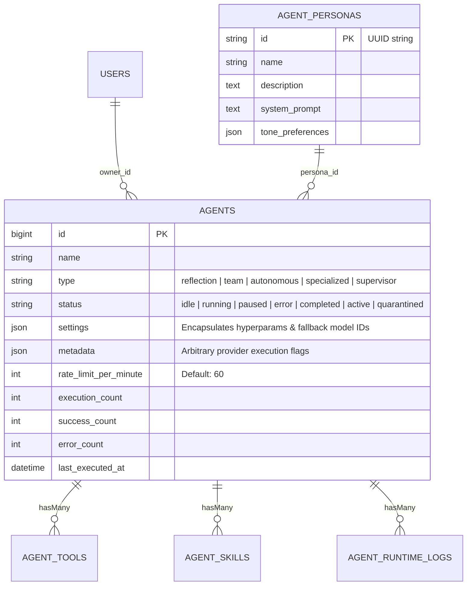

# 15. Persona Definition & Hyperparameters Backend

When an administrator configures settings inside `/hub/people-connect/agent-settings` and submits the form via POST to `route('hub.people-connect.agent-settings.save')`, the request reaches the persistence layer. 

Instead of cluttering database schemas with dozens of individual scalar columns for evolving parameters (such as `temperature`, `top_p`, `frequency_penalty`, and fallback arrays), Nexus3 relies on **`App\Models\Agent`** and **`App\Models\AgentPersona`**. This layer separates high-frequency scalar metrics from flexible JSON configuration envelopes.

---

## 1. Relational Entity Architecture & JSON Envelopes



---

## 2. Deep-Dive: `App\Models\Agent` Architecture

Examining `Agent.php` highlights how the backend classifies AI roles and maintains status states:

### 2.1 Agent Classification & State Constants
```php
class Agent extends BaseModel
{
    // Agent Types
    public const TYPE_REFLECTION = 'reflection';
    public const TYPE_TEAM = 'team';
    public const TYPE_AUTONOMOUS = 'autonomous'; // Default for PeopleConnect messaging!
    public const TYPE_SPECIALIZED = 'specialized';
    public const TYPE_SUPERVISOR = 'supervisor';

    // Agent Status Lifecycle
    public const STATUS_ACTIVE = 'active';
    public const STATUS_INACTIVE = 'inactive';
    public const STATUS_QUARANTINED = 'quarantined'; // Applied when API keys exhaust or continuously error
    public const STATUS_IDLE = 'idle';
    public const STATUS_RUNNING = 'running';
    public const STATUS_PAUSED = 'paused';
    public const STATUS_ERROR = 'error';
    public const STATUS_COMPLETED = 'completed';
```
> [!NOTE]
> **Quarantine State Protection (`STATUS_QUARANTINED`):** Why include an explicit `quarantined` state alongside `inactive` and `error`? When an agent consistently fails due to provider credential blocks or rate limit loops, automated background health checks switch its status to `quarantined`. This prevents downstream Horizon queue workers from calling unreactive endpoints until manual operator inspection takes place.

---

### 2.2 JSON Attribute Casting & Default Parameter Values
To balance structural consistency with dynamic schema needs, the model applies declarative Eloquent attribute conversions:

```php
    protected $casts = [
        'settings' => 'json',
        'metadata' => 'json',
        'is_active' => 'boolean',
        'last_executed_at' => 'datetime',
        'execution_count' => 'integer',
        'success_count' => 'integer',
        'error_count' => 'integer',
        'is_system' => 'boolean',
        'rate_limit_per_minute' => 'integer',
    ];

    protected $attributes = [
        'status' => self::STATUS_IDLE,
        'is_active' => true,
        'execution_count' => 0,
        'success_count' => 0,
        'error_count' => 0,
        'is_system' => false,
        'rate_limit_per_minute' => 60,
    ];
```
> [!TIP]
> **The JSON Settings Envelope:** By casting `'settings' => 'json'`, the application stores hyperparameter definitions as a single unified array inside MySQL:
> ```json
> {
>   "temperature": 0.7,
>   "max_tokens": 2048,
>   "model_id": 14,
>   "fallback_models": [18, 22, 5]
> }
> ```
> This structure allows UI developers to add new tuning slider inputs in the dashboard without writing database schema migrations to insert individual columns.

---

## 3. Telemetry Tracking & Success Rate Calculation

Because high-concurrency WhatsApp messaging requires operational reliability, `Agent` integrates native calculation methods directly within the Eloquent Model:

```php
    public function getSuccessRate(): float
    {
        if ($this->execution_count === 0) {
            return 0.0;
        }

        return round(($this->success_count / $this->execution_count) * 100, 2);
    }

    public function incrementExecution(): void
    {
        $this->increment('execution_count');
        $this->update(['last_executed_at' => now()]);
    }

    public function recordSuccess(): void
    {
        $this->increment('success_count');
        $this->update(['status' => self::STATUS_IDLE]);
    }

    public function recordError(): void
    {
        $this->increment('error_count');
        $this->update(['status' => self::STATUS_ERROR]);
    }
```
During an autonomous reply cycle, job supervisors call `$agent->incrementExecution()`, triggering atomic database increment operations. Once an LLM payload returns successfully, `$agent->recordSuccess()` records the completed attempt and reverts the agent status to `idle`.

---

## 4. Decoupled Personas: `App\Models\AgentPersona`

To let multiple agents share baseline conversational traits across different departments, system instructions are abstracted into an independent model, **`AgentPersona`**:

```php
class AgentPersona extends BaseModel
{
    use HasFactory;

    public $incrementing = false;
    protected $keyType = 'string'; // Uses non-incrementing UUID strings!

    protected $fillable = [
        'id',
        'name',
        'description',
        'system_prompt',
        'tone_preferences',
    ];

    protected $casts = [
        'tone_preferences' => 'json',
    ];

    public function agents()
    {
        return $this->hasMany(Agent::class, 'persona_id');
    }
}
```
Notice that `AgentPersona` uses **UUID strings** (`public $incrementing = false; protected $keyType = 'string';`) rather than integer auto-increment keys. This allows system prompts and tone preference configurations to be exported, synchronized, or deployed across multiple staging environments without risking foreign key ID conflicts.

---

## 5. Summary & Next Step

We have mapped the entity architecture, JSON hyperparameter structures, and automated operational logging driving `App\Models\Agent` and `AgentPersona`. But what happens when an agent's configured model hits API rate limits during an ongoing interaction? How does the backend track pool exhaustion and handle dynamic credential swapping?

In **Task 19 (Multi-Key Rotation Engine & Encrypted Storage)**, we analyze the secret management layer to uncover how Round-Robin LRU rotation prevents customer messaging dropouts during API outages.
