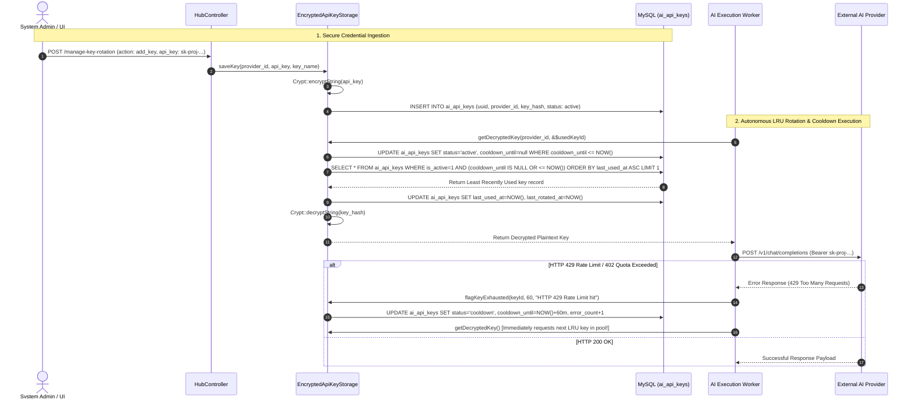

# 16. Multi-Key Rotation Engine & Encrypted Storage

To prevent customer messaging dropouts caused by third-party AI provider outages, rate limits (HTTP 429), or billing threshold exclusions (HTTP 402), Nexus3 incorporates an advanced credential resilience architecture.

Implemented across **`App\Models\AIApiKey`**, **`App\Services\AiModelsHub\EncryptedApiKeyStorage`**, and managed via **`HubController::manageKeyRotation`**, the Multi-Key Rotation Engine ensures uninterrupted conversational processing through automated key pool switching.

---

## 1. Encryption & Rotation Flow Architecture



---

## 2. Cipher Storage & UUID Entity Model (`AIApiKey`)

To protect access credentials, raw keys are never stored in plaintext within the database. `App\Models\AIApiKey` binds directly to the `ai_api_keys` schema table and enforces non-incrementing primary identifiers:

```php
class AIApiKey extends BaseModel
{
    protected $table = 'ai_api_keys';
    public $incrementing = false;
    protected $keyType = 'string'; // UUID Primary Key

    protected $fillable = [
        'id', 'provider_id', 'key_hash', 'name', 
        'is_active', 'is_default', 'status', 
        'expires_at', 'last_rotated_at', 'workspace_id', 
        'last_used_at', 'cooldown_until', 'error_count',
    ];
```
When `EncryptedApiKeyStorage::storeKey()` persists a secret, it delegates cryptographic encryption to Laravel's global cipher:
```php
$encryptedKey = Crypt::encryptString($key);

$apiKey = AIApiKey::create([
    'id' => Str::uuid(),
    'provider_id' => $providerId,
    'key_hash' => $encryptedKey,
    'name' => $name ?? "API Key for Provider {$providerId}",
    'is_active' => true,
    'is_default' => ! $hasDefault,
]);
```
> [!WARNING]
> **Application Encryption Security:** Because cryptographic hashes rely on the application key (`APP_KEY` in `.env`), rotating or losing the system `APP_KEY` will render every entry in `ai_api_keys.key_hash` unreadable. Always generate database backup archives before initiating environment rotation procedures.

---

## 3. The LRU Round-Robin Selection Algorithm

The core functionality of the rotation engine lives within `EncryptedApiKeyStorage::getDecryptedKey()`. It operates as a structured three-step verification pipeline before exposing credentials to internal workers:

### 3.1 Step 1: Automatic Cooldown Expiry Reclamation
Before querying for active credentials, the engine evaluates existing cooldown flags and reactivates expired temporary locks:
```php
AIApiKey::where('provider_id', $providerId)
    ->where('status', 'cooldown')
    ->where('cooldown_until', '<=', now())
    ->update(['status' => 'active', 'cooldown_until' => null]);
```

### 3.2 Step 2: Least Recently Used (LRU) Pool Sorting
The query ignores expired, disabled, or locked records and selects the next candidate using an ascending timestamp ordering on `last_used_at`:
```php
$apiKey = AIApiKey::where('provider_id', $providerId)
    ->where('is_active', true)
    ->where(function ($query) {
        $query->whereNull('status')->orWhereNotIn('status', ['expired', 'cooldown']);
    })
    ->where(function ($query) {
        $query->whereNull('cooldown_until')->orWhere('cooldown_until', '<=', now());
    })
    ->where(function ($query) {
        $query->whereNull('expires_at')->orWhere('expires_at', '>', now());
    })
    ->orderBy('last_used_at', 'asc') // Picks the key resting idle the longest!
    ->orderByDesc('is_default')
    ->first();
```

### 3.3 Step 3: Rotation Timestamp Attribution & Decryption
Once a candidate is retrieved, the engine updates operational usage timestamps and returns the decrypted plaintext string:
```php
$apiKey->update([
    'last_used_at' => now(),
    'last_rotated_at' => now(),
]);

$usedKeyId = $apiKey->id;

try {
    return Crypt::decryptString($apiKey->key_hash);
} catch (\Exception $e) {
    Log::error("Failed to decrypt API key for provider {$providerId}: {$e->getMessage()}");
    return null;
}
```

---

## 4. Cooldown Flagging & Controller Management

When execution workers encounter provider throughput errors, they trigger `flagKeyExhausted()`, immediately removing the affected credential from active pool selection:

```php
public function flagKeyExhausted(string $keyId, int $cooldownMinutes = 60, string $reason = ''): bool
{
    $apiKey = AIApiKey::find($keyId);
    if (! $apiKey) return false;

    $apiKey->update([
        'status' => 'cooldown',
        'cooldown_until' => now()->addMinutes($cooldownMinutes),
        'error_count' => ($apiKey->error_count ?? 0) + 1,
        'last_rotated_at' => now(),
    ]);

    Log::warning("API Key [{$apiKey->name}] flagged in cooldown for {$cooldownMinutes} minutes. Reason: {$reason}");
    return true;
}
```
Operators can manually override these rotational states through the dashboard via `HubController::manageKeyRotation()`, which responds to operational JSON requests:
- **`add_key`**: Injects an encrypted credential into the provider rotation pool.
- **`release_key`**: Reverts an exhausted key back to an active state (`cooldown_until => null`).
- **`set_cooldown`**: Temporarily quarantines a key for a user-specified duration.
- **`revoke_key`**: Removes an entry entirely from the cryptographic key storage layer.

---

## 5. Summary & Next Step

We have thoroughly documented the encryption patterns, automated cooldown recovery mechanics, and LRU algorithms driving the Multi-Key Rotation Engine.

While these credential architectures offer robust operational resilience, a close inspection of the Studio interface and related controller endpoints reveals important distinctions between functional configurations and placeholder design components.

In **Task 20 (Mockup Identification & Missing Capability Bridges)**, we conduct a deep-dive architecture assessment to isolate fully executed subsystems from interface mockups and identify missing runtime connections across the platform.
