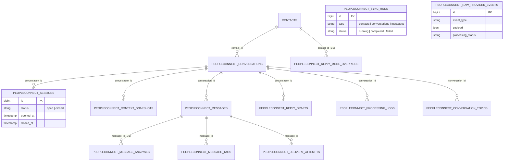

# 19. 13-Table Database Schema Blueprint & Foreign Keys

To handle real-time messaging synchronization between WAHA (WhatsApp HTTP API), Google Cloud Firestore, and AI inference engines, PeopleConnect relies on a structured schema architecture.

Defined across **`database/migrations/2026_06_11_000004_create_peopleconnect_tables.php`**, this schema consists of **exactly 13 dedicated relational tables** bound to the base application tables via cascading foreign keys, indices, and data tracking attributes.

---

## 1. Relational Entity Reference Map (ERD)

---

## 2. Detailed Table Architecture Specifications

### Table 1: `peopleconnect_conversations`
Maintains operational state and read tracking metrics for active messaging channels.
* **Primary Key:** `id` (unsignedBigInteger, auto-increment)
* **Foreign Keys:** `contact_id` references `contacts(id)` on delete **cascade**.
* **Unique Constraints:** Composite unique index on `['contact_id', 'channel', 'provider']`.
* **Key Columns:**
  * `channel`: String(50), Default `'whatsapp'`.
  * `provider`: String(50), Default `'waha'`.
  * `provider_conversation_id`: String(255), Nullable (stores WAHA chatId e.g. `201xxxxxxxxx@c.us`).
  * `status`: String(30), Default `'active'`.
  * `unread_count`: UnsignedInteger, Default `0`.
  * `reply_mode_effective`: String(20), Default `'manual'`.

---

### Table 2: `peopleconnect_sessions`
Manages 2-hour conversational sliding interaction windows used to organize message histories.
* **Foreign Keys:** `conversation_id` references `peopleconnect_conversations(id)` (**cascade**); `contact_id` references `contacts(id)` (**cascade**).
* **Key Columns:**
  * `status`: String(20), Default `'open'`.
  * `opened_at` / `closed_at`: Timestamp, Nullable.
  * `closed_reason`: String(50), Nullable (e.g., `'timeout_exceeded'`, `'operator_closed'`).
  * `message_count`: UnsignedInteger, Default `0`.
  * `summary`: Text, Nullable (AI memory summary generated upon session termination).

---

### Table 3: `peopleconnect_context_snapshots`
Stores immutable JSON context snapshots to prevent runtime race conditions during background AI generation tasks.
* **Foreign Keys:** `conversation_id` (**cascade**); `session_id` references `peopleconnect_sessions(id)` (**cascade**).
* **Key Columns:**
  * `payload`: JSON (Stores historical chat arrays and extracted facts).
  * `token_estimate`: UnsignedInteger, Default `0` (Calculated using the 4-char heuristic).
  * `agent_id` / `model_id`: UnsignedBigInteger, Nullable.

---

### Table 4: `peopleconnect_messages`
Serves as the primary operational messaging log, containing raw text content and transmission status flags.
* **Foreign Keys:** `conversation_id`, `contact_id` (**cascade**); `session_id`, `context_snapshot_id` (**set null**).
* **Indices:** Unique index on `['conversation_id', 'waha_message_id']`; Normal index on `provider_payload_hash`.
* **Key Columns:**
  * `sender_type`: String(20) (`user`, `contact`, `agent`, `system`).
  * `direction`: String(10) (`inbound`, `outbound`).
  * `body`: Text.
  * `status`: String(20), Default `'queued'`.
  * `waha_message_id`: String(255), Nullable.
  * `provider_payload_hash`: String(64), Nullable (Sha256 hash used to block duplicate webhook executions).
  * `emotional_baseline_snapshot` / `tone_mirroring_snapshot`: JSON, Nullable.
  * `sent_at`, `delivered_at`, `read_at`, `failed_at`: Timestamps, Nullable.

---

### Table 5: `peopleconnect_message_analyses`
Records NLP evaluation outputs, conversational sentiment scores, and urgency markers for each message.
* **Foreign Keys:** `message_id` references `peopleconnect_messages(id)` (**cascade**).
* **Key Columns:**
  * `topic`, `intent`, `tone`: String(100), Nullable.
  * `sentiment`: String(50), Nullable (`positive`, `neutral`, `negative`).
  * `language`: String(10), Nullable (e.g., `'ar'`, `'en'`).
  * `urgency`: String(20), Nullable (`low`, `normal`, `high`, `critical`).
  * `safety_flags`: JSON, Nullable (Contains flagged triggers or policy violations).
  * `reply_needed`: Boolean, Default `false`.

---

### Table 6: `peopleconnect_message_tags`
Allows associating custom classification tags with individual messaging interactions.
* **Foreign Keys:** `message_id` (**cascade**).
* **Unique Constraints:** Composite unique index on `['message_id', 'tag']`.
* **Key Columns:** `tag`: String(50).

---

### Table 7: `peopleconnect_reply_drafts`
Holds draft AI message replies pending operator approval under supervised Copilot Mode workflows.
* **Foreign Keys:** `conversation_id`, `message_id` (**cascade**); `context_snapshot_id` (**set null**).
* **Key Columns:**
  * `body`: Text.
  * `status`: String(20), Default `'pending'` (`pending`, `approved`, `rejected`, `sent`, `failed`).
  * `approved_by`: UnsignedBigInteger, Nullable (Stores ID of the reviewing dashboard operator).
  * `approved_at`, `sent_at`, `rejected_at`: Timestamps, Nullable.

---

### Table 8: `peopleconnect_delivery_attempts`
Tracks background retry scheduling and transmission attempts for external HTTP provider requests.
* **Foreign Keys:** `message_id` (**cascade**).
* **Key Columns:**
  * `attempt_number`: UnsignedInteger.
  * `status`: String(20) (`success`, `failed`).
  * `waha_response`: JSON, Nullable (Contains raw HTTP response headers and payloads returned by the gateway).
  * `error_message`: Text, Nullable.

---

### Table 9: `peopleconnect_sync_runs`
Logs background database-to-Firestore runtime synchronization jobs and audit histories.
* **Key Columns:**
  * `type`: String(30) (`contacts`, `conversations`, `messages`).
  * `status`: String(20), Default `'running'` (`running`, `completed`, `failed`).
  * `contacts_found`, `conversations_found`, `messages_found`: UnsignedInteger, Default `0`.
  * `errors`: JSON, Nullable.
  * `triggered_by`: String(50), Nullable (`scheduler`, `manual`).

---

### Table 10: `peopleconnect_raw_provider_events`
Serves as an immutable logging table for incoming webhook event transmissions from external messaging APIs.
* **Key Columns:**
  * `event_type`: String(50) (e.g., `message.any`, `state.change`).
  * `payload`: JSON (Stores unparsed external HTTP webhook payloads).
  * `session_name`: String(100), Nullable.
  * `processing_status`: String(20), Default `'pending'` (`pending`, `processed`, `error`).

---

### Table 11: `peopleconnect_processing_logs`
Stores debugging notes, execution traces, and operational error histories for conversational threads.
* **Foreign Keys:** `conversation_id` (**cascade**).
* **Key Columns:**
  * `event_type`: String(50).
  * `description`: Text.
  * `payload`: JSON, Nullable.

---

### Table 12: `peopleconnect_conversation_topics`
Tracks topic shifts and interaction trends within long-term messaging relationships.
* **Foreign Keys:** `conversation_id` (**cascade**); `first_message_id`, `last_message_id` (**set null**).
* **Unique Constraints:** Composite unique index on `['conversation_id', 'name']`.
* **Key Columns:**
  * `name`: String(100).
  * `message_count`: UnsignedInteger, Default `1`.
  * `first_seen_at` / `last_seen_at`: Timestamp, Nullable.

---

### Table 13: `peopleconnect_reply_mode_overrides`
Defines operational execution tolerances and rules for individual contacts across the system.
* **Foreign Keys:** `contact_id` references `contacts(id)` (**cascade**).
* **Unique Constraints:** Unique index on `contact_id` (Ensures a clean 1:1 behavioral rule mapping per contact).
* **Key Columns:**
  * `reply_mode`: String(20) (`manual`, `copilot`, `autopilot`).
  * `set_by`: String(50), Nullable.
  * `reason`: String(255), Nullable (Documents operational rationales for behavioral rule exceptions).

---

## 3. Summary & Next Step

We have successfully documented the database schema blueprint for the 13 core relational tables underlying the PeopleConnect platform.

To build upon this structural analysis, our next step is to examine how application logic connects to this database layer. In **Task 23 (Complete Eloquent Models & Service Dependency Matrix)**, we map the corresponding PHP class abstractions to show how data flows through backend services and background jobs.
