# ٠١. استيعاب Webhook والأمان ضد تكرار البيانات في WAHA

عندما تصل رسالة واتساب واردة إلى بنية **Nexus3 PeopleConnect** التحتية، تبدأ الحمولة كطلب HTTP POST عبر Webhook يُرسل بواسطة **WAHA** (واجهة برمجة تطبيقات واتساب HTTP - المدعومة بمحركات أساسية مثل `NOWEB` أو `Wwebjs`).

قبل إجراء أي تحليل لغوي، أو تقسيم للجلسات، أو تسوية لجهات الاتصال، يجب أن تعبر الحمولة الحدود الخارجية للنظام عبر طبقة استيعاب محصنة ومصممة لحماية المجال الداخلي من الأحداث المكررة وإعادة إرسال الشبكة العشوائي.

---

## ١. تسلسل التدفق المعماري

```mermaid
sequenceDiagram
    autonumber
    actor WhatsApp as عقدة WAHA (الحاوية)
    participant Route as موجه Laravel API / Webhook
    participant Service as خدمة WahaWebhookIngestionService
    participant DB as MySQL (peopleconnect_raw_provider_events)
    participant Queue as طابور Laravel Horizon / Redis

    WhatsApp->>Route: طلب POST /api/v1/webhooks/waha (حمولة JSON)
    Route->>Service: ingest(array $payload)
    
    rect rgb(20, 28, 45)
        note over Service: ١. التحقق الهيكلي من صحة الحمولة
        Service->>Service: الفحص $payload['session'] و $payload['payload']['id']
        alt غياب الجلسة أو معرف المعرف (باستثناء 'session.status')
            Service-->>Route: إنهاء وتسجيل تحذير (إرجاع 200 OK لمنع إعادة الإرسال)
        end
    end

    rect rgb(35, 20, 45)
        note over Service, DB: ٢. منع تكرار الأحداث الخام (استعلام JSON)
        Service->>DB: SELECT EXISTS WHERE session_name=? AND payload->payload->id=?
        alt اكتشاف حدث مكرر
            Service-->>Route: إنهاء وتسجيل معلومة (تخطي التنفيذ المكرر)
        end
    end

    rect rgb(20, 45, 35)
        note over Service, Queue: ٣. التخزين والتسليم غير التزامني
        Service->>DB: INSERT INTO peopleconnect_raw_provider_events (status: 'pending')
        Service->>Queue: إرسال المهمة ProcessWahaWebhookJob(payload, rawEventId)
        Service-->>Route: إرجاع 200 OK (تأكيد الاستلام لـ WAHA)
    end
```



---

## ٢. الهدف الأساسي لطبقة الاستيعاب

الهدف التصميمي الجوهري لخط أنابيب الاستيعاب هو **فصل استجابة HTTP webhooks عن المهام غير التزامنية الثقيلة على قاعدة البيانات**. نظرًا لأن المزودين الخارجيين مثل واتساب يتطلبون تأكيد استلام سريع برمز HTTP 200 (عادةً في غضون أقل من ٥ ثوانٍ) لمنع محاولات إعادة الإرسال المستمرة، فإن `WahaWebhookIngestionService` لا تنفذ أبدًا منطقًا معقدًا بشكل تزامني.

بدلاً من ذلك، تعمل الخدمة كـ **محرك تدقيق وحراسة خفيف الوزن** مع ثلاثة التزامات رئيسية:
1. **التحقق من السلامة الهيكلية:** التأكد من مطابقة البيانات الواردة لمواصفات WAHA.
2. **منع التكرار المباشر:** الحماية ضد إعادة إرسال الأحداث المطابقة الناتجة عن أعطال الشبكة المؤقتة أو إعادة المحاولة.
3. **تسجيل التدقيق الخام غير القابل للتعديل:** حفظ نص حمولة JSON الخام في التخزين الدائم قبل استدعاء عمال الخلفية، مما يضمن القدرة الكاملة على إعادة التشغيل والتعافي من الكوارث.

---

## ٣. التحليل العميق للكود المصدري

تم تغليف محرك الاستيعاب داخل `App\Services\PeopleConnect\WahaWebhookIngestionService`. فيما يلي تفكيك مشروح لمنطق عملياته:

### ٣.١ التحقق والاستخراج
```php
public function ingest(array $payload): void
{
    $session = $payload['session'] ?? null;
    $event = $payload['event'] ?? 'unknown';
    $messageId = $payload['payload']['id'] ?? null;

    if (! $session) {
        Log::warning('WAHA Webhook Ingestion: Missing session', ['payload' => $payload]);
        return;
    }

    // تجاهل المعرفات المفقودة فقط إذا كان الحدث عبارة عن إشعار بحالة دورة الحياة
    if (! $messageId && $event !== 'session.status') {
        Log::warning('WAHA Webhook Ingestion: Missing payload id', ['payload' => $payload]);
        return;
    }
```
> [!NOTE]
> لماذا تنتهي الدالة بهدوء باستخدام `return;` بدلاً من إلقاء استثناء؟ لأن إلقاء خطأ HTTP 500 غير معالج سيجبر WAHA على الدخول في دورة إعادة محاولة متكررة، مما يغرق الخادم بحمولات مشوهة. من خلال تسجيل تحذير والإنهاء بأمان، يرجع Nexus تأكيد HTTP 200، مما يفرغ طابور إعادة المحاولة لدى المزود.

---

### ٣.٢ بنية منع التكرار باستعلام JSON-Path
إحدى أكثر ميزات الموثوقية قوة في PeopleConnect هي محرك منع التكرار المستند إلى مسار SQL JSON:

```php
    // فحص منع التكرار على مستوى الحدث الخام
    if ($messageId) {
        $existing = PeopleConnectRawProviderEvent::where('session_name', $session)
            ->where('payload->payload->id', '=', $messageId)
            ->exists();

        if ($existing) {
            Log::info('WAHA Webhook Ingestion: Duplicate payload detected, skipping.', [
                'session' => $session, 
                'message_id' => $messageId
            ]);

            return;
        }
    }
```
> [!IMPORTANT]
> لاحظ استخدام صياغة السهم لـ JSON في Laravel Eloquent: `where('payload->payload->id', '=', $messageId)`. يُنشئ هذا استعلام استخراج MySQL JSON (`JSON_EXTRACT(payload, "$.payload.id")`). حتى لو قامت WAHA بث الرسالة نفسها مرتين عبر اتصالات HTTP مختلفة، يتم إيقاف الطلب الثاني فورًا قبل أن يصل إلى جداول المحادثات أو يطلق معالجة الذكاء الاصطناعي.

---

### ٣.٣ إنشاء الحدث الخام وتسليم الطابور
بمجرد التحقق ومنع التكرار، تقوم الخدمة بكتابة الحمولة الخام في MySQL وتسليم التنفيذ إلى **Laravel Horizon**:

```php
    // تخزين حدث المزود الخام
    $rawEvent = PeopleConnectRawProviderEvent::create([
        'event_type' => $payload['event'] ?? 'unknown',
        'payload' => $payload,
        'session_name' => $session,
        'received_at' => now(),
        'processing_status' => 'pending', // في انتظار عامل الخلفية
    ]);

    ProcessWahaWebhookJob::dispatch($payload, $rawEvent->id);
}
```
> [!TIP]
> لاحظ أن `ProcessWahaWebhookJob::dispatch` يمرر كل من `$payload` و `$rawEvent->id`. عندما ينهي عامل الخلفية معالجة Webhook بنجاح، يُحدث `processing_status` من `'pending'` إلى `'completed'`. وإذا حدث استثناء أثناء التنفيذ في الخلفية، يتحول إلى `'failed'`، مما يتيح للمطورين فحص الحمولات الخام التي تسببت في أخطاء تالية.

---

## ٤. مخطط قاعدة البيانات: `peopleconnect_raw_provider_events`

يعمل هذا الجدول كـ "الصندوق الأسود لتسجيل الرحلات" للنظام، حيث يحفظ كل حدث خام وارد من مزودي الرسائل الخارجيين.

| اسم العمود | النوع | المعدلات | الغرض الهندسي |
| :--- | :--- | :--- | :--- |
| `id` | `BIGINT UNSIGNED` | `PRIMARY KEY, AUTO_INCREMENT` | المعرف الداخلي الفريد لحدث المزود الخام. |
| `event_type` | `VARCHAR(255)` | `NOT NULL, INDEX` | فئة الحدث (مثل `message` أو `message.any` أو `session.status`). |
| `session_name` | `VARCHAR(255)` | `NOT NULL, INDEX` | معرف جلسة WAHA (مثل `default` أو `sales_support`). |
| `payload` | `JSON` | `NOT NULL` | كتلة JSON الكاملة وغير المضغوطة المستلمة من WAHA. |
| `processing_status`| `ENUM(...)` | `DEFAULT 'pending', INDEX` | تتبع الحالة: `'pending'` أو `'processing'` أو `'completed'` أو `'failed'`. |
| `received_at` | `TIMESTAMP` | `NOT NULL` | الطابع الزمني الدقيق للاستلام الأولي عبر HTTP. |
| `created_at` | `TIMESTAMP` | `NULL` | طوابع التدقيق القياسية في Laravel. |
| `updated_at` | `TIMESTAMP` | `NULL` | طوابع التدقيق القياسية في Laravel. |

---

## ٥. الملخص والخطوات التالية في خط الأنابيب

بمجرد إرسال `ProcessWahaWebhookJob` إلى Redis، تكتمل استجابة HTTP الفورية في أجزاء من المليثانية. تنتقل العمليات الثقيلة الآن إلى عامل طابور الخلفية، حيث يتولى **المهمة ٠٥ (قفل Redis الذري وتأكيد جهة الاتصال)** ربط رقم هاتف واتساب الخام بجهة اتصال نشطة في Nexus دون إثارة ظروف سباق التزامن.
