# ٠٢. قفل Redis الذري وتأكيد جهة الاتصال

بمجرد عبور حدث WAHA Webhook الوارد لبوابات الاستيعاب ومنع التكرار، تبدأ المهمة `ProcessWahaWebhookJob` معالجة الحمولة بشكل غير تزامني داخل عامل الطابور. التحدي التشغيلي الأول في خطوط أنابيب الرسائل ذات التدفق العالي هو **تأكيد الهوية (Identity Resolution)**: تحديد ما إذا كان رقم الهاتف الوارد ينتمي لعميل حالي أم لعميل محتمل جديد تمامًا.

في بيئات التزامن العالي (مثل الحملات التسويقية الضخمة أو روبوتات المحادثة الآلية)، قد يرسل المستخدم عدة رسائل واتساب في أجزاء من الثانية. بدون إدارة التزامن، فإن قيام عمال طابور متعددين بمحاولة تأكيد الرقم غير المعروف نفسه في وقت واحد سيؤدي إلى **تكرار ناتج عن ظروف السباق (Race Condition Duplication)** — مما يخلق سجلات متضاربة ومكررة في جدول `contacts`.

---

## ١. بنية الدفاع ضد التزامن (أقفال Redis الذرية)

للقضاء على تفتت الهويات والتجميد التبادلي لقاعدة البيانات، يستخدم Nexus خط أنابيب أقفال الاستبعاد التبادلي الذرية المدعوم بـ **Redis** (`Cache::lock`).

```mermaid
sequenceDiagram
    autonumber
    actor WorkerA as عامل الطابور ١ (الرسالة ١)
    actor WorkerB as عامل الطابور ٢ (الرسالة ٢ - تزامن)
    participant Resolver as خدمة PeopleConnectContactResolver
    participant Redis as مجمع تخزين Redis
    participant Identity as موجه الهوية ContactIdentityResolver
    participant DB as MySQL (contacts & contact_identifiers)

    WorkerA->>Resolver: resolve(chatId, "20100000000", "Ahmed")
    WorkerB->>Resolver: resolve(chatId, "20100000000", "Ahmed")
    
    rect rgb(35, 20, 45)
        note over WorkerA, Redis: العامل ١ يحصل على القفل الذري
        Resolver->>Redis: SETNX contact_resolve_20100000000 (عمر 10s)
        Redis-->>WorkerA: تم الحصول على القفل بنجاح!
    end

    rect rgb(45, 20, 20)
        note over WorkerB, Redis: العامل ٢ يتم حظره بواسطة قفل التزامن
        Resolver->>Redis: SETNX contact_resolve_20100000000 (عمر 10s)
        Redis-->>WorkerB: القفل مشغول -> العامل ٢ ينتظر حتى 5s...
    end

    rect rgb(20, 45, 35)
        note over WorkerA, DB: العامل ١ ينفذ تأكيد الهوية وإنشاء السجل
        Resolver->>Identity: resolve([whatsapp: 20100000000, phone: 20100000000])
        Identity->>DB: SELECT FROM contact_identifiers WHERE value="20100000000"
        DB-->>Identity: null (غير موجود)
        Resolver->>DB: INSERT INTO contacts (name: "Ahmed", phone: "20100000000", type: "lead")
        Resolver->>DB: INSERT INTO contact_identifiers (type: "whatsapp", value: "20100000000")
        Resolver->>Redis: تحرير القفل (contact_resolve_20100000000)
    end

    rect rgb(20, 35, 45)
        note over WorkerB, DB: العامل ٢ يفك حظره -> إعادة تحقق آمنة
        Redis-->>WorkerB: تم الاستحواذ على القفل (المحول من العامل ١)
        Resolver->>Identity: resolve([whatsapp: 20100000000, phone: 20100000000])
        Identity->>DB: SELECT FROM contact_identifiers WHERE value="20100000000"
        DB-->>Identity: تم العثور على جهة الاتصال #104! (أنشأها العامل ١)
        Resolver->>Redis: تحرير القفل (contact_resolve_20100000000)
        Resolver-->>WorkerB: إرجاع جهة الاتصال الحالية #104 (بدون إنشاء مكرر!)
    end
```



---

## ٢. التحليل العميق للكود المصدري

المنطق المسؤول عن تأكيد الهوية يقع في `App\Services\PeopleConnect\PeopleConnectContactResolver`. فيما يلي تفكيك تقني دقيق لتنفيذه:

### ٢.١ الاستحواذ على القفل الذري
```php
public function resolve(string $chatId, string $phone, string $displayName = ''): Contact
{
    // حل مشكلة ظروف السباق في تأكيد هوية جهة الاتصال.
    // نستخدم Cache::lock() (أقفال Redis الذرية) بناءً على رقم الهاتف لتسلسل المعالجة.
    // الطلبات المتزامنة تنتظر حتى 5 ثوانٍ.
    $lock = Cache::lock("contact_resolve_{$phone}", 10);

    try {
        $lock->block(5);
```
> [!IMPORTANT]
> لاحظ قيمتي المهلة المتميزتين: `Cache::lock("contact_resolve_{$phone}", 10)` يحدد **أقصى عمر للقفل (TTL) بـ ١٠ ثوانٍ**. يعمل هذا كآلية لمنع التجميد التبادلي؛ حتى لو تعطل عامل الطابور بشكل غير متوقع أو واجه خطأ قاتلاً في PHP، يزيل Redis القفل تلقائيًا بعد ١٠ ثوانٍ. وعلى العكس من ذلك، فإن `$lock->block(5)` يأمر العمال المتزامنين **بإيقاف التنفيذ مؤقتًا حتى ٥ ثوانٍ** انتظارًا للقفل قبل إلقاء استثناء `LockTimeoutException` وإعادة محاولة المهمة.

---

### ٢.٢ محرك المطابقة متعدد المعرفات
بدلاً من تنفيذ عمليات بحث بسيطة مقابل عمود `contacts.phone` المفرد، يوجه Nexus معالجة الهويات من خلال الوسيط الموحد (`ContactIdentityResolver`):

```php
        // ١. محاولة التأكيد باستخدام ContactIdentityResolver
        $identifiers = [
            ['type' => 'whatsapp', 'value' => $phone],
            ['type' => ContactIdentifier::TYPE_PHONE, 'value' => $phone],
        ];

        $contact = $this->identityResolver->resolve($identifiers);
```
> [!TIP]
> لماذا يتم فحص كل من نوعي المعرفات `'whatsapp'` و `'phone'`؟ لأن العميل قد يكون قد دخل النظام في الأصل عبر نموذج ويب أو استيراد CRM (مسجل تحت `TYPE_PHONE`) ولم يتفاعل سابقًا عبر واتساب. من خلال فحص كلا المخططين، ينجح PeopleConnect في ربط تدفقات واتساب الواردة بملفات التعريف الموحدة القائمة دون إنشاء هوية زائر مكررة.

---

### ٢.٣ التحديث الذكي للنصوص المؤقتة والمعالجة الذاتية
عند التعرف على جهة اتصال حالية، تنفذ الخدمة روتينين للمعالجة الذاتية قبل الإنهاء:

```php
        if ($contact) {
            // التأكد من ربط معرف واتساب إذا لم يكن مرتبطًا
            $this->identityResolver->linkIdentifier($contact, 'whatsapp', $phone, false);

            // تحديث الاسم المؤقت إذا توفر اسم عرض حقيقي
            if (! empty($displayName) && (
                empty($contact->name) || 
                str_starts_with($contact->name, 'WAHA Contact') || 
                str_starts_with($contact->name, 'WhatsApp User') || 
                $contact->name === $phone
            )) {
                $contact->update(['name' => $displayName, 'display_name' => $displayName]);
            }

            return $contact;
        }
```
> [!NOTE]
> غالبًا ما يدخل العملاء المحتملون الجدد إلى النظام دون اسم بشري، ويرثون أسماء مؤقتة مثل `'WAHA Contact 9421'` أو `'WhatsApp User'`. عندما يرسل المستخدم أخيرًا اسم العرض في WAHA (`pushname`)، يلتقط المحلل ذلك ويرقي حقول `name` و `display_name` الأساسية في الوقت الفعلي.

---

### ٢.٤ إنشاء العميل المحتمل الجديد والمزامنة مع المركز
إذا لم يتم العثور على ملف تعريف مطابق في أي جدول معرفات، يتم إنشاء ملف تعريف جديد كعميل محتمل (`Lead`) وتوجيهه فورًا إلى مركز جهات الاتصال الرئيسي:

```php
        // ٢. لم يتم العثور عليه، إنشاء جهة اتصال جديدة
        $contactName = ! empty($displayName) ? $displayName : 'WAHA Contact '.substr($phone, -4);

        $contact = Contact::create([
            'name' => $contactName,
            'phone' => $phone,
            'whatsapp_number' => $phone,
            'type' => 'lead',
            'is_active' => true,
        ]);

        // ربط المعرفات للمطابقة السريعة المستقبليّة
        $this->identityResolver->linkIdentifier($contact, ContactIdentifier::TYPE_PHONE, $phone, true);
        $this->identityResolver->linkIdentifier($contact, 'whatsapp', $phone, false);

        // تشغيل مزامنة تفاصيل جهة الاتصال عبر المركز
        $this->contactHubService->syncContactDetails($contact);

        return $contact;
    } finally {
        $lock->release();
    }
}
```
> [!CAUTION]
> لاحظ أن `$lock->release()` تقع بوضوح داخل كتلة `finally`. بغض النظر عما إذا كان تأكيد الهوية ينتهي بنجاح، أو يثير استثناء تحقق في قاعدة البيانات، أو يواجه مهلة شبكة في `ContactHubService`، فإنه يُضمن تحرير قفل Redis فور الخروج من الدالة، مما يحافظ على التدفق العالي لخط الأنابيب.

---

## ٣. بنية قاعدة البيانات: مخطط الهوية

لدعم تعيين المعرفات متعددة الأشكال عبر قنوات الرسائل، يعتمد PeopleConnect على هيكل علائقي منفصل بين جهات الاتصال الأساسية وخصائص هويتها.

### `contacts` (جدول الكيان الأساسي)
| اسم العمود | النوع | المعدلات | الغرض الهندسي |
| :--- | :--- | :--- | :--- |
| `id` | `BIGINT UNSIGNED` | `PRIMARY KEY, AUTO_INCREMENT` | المعرف الفريد لملف التعريف. |
| `name` | `VARCHAR(255)` | `NOT NULL` | اسم العرض الكامل (قابل للتحديث من النصوص المؤقتة). |
| `phone` | `VARCHAR(50)` | `NULL, INDEX` | رقم الهاتف الأساسي الافتراضي. |
| `whatsapp_number` | `VARCHAR(50)` | `NULL, INDEX` | رقم الهدف المخصص لشبة واتساب. |
| `type` | `VARCHAR(50)` | `DEFAULT 'lead', INDEX` | حالة تقسيم CRM (`lead`, `customer`, `vip`). |
| `is_active` | `BOOLEAN` | `DEFAULT true` | يحدد ما إذا كانت القواعد والوكلاء الآليون يمكنهم التفاعل مع الكيان. |

### `contact_identifiers` (جدول التوجيه متعدد الأشكال)
| اسم العمود | النوع | المعدلات | الغرض الهندسي |
| :--- | :--- | :--- | :--- |
| `id` | `BIGINT UNSIGNED` | `PRIMARY KEY, AUTO_INCREMENT` | المعرف الداخلي لسجل التوجيه. |
| `contact_id` | `BIGINT UNSIGNED` | `FOREIGN KEY (contacts.id), INDEX` | مؤشر علائقي لملف التعريف الأساسي. |
| `type` | `VARCHAR(50)` | `NOT NULL, INDEX` | نوع القناة: `'whatsapp'`, `'phone'`, `'telegram'`, `'email'`. |
| `value` | `VARCHAR(255)` | `NOT NULL, INDEX` | قيمة المعرف المنظفة (مثل أرقام دولية `20100000000`). |
| `is_primary` | `BOOLEAN` | `DEFAULT false` | يحدد وسيلة الاتصال الرئيسية للبث الآلي الخارجي. |

---

## ٤. الملخص والخطوات التالية في خط الأنابيب

بعد تأكيد هوية جهة الاتصال بشكل حتمي وبدون سجلات مكررة، تواصل `ProcessWahaWebhookJob` إدارة سياق المحادثة. في **المهمة ٠٦ (إدارة الجلسات الزمنية وتقسيم نافذة الساعتين)**، نفحص كيف يقسم PeopleConnect سلسلة محادثات واتساب المستمرة ديناميكيًا إلى جلسات نظيفة مدتها ساعتان لمنع استنفاد نافذة سياق نماذج الذكاء الاصطناعي وتشتت التوجيهات.
