# ٠٣. إدارة الجلسات الزمنية وتقسيم نافذة الساعتين

في معماريات الرسائل الكلاسيكية مثل واتساب، تظل سلاسل المحادثات دائمة عمليًا. قد يتحدث مستخدمان بشكل مستمر عبر أشهر أو حتى سنوات داخل خط زمني واحد مستمر (`provider_conversation_id`). بينما تعمل بنية المحادثات غير المحدودة هذه بسلاسة للمشغلين البشريين، إلا أنها تخلق اختناقات نظام حرجة لـ **وكلاء الذكاء الاصطناعي الأوتوماتيكيين** و**نماذج اللغات الكبيرة (LLMs)**.

إذا تم تكليف وكيل ذكاء اصطناعي بالرد على سؤال عميل وارد، فإن تزويده بسجل محادثة متعدد السنوات وغير محدود يؤدي إلى عطلين هندسيين كارثيين:
1. **تداخل نافذة الرموز (Tokens) والاستنفاد المالي:** المشابكة السريعة لحدود الرموز في النماذج الحديثة (8k, 32k, 128k)، مما يرفع زمن التأخير وتكاليف API ويؤدي إلى أخطاء اقتطاع الذاكرة.
2. **تشتت السياق والهلوسة الدلالية:** نموذج اللغة الذي يُعرض عليه مئات المحادثات التاريخية سيخلط كثيرًا بين مشكلة دعم سابقة منذ ثمانية أشهر واستفسار شراء غير مرتبط تمامًا تم استلامه قبل خمس دقائق.

لمعادلة هذه الاختناقات، يقدم PeopleConnect **التقسيم الزمني للجلسات (Temporal Session Slicing)**: وهي طبقة تقسيم محادثات ذكية تقطع تدفقات الرسائل المستمرة إلى حلقات تفاعل منفصلة وعالية الأهمية محكومة بـ **حد عدم نشاط لمدة ساعتين**.

---

## ١. تسلسل تقسيم الجلسات المعماري

```mermaid
sequenceDiagram
    autonumber
    actor Worker as عامل الطابور (ProcessWahaWebhookJob)
    participant ConvSvc as خدمة PeopleConnectConversationService
    participant SessSvc as خدمة PeopleConnectSessionService
    participant DB as قاعدة بيانات MySQL

    Worker->>ConvSvc: resolveOrCreate(contactId=104, channel='whatsapp', chatId='20100000000@c.us')
    ConvSvc->>DB: SELECT * FROM peopleconnect_conversations WHERE contact_id=104 AND provider='waha'
    alt المحادثة موجودة
        DB-->>ConvSvc: إرجاع المحادثة #55 (آخر رسالة: 2026-08-02 08:00:00)
    else المحادثة غير موجودة
        ConvSvc->>DB: INSERT INTO peopleconnect_conversations (reply_mode_effective: 'manual', status: 'active')
        DB-->>ConvSvc: إرجاع المحادثة المنشأة حديثًا #55
    end

    Worker->>SessSvc: resolveOrOpen(conv=#55, messageTime: 2026-08-02 11:30:00)
    SessSvc->>DB: SELECT * FROM peopleconnect_sessions WHERE conversation_id=55 AND status='open'
    DB-->>SessSvc: تم العثور على الجلسة #890 (تاريخ الفتح: 2026-08-02 07:50:00)

    rect rgb(45, 20, 20)
        note over SessSvc, DB: فحص قاعدة عدم النشاط: هل مرت أكثر من ساعتين منذ آخر رسالة؟
        SessSvc->>SessSvc: check: last_message_at (08:00) + ساعتان < current_message (11:30) == TRUE!
        SessSvc->>DB: UPDATE peopleconnect_sessions SET status='closed', closed_at='11:30:00', closed_reason='inactivity' WHERE id=890
        note right of DB: تم إغلاق الجلسة التاريخية. إعادة ضبط نافذة سياق الذكاء الاصطناعي!
    end

    rect rgb(20, 45, 35)
        note over SessSvc, DB: إنشاء جلسة محادثة جديدة نظيفة
        SessSvc->>DB: INSERT INTO peopleconnect_sessions (conversation_id: 55, contact_id: 104, status: 'open', message_count: 0)
        DB-->>SessSvc: إرجاع الجلسة الجديدة #891
    end
    SessSvc-->>Worker: إرجاع الجلسة النشطة #891 لاستيعاب الذكاء الاصطناعي التالي
```



---

## ٢. تأكيد المحادثة (`PeopleConnectConversationService`)

قبل تقييم قواعد الجلسة، يربط عامل الرسائل هدف واتساب الخام بجذر محادثة دائم داخل `PeopleConnectConversationService::resolveOrCreate()`:

```php
public function resolveOrCreate(int $contactId, string $channel, string $chatId): PeopleConnectConversation
{
    $provider = 'waha'; // مزود النقل المستهدف

    $conversation = PeopleConnectConversation::where('contact_id', $contactId)
        ->where('channel', $channel)
        ->where('provider', $provider)
        ->first();

    // خيار احتياطي: البحث بواسطة معرف المحادثة لدى المزود إذا تغير ربط جهة الاتصال
    if (! $conversation) {
        $conversation = PeopleConnectConversation::where('provider_conversation_id', $chatId)->first();
    }
```
> [!NOTE]
> لماذا تبحث الخدمة بـ (`contact_id`, `channel`, `provider`) أولاً قبل العودة إلى `provider_conversation_id`؟ لأن معرف واتساب للعميل قد يظهر أحيانًا بلاحقات مختلفة (مثل أرقام مجردة مقابل `@c.us` أو معرفات الأجهزة المرتبطة `@lid`). البحث بالمفاتيح الأجنبية الرئيسية أولاً يضمن اتساق الهوية عبر تنقلات القنوات.

عند استعادة المحادثات القائمة، تنفذ الخدمة تصحيحًا للهذف في الوقت الفعلي، وتضيف تلقائيًا بناء النطاق المفقود لـ WAHA:
```php
    if ($conversation) {
        $updates = [];
        if ($conversation->contact_id !== $contactId) {
            $updates['contact_id'] = $contactId;
        }
        // ترقية المعرفات المجردة إلى نقاط نهاية إرسال كاملة بـ @c.us
        if (empty($conversation->provider_conversation_id) || ($chatId && str_contains($chatId, '@c.us'))) {
            $updates['provider_conversation_id'] = $chatId;
        }
        if (! empty($updates)) {
            $conversation->update($updates);
        }

        return $conversation;
    }
```
إذا كان التفاعل يمثل جهة اتصال للمرة الأولى، يتم إنشاء سجل جذر جديد مع وضع رد افتراضي `reply_mode_effective` قيمته `'manual'`:
```php
    return PeopleConnectConversation::create([
        'contact_id' => $contactId,
        'channel' => $channel,
        'provider' => $provider,
        'provider_conversation_id' => $chatId,
        'status' => 'active',
        'unread_count' => 0,
        'reply_mode_effective' => 'manual', // يتطلب تفعيلاً صريحًا إلى 'copilot' أو 'autopilot'
    ]);
}
```

---

## ٣. محرك التقسيم الزمني للساعتين (`PeopleConnectSessionService`)

بمجرد تأمين المحادثة الأب، ينتقل التحكم إلى `PeopleConnectSessionService::resolveOrOpen()`، حيث يُفرض المنطق الأساسي للتقسيم الزمني:

```php
public function resolveOrOpen(PeopleConnectConversation $conv, Carbon $messageTime): PeopleConnectSession
{
    $openSession = $conv->sessions()->where('status', 'open')->first();

    if ($openSession) {
        $lastMessageAt = $conv->last_message_at;

        // إذا مرت أكثر من ساعتين منذ آخر رسالة، يتم إغلاق الجلسة
        if ($lastMessageAt && $lastMessageAt->copy()->addHours(2)->lt($messageTime)) {
            $openSession->update([
                'status' => 'closed',
                'closed_at' => $messageTime,
                'closed_reason' => 'inactivity',
            ]);
            $openSession = null; // قطع المقبض لإجبار إعادة الإنشاء
        }
    }
```
> [!IMPORTANT]
> لاحظ المنطق الشرطي: `$lastMessageAt->copy()->addHours(2)->lt($messageTime)`. لماذا التقييم مقابل `$conv->last_message_at` بدلاً من `$openSession->opened_at`؟ لو قمنا بالتقييم مقابل `opened_at`، لتم قطع تفاعل نشط ومهم للغاية مع العميل بشكل تعسفي كل ساعتين في منتصف النقاش! بالقياس مقابل `last_message_at`، **تظل الجلسات مفتوحة لأجل غير مسمى طالما استمرت الرسائل النشطة**. تنتهي الجلسة فقط عندما يمتد *الصمت* لمدة ساعتين كاملتين.

إذا لم تكن هناك جلسة مفتوحة (أو إذا تم إنهاء الجلسة النشطة فورًا بسبب عدم النشاط)، يتم إنشاء حد جلسة جديد:

```php
    if (! $openSession) {
        $openSession = $conv->sessions()->create([
            'contact_id' => $conv->contact_id,
            'status' => 'open',
            'opened_at' => $messageTime,
            'message_count' => 0,
        ]);
    }

    return $openSession;
}
```
> [!TIP]
> **التنظيف الآلي المجدول:** بالإضافة إلى التقسيم المباشر أثناء استلام Webhook، يعمل في البنية التحتية مهمة خلفية مجدولة (`CloseInactivePeopleConnectSessionsJob`). تعمل كآلية مسح استباقية تفحص MySQL كل ساعة للجلسات المفتوحة المهجورة وتحولها إلى `status = 'closed'` بسبب `closed_reason = 'inactivity'`، مما يحافظ على نظافة التحليلات حتى لو لم يرد المستخدم مرة أخرى.

---

## ٤. بنية قاعدة البيانات: مخطط المحادثات والجلسات

العلاقة ذات المستويين بين المحادثات المستمرة وحلقات التفاعل المقسمة مشفرة عبر جدولين رئيسيين:

### `peopleconnect_conversations` (مصفوفة المحادثة الدائمة)
| اسم العمود | النوع | المعدلات | الغرض الهندسي |
| :--- | :--- | :--- | :--- |
| `id` | `BIGINT UNSIGNED` | `PRIMARY KEY, AUTO_INCREMENT` | مقبض المحادثة الداخلي. |
| `contact_id` | `BIGINT UNSIGNED` | `FOREIGN KEY (contacts.id), INDEX` | رابط المالك الرئيسي. |
| `channel` | `VARCHAR(50)` | `NOT NULL, INDEX` | وسيط الرسائل (مثل `'whatsapp'`, `'telegram'`). |
| `provider` | `VARCHAR(50)` | `NOT NULL` | محرك مزود التوجيه (مثل `'waha'`). |
| `provider_conversation_id` | `VARCHAR(255)` | `NOT NULL, INDEX` | عنوان النقل المستهدف (مثل `20100000000@c.us`). |
| `reply_mode_effective`| `ENUM(...)` | `DEFAULT 'manual', INDEX` | حوكمة التحكم بالذكاء الاصطناعي: `'manual'`, `'copilot'`, `'autopilot'`. |
| `status` | `VARCHAR(50)` | `DEFAULT 'active', INDEX` | حالة المحادثة التشغيلية (`active`, `archived`, `blocked`). |
| `last_message_preview`| `TEXT` | `NULL` | مقتطع النص المختصر لآخر رسالة للعرض في الشريط الجانبي. |
| `last_message_at` | `TIMESTAMP` | `NULL, INDEX` | المرساة الزمنية المستعملة بواسطة محرك تقسيم الساعتين. |
| `unread_count` | `INT UNSIGNED` | `DEFAULT 0` | عداد الرسائل غير المقروءة في الوقت الفعلي. |

### `peopleconnect_sessions` (شرائح الجلسات الزمنية)
| اسم العمود | النوع | المعدلات | الغرض الهندسي |
| :--- | :--- | :--- | :--- |
| `id` | `BIGINT UNSIGNED` | `PRIMARY KEY, AUTO_INCREMENT` | معرف شريحة الجلسة المنفصلة. |
| `conversation_id` | `BIGINT UNSIGNED` | `FOREIGN KEY, INDEX` | مؤشر ملكية المحادثة الأب. |
| `contact_id` | `BIGINT UNSIGNED` | `FOREIGN KEY, INDEX` | فهرس علائقي ثانٍ للتحليلات. |
| `status` | `ENUM(...)` | `DEFAULT 'open', INDEX` | حالة الحلقة النشطة: `'open'`, `'closed'`, `'handoff'`. |
| `message_count` | `INT UNSIGNED` | `DEFAULT 0` | عداد حجم الرسائل المتتبعة داخل هذه النافذة الزمنية. |
| `opened_at` | `TIMESTAMP` | `NOT NULL` | الطابع الزمني الدقيق لبداية التفاعل في الشريحة. |
| `closed_at` | `TIMESTAMP` | `NULL` | الطابع الزمني للإنهاء عند إغلاق الشريحة. |
| `closed_reason` | `VARCHAR(100)` | `NULL` | تصنيف سبب الإنهاء (مثل `'inactivity'`, `'resolved'`, `'agent_handoff'`). |

---

## ٥. الملخص والخطوات التالية في خط الأنابيب

مع تأكيد المحادثة وحل حد الجلسة النشطة بنجاح، يصبح النظام أخيرًا جاهزًا لحفظ الحمولة الواردة. في **المهمة ٠٧ (تخزين قاعدة البيانات وعدادات الرسائل غير المقروءة)**، نحمل كيف تضمن `PeopleConnectMessageService` حفظ الرسالة في التخزين، وتحديث مقاييس التفاعل، وبدء البث الفوري لواجهة المستخدم.
