# ٠٤. تخزين قاعدة البيانات وعدادات الرسائل غير المقروءة

مع تأكيد هوية المرسل وإنشاء شريحة زمنية نشطة للمحادثة، تتقدم المهمة `ProcessWahaWebhookJob` نحو مهمتها الأساسية للبيانات العلائقية: حفظ الرسالة الواردة في تخزين MySQL الدائم.

نظرًا لأن البنية التحتية للرسائل معرضة بشدة لتسليم الشبكة المكرر (مثل تأخر إشعارات TCP ACK مما يدفع WAHA لإعادة إرسال حمولات Webhook متطابقة)، فإن إدراج الرسائل مباشرة في جدول Eloquent ORM دون تحقق تشفيري ثانٍ يمكن أن يؤدي إلى محادثات مكررة. لمنع فوضى قاعدة البيانات، يفرض PeopleConnect **جدار حماية ثنائي المستويات لمنع تكرار البيانات العلائقية** داخل `PeopleConnectMessageService::insert()`.

---

## ١. تسلسل حفظ البيانات والعدادات المعماري

```mermaid
sequenceDiagram
    autonumber
    actor Worker as عامل الطابور (ProcessWahaWebhookJob)
    participant MsgSvc as خدمة PeopleConnectMessageService
    participant DB as MySQL (peopleconnect_messages)
    participant LogDB as MySQL (peopleconnect_processing_logs)
    participant ConvDB as MySQL (peopleconnect_conversations)
    participant SessDB as MySQL (peopleconnect_sessions)

    Worker->>MsgSvc: insert([conv_id: 55, body: "السلام عليكم", waha_message_id: "true_id_99", hash: "a8f3..."])
    
    rect rgb(35, 20, 45)
        note over MsgSvc, DB: التحقق من المستوى ١: البحث عن معرف رسالة WAHA
        MsgSvc->>DB: SELECT EXISTS WHERE conversation_id=55 AND waha_message_id="true_id_99"
        alt تم اكتشاف تكرار بواسطة waha_message_id
            MsgSvc->>LogDB: INSERT INTO processing_logs (event_type: "dedup_skipped", reason: "waha_message_id")
            MsgSvc-->>Worker: إلقاء DuplicateMessageException (إيقاف خط الأنابيب)
        end
    end

    rect rgb(45, 30, 20)
        note over MsgSvc, DB: التحقق من المستوى ٢: البحث عن التجزئة التشفيرية للحمولة
        MsgSvc->>DB: SELECT EXISTS WHERE conversation_id=55 AND provider_payload_hash="a8f3..."
        alt تم اكتشاف تكرار بواسطة تجزئة SHA-256
            MsgSvc->>LogDB: INSERT INTO processing_logs (event_type: "dedup_skipped", reason: "provider_payload_hash")
            MsgSvc-->>Worker: إلقاء DuplicateMessageException (إيقاف خط الأنابيب)
        end
    end

    rect rgb(20, 45, 35)
        note over MsgSvc, DB: الحفظ الذري الناجح
        MsgSvc->>DB: INSERT INTO peopleconnect_messages (status: "delivered", body: "السلام عليكم")
        DB-->>MsgSvc: إرجاع الرسالة المحفوظة حديثًا #4401
        MsgSvc-->>Worker: إرجاع الرسالة #4401
    end

    rect rgb(20, 35, 45)
        note over Worker, ConvDB: معاينة المحادثة في الوقت الفعلي وزيادة غير المقروء
        Worker->>ConvDB: UPDATE conversations SET last_message_at=NOW(), last_message_preview="السلام عليكم", unread_count=unread_count+1
        Worker->>SessDB: UPDATE sessions SET message_count = message_count + 1 WHERE id=891
    end
```



---

## ٢. محرك منع التكرار ثنائي المستويات (`PeopleConnectMessageService`)

بينما تقدم `WahaWebhookIngestionService` حماية أولية ضد التكرار عند مستوى استلام Webhook الأولي، يحدث فحص تشفيري ثانٍ داخل `PeopleConnectMessageService::insert()`، مما يحمي ضد إعادة محاولة العمال الداخليين أو انتقال الحمولات بين الجلسات:

### ٢.١ المستوى ١: فحص معرف المزود
```php
public function insert(array $data): PeopleConnectMessage
{
    $conversationId = $data['conversation_id'];
    $wahaMessageId = $data['waha_message_id'] ?? null;
    $hash = $data['provider_payload_hash'] ?? null;

    // فحص منع التكرار ١: waha_message_id
    if ($wahaMessageId) {
        $exists = PeopleConnectMessage::where('conversation_id', $conversationId)
            ->where('waha_message_id', $wahaMessageId)
            ->exists();

        if ($exists) {
            $this->logDedup($conversationId, $wahaMessageId, 'waha_message_id');
            throw new DuplicateMessageException("Duplicate message detected by waha_message_id: {$wahaMessageId}");
        }
    }
```

### ٢.٢ المستوى ٢: فحص التجزئة التشفيرية للحمولة
ماذا يحدث إذا تعطل جسر الرسائل الخارجي وبث رسالة نصية متطابقة مع معرف `message_id` فارغ أو يتغير ديناميكيًا؟ للحماية من هذه الثغرة، تحسب `ProcessWahaWebhookJob` **تجزئة تشفيرية كاملة بنظام SHA-256** لحمولة JSON الخام الواردة قبل استدعاء `insert()`:

```php
// داخل ProcessWahaWebhookJob:
'provider_payload_hash' => hash('sha256', json_encode($this->payload)),
```
تقيم الخدمة هذه التجزئة مباشرة مقابل السجلات الحالية داخل المحادثة:
```php
    // فحص منع التكرار ٢: provider_payload_hash
    if ($hash) {
        $exists = PeopleConnectMessage::where('conversation_id', $conversationId)
            ->where('provider_payload_hash', $hash)
            ->exists();

        if ($exists) {
            $this->logDedup($conversationId, $wahaMessageId, 'provider_payload_hash');
            throw new DuplicateMessageException("Duplicate message detected by hash: {$hash}");
        }
    }
```
> [!IMPORTANT]
> عند احتجاز رسالة مكررة في أي من المستويين، وبدلاً من الإنهاء بهدوء، تطلق الخدمة `$this->logDedup()`، مما يكتب سجل قياس غير قابل للتغيير في `peopleconnect_processing_logs` مع `event_type = 'dedup_skipped'`. يوفر هذا للمسؤولين تأكيدًا مرئيًا لعدد الرسائل المكررة التي تم اعتراضها خلال فترات الحمل العالي دون تلوث سجلات المحادثات الموجهة للمستخدم.

---

## ٣. الاقتطاع متعدد البايتات وحسابات عداد غير المقروء

فور الحفظ العلائقي، تقوم `ProcessWahaWebhookJob` بمزامنة الكيانات الأب بحيث تعرض شاشات الشريط الجانبي في لوحة التحكم النشاط في الوقت الفعلي دون الاستعلام عن ملايين سجلات الرسائل الأساسية:

```php
// داخل ProcessWahaWebhookJob::handle():
try {
    $message = $messageService->insert([ ... ]);

    // تحديث معاينة آخر رسالة في المحادثة
    $conversation->update([
        'last_message_at' => Carbon::createFromTimestamp($timestamp),
        'last_message_preview' => mb_substr($body, 0, 100),
        'unread_count' => $conversation->unread_count + 1,
    ]);

    // تحديث حجم رسائل الجلسة الزمنية النشطة
    $session->increment('message_count');

} catch (DuplicateMessageException $e) {
    Log::info('ProcessWahaWebhookJob: Duplicate message skipped', ['error' => $e->getMessage()]);
}
```
> [!TIP]
> **أمان الأحرف متعددة البايتات (`mb_substr`):** لاحظ الاستخدام الصريح لـ `mb_substr($body, 0, 100)` بدلاً من `substr()` التقليدية في PHP. لماذا هذا حيوي؟ في بيئات إدارة علاقات العملاء متعددة اللغات التي تتعامل مع النصوص العربية أو رموز التعبير المركبة المعقدة بـ UTF-8، فإن الاقتطاع التقليدي على مستوى البايتات (`substr`) غالبًا ما يكسر الأحرف متعددة البايتات إلى نصفين عند حد ١٠٠ بايت، مما يؤدي إلى ظهور أحرف مكسورة مشوهة () داخل الشريط الجانبي لواجهة المستخدم. يضمن استخدام `mb_substr` تقسيم النصوص بنظافة عند حدود أحرف UTF-8 الكاملة.

---

## ٤. بنية قاعدة البيانات: مخطط الرسائل والتدقيق

تكتمل السلامة الهيكلية لحفظ الرسائل بفهارس صارمة وقيود على الأنواع عبر جدولين:

### `peopleconnect_messages` (مصفوفة بيانات المحادثات)
| اسم العمود | النوع | المعدلات | الغرض الهندسي |
| :--- | :--- | :--- | :--- |
| `id` | `BIGINT UNSIGNED` | `PRIMARY KEY, AUTO_INCREMENT` | معرف تسلسل الرسالة الداخلي. |
| `conversation_id` | `BIGINT UNSIGNED` | `FOREIGN KEY, INDEX` | مؤشر المحادثة الأب. |
| `session_id` | `BIGINT UNSIGNED` | `FOREIGN KEY, NULL, INDEX` | ارتباط شريحة الجلسة الزمنية. |
| `contact_id` | `BIGINT UNSIGNED` | `FOREIGN KEY, INDEX` | رابط كيان المؤلف / المستلم. |
| `sender_type` | `VARCHAR(50)` | `NOT NULL` | تصنيف المؤلف (`contact`, `user`, `agent`, `system`). |
| `direction` | `VARCHAR(50)` | `NOT NULL, INDEX` | متجه الإرسال (`inbound`, `outbound`). |
| `body` | `TEXT` | `NOT NULL` | المحتوى النصي الخام بشرائح يونيكود. |
| `status` | `VARCHAR(50)` | `DEFAULT 'delivered', INDEX` | تتبع التسليم (`sending`, `sent`, `delivered`, `read`, `failed`). |
| `waha_message_id` | `VARCHAR(255)` | `NULL, INDEX` | معرف مرجع محرك إرسال WAHA. |
| `provider_payload_hash`| `VARCHAR(64)` | `NULL, INDEX` | تجزئة النزاهة SHA-256 لمنع التكرار في المستوى ٢. |
| `delivered_at` | `TIMESTAMP` | `NULL` | العلامة الزمنية الدقيقة لاستلام المزود المؤكد. |

### `peopleconnect_processing_logs` (جدول قياسات التدقيق)
| اسم العمود | النوع | المعدلات | الغرض الهندسي |
| :--- | :--- | :--- | :--- |
| `id` | `BIGINT UNSIGNED` | `PRIMARY KEY, AUTO_INCREMENT` | معرف التدقيق الداخلي. |
| `conversation_id` | `BIGINT UNSIGNED` | `FOREIGN KEY, NULL, INDEX` | سلسلة المحادثة المرتبطة، إذا تم تحديدها. |
| `event_type` | `VARCHAR(100)` | `NOT NULL, INDEX` | تصنيف القياس (مثل `'dedup_skipped'`, `'ai_fallback'`). |
| `description` | `TEXT` | `NOT NULL` | شرح بشري لإجراء التخفيف في خط الأنابيب. |
| `payload` | `JSON` | `NULL` | حمولة البيانات التشخيصية السياقية. |

---

## ٥. الملخص والخطوات التالية في خط الأنابيب

مع كتابة الرسالة بنجاح في MySQL، وزيادة عدادات غير المقروء، وتصفية الرسائل المكررة، يكتمل تحديث البنية العلائقية. ومع ذلك، فإن انتظار عملاء واجهة المستخدم لإجراء طلبات استطلاع HTTP متكررة للتحقق من تحديثات قاعدة البيانات يؤدي إلى تأخير شبكي شديد. في **المهمة ٠٨ (مزامنة Firestore بزمن تأخير صفري)**، نستكشف كيف يحقن PeopleConnect حمولات الرسائل مباشرة في **Google Firebase Firestore** لإطلاق تحديثات فوريّة وتفاعلية لواجهة المستخدم في جلسات المتصفح المفتوحة.
