# ٠٥. مزامنة Firestore بزمن تأخير صفري

في تطبيقات الويب التقليدية، يعتمد عرض خلاصات الرسائل في الوقت الفعلي بشكل كبير على الاستطلاع المتكرر (Polling)، حيث يرسل عملاء واجهة المستخدم طلبات HTTP كل بضع ثوانٍ لسؤال MySQL عما إذا كانت هناك سجلات جديدة. عبر آلاف المستخدمين المتصلين، يؤدي الاستطلاع إلى تعارض قفل قاعدة البيانات وتأخير عرض الرسائل المرئي بعدة ثوانٍ.

لإزالة زمن التأخير وفصل عرض واجهة المستخدم كثيف القراءة عن قواعد بيانات MySQL المعاملاتية، يفرض PeopleConnect **بنية مزامنة الكتابة المزدوجة (Dual-Write Synchronization Architecture)**. بمجرد حفظ الرسالة الواردة محليًا، تشغل `ProcessWahaWebhookJob` خدمة `FirestoreSyncService` لنقل حمولات المستندات المنسقة مباشرة إلى **Google Firebase Firestore**. يختبر عملاء الواجهة المتصلون والمشتركون في تدفقات مستندات Firestore تحديثات بزمن تأخير صفري دون إرسال استعلامات استطلاع لقاعدة البيانات.

---

## ١. تدفق مزامنة Firestore المعماري

```mermaid
sequenceDiagram
    autonumber
    actor Worker as عامل الطابور (ProcessWahaWebhookJob)
    participant Sync as خدمة FirestoreSyncService
    participant Auth as مصادقة Google OAuth (حساب الخدمة)
    participant Cloud as واجهة برمجة Google Firestore REST API
    actor UI as عميل Vue / Blade (اشتراك OnSnapshot المباشر)

    Worker->>Sync: syncConversationOverview("20100000000@c.us", [name: "Ahmed", unreadCount: 1, ...])
    
    rect rgb(20, 28, 45)
        note over Sync: ١. الحماية والتحقق من بيئة الاختبار
        Sync->>Sync: فحص: app()->runningUnitTests()? (تخطي طلبات HTTP أثناء الاختبارات!)
    end

    rect rgb(35, 20, 45)
        note over Sync, Auth: ٢. الحصول على رمز وصول OAuth لمخزن البيانات
        Sync->>Auth: fetchAuthToken(scope: 'https://www.googleapis.com/auth/datastore')
        Auth-->>Sync: إرجاع رمز الوصول المؤقت JWT Bearer
    end

    rect rgb(45, 30, 20)
        note over Sync: ٣. تحويل أنواع البيانات التكراري (PHP -> حقول Firestore)
        Sync->>Sync: convertToFirestoreFields() -> التحويل إلى stringValue, integerValue, mapValue
        Sync->>Sync: إنشاء معلمات URL: ?updateMask.fieldPaths=name&updateMask.fieldPaths=unreadCount...
        end

    rect rgb(20, 45, 35)
        note over Sync, Cloud: ٤. تعديل المستند الذري عبر REST (طلب PATCH)
        Sync->>Cloud: PATCH https://firestore.googleapis.com/v1/projects/{proj}/databases/(default)/documents/chats/20100000000@c.us
        Cloud-->>Sync: 200 OK (تم تحديث المستند)
    end

    Worker->>Sync: syncMessage("20100000000@c.us", "true_id_99", [body: "السلام عليكم", timestamp: 1722590000000...])
    Sync->>Cloud: PATCH documents/chats/20100000000@c.us/messages/true_id_99
    Cloud-->>Sync: 200 OK (تم حفظ مستند الرسالة المتداخل)

    rect rgb(20, 35, 45)
        note over Cloud, UI: ٥. البث الفوري المباشر للعميل
        Cloud-->>UI: دفع المستند عبر WebSocket -> تحديث الشريط الجانبي ونافذة المحادثة فورًا!
    end
```



---

## ٢. بنية REST API المباشرة مقابل حزم SDK الثقيلة

إحدى الخصائص الهندسية المميزة لخدمة `FirestoreSyncService` هي قرارها الواعي بتجاوز حزم Firebase SDK الخارجية الضخمة في PHP. بدلاً من ذلك، تتصل مباشرة مع **نقاط نهاية Google Cloud REST** باستخدام إمكانيات HTTP المضمنة في Laravel وبيانات الاعتماد الخفيفة `ServiceAccountCredentials`:

```php
public function __construct()
{
    try {
        $serviceAccountPath = config('services.firebase.service_account', 
            base_path('nexus-c9155-firebase-adminsdk-fbsvc-be5bcfadde.json'));

        if (file_exists($serviceAccountPath)) {
            $content = file_get_contents($serviceAccountPath);
            if ($content !== false) {
                $this->serviceAccount = json_decode($content, true);
                $this->projectId = $this->serviceAccount['project_id'] ?? null;
                if ($this->projectId) {
                    $this->baseUrl = "https://firestore.googleapis.com/v1/projects/{$this->projectId}/databases/(default)/documents";
                }
            }
        }
    } catch (\Throwable $e) {
        Log::warning('FirestoreSyncService initialization fallback: '.$e->getMessage());
        $this->baseUrl = null;
    }
}
```
> [!NOTE]
> لماذا نجتنب حزم Firebase SDK الخارجية؟ لأن مكتبات PHP Firebase التقليدية تعتمد بشكل كبير على امتدادات gRPC المعقدة وعمليات المقابس طويلة الأجل التي تفشل غالبًا عبر بيئات الخوادم ذات الحاويات (مثل صور Alpine Docker الخفيفة أو العمال بدون خادم). يضمن استخدام استدعاءات HTTPS REST المباشرة عبر `Illuminate\Support\Facades\Http` القابلية الشاملة للنقل بين المنصات.

---

## ٣. التحليل العميق للكود المصدري

### ٣.١ حماية الاختبارات الآلية وتوجيه الرموز
عندما ينفذ عمال طابور الخلفية مجموعات الاختبارات أو التقييمات البرمجية، فإن إرسال معاملات شبكة حية إلى خوادم Google سيؤدي إلى عدم استقرار خطوط التكامل المستمر (CI/CD). لاحظ كيف تحمي `writeDocument()` تلقائيًا ضد التنفيذ أثناء الاختبار:

```php
protected function writeDocument(string $path, array $data): bool
{
    if (! $this->isConfigured()) {
        return false;
    }

    // تجنب ملوثات Firestore أو إجراء استدعاءات شبكة أثناء تشغيل اختبارات PHPUnit
    if (app()->runningUnitTests()) {
        return true;
    }

    $token = $this->getAccessToken();
    if (! $token) {
        return false;
    }
```

---

### ٣.٢ تحسين قناع تحديث الحقول (Update Mask)
عند تحديث مستند محادثة حالي في Firestore، فإن استبدال المستند بأكمله عبر أمر PUT التقليدي سيؤدي إلى محو البيانات الوصفية المكتوبة مباشرة بواسطة خدمات دقيقة أخرى. لمنع تدمير البيانات، تستفيد الخدمة من **أقنعة التحديث (Update Masks)** في Google Cloud:

```php
    try {
        $fields = $this->convertToFirestoreFields($data);
        $queryParams = [];
        foreach (array_keys($data) as $field) {
            $queryParams[] = 'updateMask.fieldPaths='.urlencode((string) $field);
        }

        $url = $this->baseUrl.'/'.ltrim($path, '/').'?'.implode('&', $queryParams);

        $response = Http::withToken($token)->patch($url, [
            'fields' => $fields,
        ]);
```
> [!IMPORTANT]
> لاحظ نص المعلمات المنشأ: `?updateMask.fieldPaths=lastMessage&updateMask.fieldPaths=unreadCount`. من خلال تنفيذ طلب REST `PATCH` مجتمعًا مع أهداف مسارات حقول صريحة، تقوم Firestore بتحديث السمات المحددة فقط مع الحفاظ على أي مفاتيح مستند محيطة.

---

### ٣.٣ محرك التحويل التكراري للأنواع
على عكس قواعد بيانات المستندات التقليدية التي تقبل JSON غير محدد الأنواع، تطلب Google Firestore تسمية صريحة لنوع البيانات لكل قيمة حقل فردية (مثل `stringValue`, `integerValue`, `mapValue`). للتعامل مع هذا دون أكواد مكررة، تطبق `FirestoreSyncService` محرك تحويل أنواع تكراري:

```php
protected function convertValue(mixed $value): array
{
    if (is_null($value)) {
        return ['nullValue' => 'NULL_VALUE'];
    }
    if (is_bool($value)) {
        return ['booleanValue' => $value];
    }
    if (is_int($value)) {
        // تتطلب واجهة REST لـ Firestore تغليف الأعداد الصحيحة كنصوص صريحة
        return ['integerValue' => (string) $value];
    }
    if (is_float($value)) {
        return ['doubleValue' => $value];
    }
    if (is_array($value)) {
        if (empty($value) || array_is_list($value)) {
            $values = [];
            foreach ($value as $item) {
                $values[] = $this->convertValue($item);
            }
            return ['arrayValue' => ['values' => $values]];
        }

        return ['mapValue' => ['fields' => $this->convertToFirestoreFields($value)]];
    }

    return ['stringValue' => (string) $value];
}
```
> [!TIP]
> **لماذا يتم تحويل الأعداد الصحيحة إلى نصوص صريحة؟** لاحظ السطر: `'integerValue' => (string) $value`. في JavaScript وبيئات الحوسبة التقليدية 32-بت، يمكن للطوابع الزمنية 64-بت أو معرفات الأعداد الصحيحة الكبيرة (مثل أرقام رسائل واتساب) أن تتجاوز بسهولة `Number.MAX_SAFE_INTEGER`، مما يؤدي إلى فقدان الدقة. تفرض Google Firestore نصوصًا مشفرة لجميع قيم الأعداد الصحيحة 64-بت عبر REST لمنع تشوه الأرقام أثناء تسلسل JSON.

---

## ٤. مصفوفة مخطط مستندات Firestore NoSQL

تعرض خدمة المزامنة أربعة طرق إدخال عامة مخصصة، ترتبط مباشرة ببنية مجموعات مستندات NoSQL الهرمية القياسية:

| طريقة تنفيذ PHP | مسار مستند Firestore المستهدف | بنية الحمولة | الوظيفة الهندسية |
| :--- | :--- | :--- | :--- |
| `syncSession(...)` | `sessions/{sessionName}` | `name`, `status`, `engine.state`, `me.pushName`, `updatedAt` | تتبع حالة اتصال حاوية WAHA المباشرة والبيانات الوصفية لمصادقة الجهاز. |
| `syncContact(id, data)` | `contacts/{id}` | `name`, `phone`, `whatsapp_number`, `type`, `avatar_url` | مزامنة تفاصيل هوية ملف تعريف CRM للبحث الشامل لدى العملاء. |
| `syncConversationOverview(...)` | `chats/{chatId}` | `id`, `name`, `picture`, `unreadCount`, `lastMessage.body`, `timestamp` | تشغيل قائمة اختيار المحادثات التفاعلية المباشرة في لوحة التحكم دون استعلامات SQL. |
| `syncMessage(chatId, msgId, ...)`| `chats/{chatId}/messages/{msgId}`| `id`, `body`, `timestamp`, `fromMe`, `hasMedia`, `type`, `ack` | سجل الرسائل الدائم المعروض مباشرة داخل صندوق مناقشة المحادثة. |

---

## ٥. الملخص والخطوات التالية في خط الأنابيب

بينما توفر مزامنة Firestore تدفقًا للمستندات في الوقت الفعلي إلى جلسات المتصفح الخارجية، فإن مكونات التطبيق الداخلية — مثل شاشات الخلفية الإدارية، ومراكز الإشعارات، وسير العمل الأوتوماتيكي — تعتمد على بنية الأحداث المضمنة داخل Laravel نفسه. في **المهمة ٠٦ (بث WebSockets عبر Laravel Reverb)**، نحقق في كيفية بث `PeopleConnectRealtimeBroadcaster` لـ WebSockets بزمن تأخير صفري عبر قنوات Reverb وتوجيه مستمعي أحداث النظام.
