# ٠٦. بث WebSockets عبر Laravel Reverb

الخطوة الأخيرة في خط أنابيب رسائل PeopleConnect الواردة هي بث الأحداث والتنبيهات في الوقت الفعلي. بينما تدفع مزامنة Firestore تحديثات المستندات مباشرة إلى العملاء المتصلين بالسحابة، تعتمد الوحدات المؤسسية الداخلية — مثل شاشات الإدارة الرئيسية، ولوحات تحكم الوكلاء المباشرة، وسير العمل الأوتوماتيكي في الخلفية — بشكل كامل على أحداث Laravel المضمنة والمبثوثة عبر **Laravel Reverb WebSockets**.

لضمان التسليم بزمن تأخير صفري دون خلق نقاط عطل فردية في عمال معاملات قاعدة البيانات، يطبق PeopleConnect **محرك بث WebSockets مقاوم للأعطال ومزدوج التوجيه** محكوم بـ `PeopleConnectRealtimeBroadcaster`.

---

## ١. تسلسل بث Reverb المعماري

```mermaid
sequenceDiagram
    autonumber
    actor Worker as عامل الطابور (ProcessWahaWebhookJob)
    participant Broadcaster as خدمة PeopleConnectRealtimeBroadcaster
    participant Event as الحدث MessageReceived (ShouldBroadcastNow)
    participant Reverb as خادم Laravel Reverb WebSocket
    participant Listeners as مستمعو قواعد ECA وسير العمل
    actor Echo as عميل واجهة المستخدم (Laravel Echo)

    Worker->>Broadcaster: messageReceived(الرسالة #4401)
    
    rect rgb(35, 20, 45)
        note over Broadcaster, Event: ١. الإرسال المرن للأحداث (safeBroadcast)
        Broadcaster->>Broadcaster: فتح درع الحماية Try/Catch
        Broadcaster->>Event: إنشاء كائن جديد من MessageReceived(#4401)
        Broadcaster->>Event: dispatch() [ShouldBroadcastNow + ShouldQueueAfterCommit]
    end

    rect rgb(20, 45, 35)
        note over Event, Reverb: ٢. النقل بزمن تأخير صفري عبر Reverb (تجاوز الطابور)
        Event->>Reverb: POST /apps/{app_id}/events (الحمولة: "message.received")
        note right of Reverb: القنوات المستهدفة:<br/>1. private-peopleconnect.conversation.55<br/>2. private-peopleconnect.hub
        Reverb-->>Event: 200 OK (تم بث الحدث)
    end

    rect rgb(20, 35, 45)
        note over Reverb, Echo: ٣. النشر الفوري للعميل عبر WebSocket
        Reverb-->>Echo: دفع عبر WebSocket -> يطلب Laravel Echo الاستماع لـ '.message.received'
        Echo->>Echo: عرض حركة المحادثة وتنبيه الصوت فورًا!
    end

    rect rgb(45, 30, 20)
        note over Event, Listeners: ٤. تنبيهات سير العمل الداخلي بعد التثبيت
        Event-->>Listeners: تشغيل المستمعين فقط بعد تثبيت معاملة MySQL!
    end
```



---

## ٢. الإرسال المقاوم للأعطال (`PeopleConnectRealtimeBroadcaster`)

ينشأ نمط خطير في تطبيق WebSockets المبتدئ عندما يتعرض محرك المقابس الخارجي (مثل Reverb أو Pusher) لانقطاع شبكي مؤقت أو استنفاد المنافذ. في التطبيقات العادية، إذا واجه `event(new MessageReceived($message))` فشل اتصال المقبس، يطلق PHP استثناءً قاطعا، مما يؤدي إلى تعطل مهمة Horizon المحيطة والتراجع عن معاملات قاعدة البيانات بعد وصول الرسالة بالفعل من واتساب!

لعزل موثوقية التخزين عن شبكات المقابس المؤقتة، تغلف `PeopleConnectRealtimeBroadcaster` جميع عمليات البث داخل طريقة حماية مخصصة (`safeBroadcast`):

```php
public function messageReceived(PeopleConnectMessage $message): void
{
    $this->safeBroadcast(new MessageReceived($message), 'MessageReceived');
}

protected function safeBroadcast(object $event, string $eventName): void
{
    try {
        event($event);
    } catch (Throwable $e) {
        Log::warning("PeopleConnect realtime broadcast failed for [{$eventName}]: {$e->getMessage()}");
    }
}
```
> [!CAUTION]
> **لماذا تستهلك الاستثناءات عبر `Log::warning`؟** لأن البث في الوقت الفعلي يُعتبر طبقة تحسين، بينما يُعد حفظ الرسالة في قاعدة البيانات متطلب بيانات حرجًا. إذا كان مجمع مقابس Reverb غير متاح لفترة وجيزة أثناء إعادة تشغيل البنية التحتية، تلتقط `safeBroadcast` استثناء الشبكة وتسجل تحذيرًا تشخيصيًا في سجلات التطبيق القياسية. ينهي عامل الطابور الأساسي التنفيذ بنجاح دون إسقاط اتصالات العملاء الواردة!

---

## ٣. التحليل العميق: تصميم الأحداث والواجهات الهجينة

تطبق فئات أحداث البث الأساسية — والممثلة بـ `App\Events\PeopleConnect\MessageReceived` — عقداً معمارياً متقدماً يستفيد من واجهتين مزدوجتين:

```php
class MessageReceived implements ShouldBroadcastNow, ShouldQueueAfterCommit
{
    use Dispatchable, InteractsWithSockets, SerializesModels;

    public bool $deleteWhenMissingModels = true;

    public function __construct(public PeopleConnectMessage $message) {}
```
> [!IMPORTANT]
> لاحظ الجمع بين `ShouldBroadcastNow` و `ShouldQueueAfterCommit`:
> 1. **`ShouldBroadcastNow`:** يجبر برنامج تشغيل البث في Laravel على تجاوز إدراج المهمة في طابور Redis Horizon. بدلاً من ذلك، يتصل فورًا مع محرك Laravel Reverb REST عبر HTTP داخل دالة التنفيذ الحالية، مما يقطع ما يصل إلى ٥٠٠ ملي ثانية من تأخيرات التسلسل!
> 2. **`ShouldQueueAfterCommit`:** بينما تخرج المقابس الخارجية فورًا، يُطلب من أي مستمعين خلفيين داخلين مرتبطين بهذا الحدث (مثل قواعد إشعارات CRM أو سير عمل ECA) إيقاف التنفيذ مؤقتًا حتى تكتمل معاملات SQL النشطة بالكامل. يمنع هذا أخطاء التوقيت الكلاسيكية حيث يحاول مستمعو الأتمتة قراءة رسالة وصلت حديثًا قبل إغلاق معاملة قاعدة البيانات المحيطة!

---

### ٣.١ التوجيه متعدد القنوات
لخدمة كل من نوافذ المحادثات التفصيلية وتدفقات المراقبة الشاملة للنظام، يوجه الحدث الحمولات بالتزامن إلى قناتين خاصتين وموثقتين:

```php
public function broadcastOn(): array
{
    return [
        new PrivateChannel('peopleconnect.conversation.'.$this->message->conversation_id),
        new PrivateChannel('peopleconnect.hub'),
    ];
}
```
- `private-peopleconnect.conversation.{id}`: يستهلك مباشرة بواسطة ممثلي خدمة العملاء الذين يشاهدون محادثة واتساب محددة.
- `private-peopleconnect.hub`: يستهلك بواسطة شاشات لوحة التحكم العامة، ومراقبي التنبيهات الصوتية، ومؤشرات الرسائل غير المقروءة عبر مساحة العمل بأكملها.

---

### ٣.٢ حماية مساحات الأسماء وتحسين الحمولات
بدلاً من تسلسل كائنات نماذج Eloquent بالكامل عبر اتصالات WebSockets (والتي قد تكشف عن طوابع زمنية علائقية داخلية سرية أو تستهلك نطاقًا تبادليًا مفرطًا)، توحد الفئة مخططها الخارجي عبر خطافات تنسيق صريحة:

```php
public function broadcastAs(): string
{
    // يحمي التفاصيل الداخلية لمساحة أسماء PHP، موفرًا معرفات نظيفة وصديقة لـ JavaScript
    return 'message.received';
}

public function broadcastWith(): array
{
    return [
        'message_id' => $this->message->id,
        'conversation_id' => $this->message->conversation_id,
        'contact_id' => $this->message->contact_id,
        'body' => $this->message->body,
        'direction' => $this->message->direction,
        'sender_type' => $this->message->sender_type,
        'status' => $this->message->status,
        'delivered_at' => $this->message->delivered_at?->toIso8601String(),
    ];
}
```
> [!TIP]
> **تسلسل ISO 8601:** لاحظ السطر: `$this->message->delivered_at?->toIso8601String()`. عند تمرير البيانات الزمنية عبر WebSockets إلى متصفحات تعمل عبر مناطق زمنية متنوعة، فإن إرسال نصوص الطوابع الزمنية العادية لـ MySQL (`2026-08-02 14:30:00`) يؤدي إلى غموض في تحليل التواريخ في محركات JavaScript. التحويل المباشر إلى تنسيق ISO 8601 UTC الصارم يضمن عرضًا سلسًا لدى العميل باستخدام أدوات الويب القياسية مثل `dayjs` أو `Intl.DateTimeFormat`.

---

## ٤. مصفوفة الأحداث الكاملة في الوقت الفعلي

تعرض `PeopleConnectRealtimeBroadcaster` ثمانية محفزات إشارات قياسية، تشكل القاموس الكامل للرسائل المباشرة في المنصة:

| محفز طريقة البث | اسم فئة الحدث الخارجي | اسم البث المستعار (`broadcastAs`) | قنوات البث المستهدفة | الإجراء الرئيسي المعروض في الواجهة |
| :--- | :--- | :--- | :--- | :--- |
| `messageReceived($msg)` | `MessageReceived` | `message.received` | `conversation.{id}`, `hub` | يعرض فقاعة الرسالة الواردة، ويزيد عداد الشريط الجانبي. |
| `messageAnalyzed($msg, $an)` | `MessageAnalyzed` | `message.analyzed` | `conversation.{id}`, `hub` | يعرض أعلام التحليل النبراتي ووسوم النوايا في الوقت الفعلي على الرسائل. |
| `messageDelivered($msg)` | `MessageDelivered` | `message.delivered` | `conversation.{id}`, `hub` | يُحدث مؤشر حالة الرسائل الصادرة إلى علامتي صح مزدوجتين. |
| `messageFailed($msg, $reason)`| `MessageFailed` | `message.failed` | `conversation.{id}`, `hub` | يظلل الرسالة باللون الأحمر ويعرض إشعار خطأ تشخيصيًا. |
| `sessionOpened($session)` | `SessionOpened` | `session.opened` | `conversation.{id}`, `hub` | يضيء حلقة حالة واجهة المستخدم لإظهار نافذة تفاعل الذكاء الاصطناعي النشطة. |
| `sessionClosed($session)` | `SessionClosed` | `session.closed` | `conversation.{id}`, `hub` | يسجل مؤشرًا مرئيًا يظهر إنهاء شريحة المحادثة. |
| `replyDraftCreated($draft)`| `ReplyDraftCreated` | `reply-draft.created` | `conversation.{id}`, `hub` | يحقن الرد الموصى به من مساعد الذكاء الاصطناعي مباشرة في منطقة كتابة المشغل. |
| `autopilotBlocked($id, $err)`| `AutopilotBlocked` | `autopilot.blocked` | `conversation.{id}`, `hub` | يرسل تحذيرًا مرئيًا للنظام يبين أن حدود أمان الذكاء الاصطناعي أوقفت الرد الآلي. |

---

## ٥. ملخص المرحلة ٢ (خط أنابيب الرسائل الواردة)

مع التنفيذ الناجح لبث Reverb WebSocket، تنتهي **المرحلة ٢ (خط أنابيب الرسائل الواردة)** رسميًا. لقد دققنا بشكل شامل المسار الكامل للرسالة الواردة — بدءًا من بوابات منع تكرار WAHA الأولية، وتأكيد جهات اتصال Redis الذري، وتقسيم الجلسات الزمنية لمدة ساعتين، إلى التخزين العلائقي، والكتابة المزدوجة في Firestore بزمن تأخير صفري، وبث Reverb المرن.

في **المرحلة ٣ (خط أنابيب الرسائل الصادرة)**، نتحول لفحص كيفية نشوء الرسائل من المشغلين البشريين في لوحة التحكم ومحركات النظام الآلية لتنتقل إلى البنى التحتية الخارجية للرسائل، بدءًا من **المهمة ١٠ (معمارية الإرسال اليدوي من لوحة التحكم)**.
