# ٠٧. معمارية إرسال الواجهة اليدوي من لوحة التحكم

عندما يتفاعل مشغل دعم العملاء البشري أو المستخدم العام مع لوحة تحكم مركز PeopleConnect، فإن إرسال رد يدوي مباشرة من واجهة الزجاج النيون يتضمن خط أنابيب تزامنيًا ممرسًا. على عكس الرسائل الواردة، التي تعتمد بشكل كامل على طوابير الخلفية غير التزامنية لمعالجة إشعارات Webhook العشوائية من WAHA، يجب أن ينفذ الإرسال الخارجي من لوحة التحكم بشكل فوري لتوفير تأكيد مرئي مباشر وتشخيص للأخطاء للمشغل.

للالتزام بأفضل الممارسات المؤسسية في Laravel والحفاظ على الفصل النظيف بين المسؤوليات، يتجنب توجيه الرسائل الصادرة تمامًا إجراءات المتحكمات (Controllers) الضخمة. بدلاً من ذلك، يوجه الطلب عبر طبقات تحقق صارمة في فئات Form Request نحو بنية تنفيذ أعمال مخصصة أحادية الإجراء (`SendContactMessageAction`).

---

## ١. تسلسل إرسال الواجهة الصادر المعماري

```mermaid
sequenceDiagram
    autonumber
    actor Operator as مشغل لوحة التحكم (المتصفح)
    participant Ctrl as HubController::sendContactMessage
    participant Req as فئة SendPeopleConnectMessageRequest
    participant Action as إجراء SendContactMessageAction
    participant Cache as خدمة SettingCacheService
    participant WAHA as حاوية WAHA API الخارجية
    participant DB as MySQL (messages & conversations)
    participant Cloud as واجهة برمجة Google Firestore REST API
    participant Reverb as Laravel Reverb WebSockets

    Operator->>Ctrl: POST /hub/people-connect/send-message (الحمولة: [waha_chat_id, content])
    Ctrl->>Req: التفويض والتحقق من مخطط الطلب
    Req-->>Ctrl: تمرير مصفوفة المدخلات المتحقق منها
    Ctrl->>Action: execute($request->validated())

    rect rgb(35, 20, 45)
        note over Action: ١. توحيد الهدف وتأكيد اللاحقات
        Action->>Action: التحقق من اللاحقة: إذا كانت أرقامًا مجردة (20100...)، يضاف تلقائيًا '@c.us'
        Action->>Action: إذا توفر contact_id فقط -> SELECT phone FROM contacts -> يضاف '@c.us'
    end

    rect rgb(20, 35, 45)
        note over Action, WAHA: ٢. الإرسال التزامني ودرع مهلة الشبكة المرن
        Action->>Cache: جلب الإعدادات المباشرة (waha_url, waha_session, waha_api_key)
        Action->>WAHA: POST http://waha:3000/api/sendText [مهلة: 5 ثوانٍ]
        alt استجابة WAHA بـ 200 OK
            WAHA-->>Action: تم تأكيد الإرسال -> status = 'delivered'
        else مهلة الشبكة / حالة غير 200
            WAHA-->>Action: استثناء / مهلة -> التقاط الاستثناء -> status = 'sent' (منع الانهيار!)
        end
    end

    rect rgb(20, 45, 35)
        note over Action, DB: ٣. التخزين العلائقي ومزامنة الجلسة
        Action->>DB: INSERT INTO peopleconnect_messages (direction: 'outbound', sender_type: 'agent', status: $status)
        Action->>DB: UPDATE conversations SET last_message_at = NOW()
    end

    rect rgb(45, 30, 20)
        note over Action, Reverb: ٤. النشر المزدوج في الوقت الفعلي
        Action->>Reverb: messageReceived(الرسالة #4402) -> دفع عبر WebSockets لنوافذ المشغلين الثانوى
        Action->>Cloud: PATCH chats/{id}/messages/out_4402 -> تحديث فوري تفاعلي في Firestore
    end
    Action-->>Ctrl: إرجاع ['success' => true, 'message' => الرسالة #4402]
    Ctrl-->>Operator: 200 OK (استجابة JSON)
```



---

## ٢. البنية النظيفة: طبقة المتحكم والتحقق

من التوجيهات الهندسية الحيوية في Nexus أن **المتحكمات يجب أن توجه طلبات HTTP فقط دون احتواء منطق أعمال أو تحقق يدوي من قاعدة البيانات**. لاحظ بنظافة كيف تنفذ `HubController::sendContactMessage` هذه الحدود:

```php
public function sendContactMessage(
    SendPeopleConnectMessageRequest $request,
    SendContactMessageAction $sendAction
) {
    try {
        $result = $sendAction->execute($request->validated());

        return response()->json($result);
    } catch (\InvalidArgumentException $e) {
        return response()->json(['success' => false, 'message' => $e->getMessage()], 400);
    } catch (\RuntimeException $e) {
        return response()->json(['success' => false, 'message' => $e->getMessage()], 500);
    } catch (\Throwable $e) {
        Log::error('Send contact message exception', ['error' => $e->getMessage()]);

        return response()->json(['success' => false, 'message' => 'An unexpected error occurred.'], 500);
    }
}
```

تحدد فئة طلب Form Request المصاحبة (`SendPeopleConnectMessageRequest`) قواعد تحقق هيكلية صريحة قبل تنفيذ طريقة المتحكم:
```php
public function rules(): array
{
    return [
        'content' => ['required', 'string'],
        'contact_id' => ['nullable', 'numeric'],
        'waha_chat_id' => ['nullable', 'string'],
    ];
}
```

---

## ٣. التحليل العميق: خط أنابيب تنفيذ `SendContactMessageAction`

بمجرد التأكد من صحة المدخلات، ينقل التحكم إلى `App\Services\PeopleConnect\SendContactMessageAction::execute()`، والتي تنسق أربع خطوات تشغيلية رئيسية:

### ٣.١ توحيد نقطة النهاية وتأكيد اللاحقة
في سيناريوهات إدارة علاقات العملاء الواقعية، قد يبدأ المشغلون البشريون الرسائل باستخدام أرقام دولية مجردة (مثل `20100000000`) أو معرفات ملفات تعريف CRM بدلاً من أهداف توجيه واتساب المنسقة بالكامل (`@c.us` أو `@lid`). ينفذ الإجراء عملية توحيد ذكية:

```php
$chatId = null;
$contact = null;

if (! empty($validated['waha_chat_id'])) {
    $chatId = $validated['waha_chat_id'];
    // ضمان صياغة استهداف واتساب المناسبة
    if (! str_ends_with($chatId, '@c.us') && ! str_ends_with($chatId, '@g.us') && ! str_ends_with($chatId, '@lid')) {
        $chatId .= '@c.us';
    }
    $phone = preg_replace('/@(c\.us|g\.us|lid|broadcast|s\.whatsapp\.net)$/i', '', $chatId);
    $contact = $this->contactResolver->resolve($chatId, $phone, $phone);
} elseif (! empty($validated['contact_id'])) {
    $contact = Contact::findOrFail($validated['contact_id']);
    $phone = $contact->phone;
    if (empty($phone)) {
        throw new \InvalidArgumentException('Contact does not have a valid phone number.');
    }
    $chatId = $phone;
    if (! str_ends_with($chatId, '@c.us') && ! str_ends_with($chatId, '@g.us') && ! str_ends_with($chatId, '@lid')) {
        $chatId .= '@c.us';
    }
} else {
    throw new \InvalidArgumentException('Either waha_chat_id or contact_id is required.');
}
```
> [!NOTE]
> لماذا يحافظ الكود بشكل صريح على لاحقات `@lid` دون استبدالها؟ تمثل معرفات الأجهزة المرتبطة بواتساب (`@lid`) مسارات توجيه حديثة للبنية التحتية متعددة الأجهزة. إذا كان المشغل يتحدث عبر نقطة نهاية جهاز مرتبط، فإن كتابة اللاحقة كـ `@c.us` ستؤدي إلى خطأ توجيه ضخم برمز 500 في WAHA! الفحص لجميع اللاحقات الثلاث (`@c.us`, `@g.us`, `@lid`) يضمن التوافق الكامل مع جميع الأجهزة.

---

### ٣.٢ التكوين الديناميكي ودرع حماية الشبكة المرن
بدلاً من كتابة نطاقات النقاط النهائية بشكل ثابت أو الاعتماد فقط على معلمات `.env` الثابتة التي تتطلب إعادة تشغيل الحاويات لتغييرها، يستعيد الإجراء إعدادات التشغيل ديناميكيًا عبر `SettingCacheService`:

```php
$settings = app(SettingCacheService::class);
$wahaUrl = rtrim((string) $settings->get('waha_url', 
    config('waha.api_url', config('services.waha.api_url', 'http://localhost:3000'))), '/');
$wahaSession = (string) $settings->get('waha_session', 
    config('waha.default_session', config('services.waha.session', 'default')));
$wahaKey = (string) $settings->get('waha_api_key', 
    config('waha.api_key', config('services.waha.api_key', '')));
```

بعد استخراج التكوين، تُرسل الرسالة عبر طلب HTTPS POST تزامني. لاحظ بشكل حاسم كيف يطبق الإجراء **درع التدهور المرن (Graceful Degradation Shield)** حول نقل الشبكة:

```php
$status = 'delivered';
try {
    $response = Http::timeout(5)->withHeaders($headers)->post("{$wahaUrl}/api/sendText", [
        'session' => $wahaSession,
        'chatId' => $chatId,
        'text' => $validated['content'],
    ]);

    if (! $response->successful()) {
        Log::warning('WAHA transmission returned non-200 status', ['body' => $response->body(), 'status' => $response->status()]);
        $status = 'sent';
    }
} catch (\Throwable $e) {
    Log::warning('WAHA transmission timeout or network exception', ['error' => $e->getMessage()]);
    $status = 'sent'; // خفض الدرجة بمرونة بدلاً من إلقاء استثناء تشغيلي قاتل!
}
```
> [!IMPORTANT]
> لماذا يتم خفض الحالة إلى `$status = 'sent'` عندما تتسبب مهلة `Http::timeout(5)` في استثناء مهلة شبكية بدلاً من إيقاف التنفيذ فورًا؟ في معماريات واتساب بدون واجهة، غالبًا ما تواجه حاويات API الخارجية ارتفاعات في استخدام المعالج أثناء توقيع الرسائل، مما يتسبب في انقضاء مهلة مقبس HTTP البالغة ٥ ثوانٍ حتى لو تم وضع الرسالة بنجاح في طابور الإرسال الخارجي! لو ألقى PHP استثناء تشغيليًا قاتلاً هنا، لن يتم حفظ سجل الرسالة أبدًا في MySQL، مما ينتج عنه سيناريو مربك حيث يتلقى العميل الرسالة على واتساب ولكن لوحة تحكم المشغل تظهر سجل محادثة فارغًا! التخفيض إلى `'sent'` يحافظ على مزامنة قاعدة البيانات المحلية مع السماح لإشعارات الاستلام اللاحقة (ACKs) بترقية الحالة إلى `'delivered'` أو `'read'`.

---

### ٣.٣ التخزين والمزامنة المزدوجة بزمن تأخير صفري
بعد الإرسال عبر الشبكة، يسجل الإجراء التفاعل محليًا ويطلق تحديثات متزامنة عبر كل من طبقتي المقابس WebSockets وتدفق بيانات NoSQL:

```php
$message = $this->messageService->insert([
    'conversation_id' => $conversation->id,
    'session_id' => $session->id,
    'contact_id' => $contact->id,
    'sender_type' => 'agent', // يوضح أن مشغل لوحة التحكم البشري أنشأ هذا الاتصال
    'direction' => 'outbound',
    'body' => $validated['content'],
    'status' => $status,
    'delivered_at' => now(),
]);

// ١. إطلاق أحداث WebSockets المضمنة في Laravel عبر قنوات Reverb
$this->broadcaster->messageReceived($message);

// ٢. إرسال تحديثات المستندات بزمن تأخير صفري إلى Google Firebase Firestore
$this->firestoreSyncService->syncMessage($chatId, 'out_'.$message->id, [
    'id' => 'out_'.$message->id,
    'body' => $validated['content'],
    'fromMe' => true,
    'timestamp' => now()->timestamp * 1000,
    'type' => 'chat',
    'ack' => 1,
]);
```
> [!TIP]
> **إضافة بادئة معرفات الإرسال في Firestore:** لاحظ السطر: `'out_'.$message->id`. لماذا تضاف البادئة `'out_'` لمعرف الرسالة في Firestore؟ في تفاعلات واتساب الواردة، تصل الرسائل تحمل تجزئات تشفيرية فريدة من WAHA (مثل `true_20100..._92019A`). وعلى العكس من ذلك، تعتمد الإرسالات اليدوية الفورية المنشأة بواسطة مشغلي لوحة التحكم أولياً على المفاتيح الرئيسية التلقائية في MySQL (`$message->id`). تضمن البادئة `'out_'` تمييزًا مرئيًا واضحًا وتتجنب تعارض الفهارس بين معرفات قاعدة البيانات المحلية ومعرفات حمولات واتساب الخارجية داخل مجموعات مستندات Firestore.

---

## ٤. الملخص والخطوات التالية في خط الأنابيب

لقد رسمنا بنجاح مسار التنفيذ التزامني للرسائل اليدوية المرسلة مباشرة من لوحة التحكم التفاعلية. ومع ذلك، فإن معماريات الاتصال القوية لا يمكن أن تعتمد فقط على استدعاءات REST بسيطة ذات نقطة نهاية واحدة عند التعامل مع أحجام إرسال ضخمة أو أعطال حاويات مؤقتة. في **المهمة ٠٨ (بوابة WAHA الديناميكية ومحرك التخزين المؤقت الاحتياطي)**، نستكشف كيف توجه بنية المنصة الأوسع الجلسات الاحتياطية، والجهات متعددة النماذج، واستراتيجيات التخزين المؤقت لزيادة الجاهزية والاستمرارية.
