# ٠٨. بوابة WAHA الديناميكية ومحرك التخزين المؤقت الاحتياطي

في تطبيقات خوادم الويب التقليدية الأحادية، يتم تعريف إعدادات بوابات الرسائل الخارجية — مثل نطاقات API، وأسرار المصادقة، ومعرفات الجلسات النشطة — بشكل ثابت داخل ملفات البيئة (`.env`) ويتم تجميعها في مصفوفات تكوين ثابتة. ورغم بساطة هذا الإعداد، فإن أنماط التكوين الثابت تخلق مخاطر تشغيلية حساسة لرسائل واتساب الحرجة:

١. **اختناق إعادة التشغيل الثابت:** عندما ينتهي مفتاح API أو تتطلب جلسة واتساب النشطة تدويرًا طارئًا (مثل الانتقال من الجلسة `'default'` إلى `'backup_session'`)، فإن تحديث متغيرات البيئة الثابتة يتطلب تنفيذ إعادة تحميل التكوين عبر السطر البرمجي (`php artisan config:cache`) أو إعادة تشغيل حاويات التطبيق.
٢. **فقدان إشعارات Webhook أثناء إعادة التشغيل:** في البيئات ذات التزامن العالي، يؤدي إعادة تشغيل عمال طابور خلفية Redis أو PHP-FPM أثناء إعادة تحميل التكوين حتمًا إلى إسقاط إشعارات WAHA الواردة وكسر دورات المعالجة النشطة لوكلاء الذكاء الاصطناعي.

لتحقيق التشغيل المستمر، يطبق PeopleConnect **محرك تخزين مؤقت احتياطي من ٣ مستويات** محكوم بـ `SettingCacheService`، مما يتيح التبديل المباشر والتلقائي للإعدادات عبر آلاف العمال النشطين دون الحاجة لإعادة تشغيل الحاوية.

---

## ١. التسلسل المعماري لـ 3-Tier Fallback Sequence

```mermaid
sequenceDiagram
    autonumber
    actor Action as مرسل الرسائل الصادرة (SendContactMessageAction)
    participant CacheSvc as خدمة SettingCacheService
    participant Redis as مجمع Redis المؤقت (TTL: 3600s)
    participant DB as قاعدة بيانات MySQL (جدول settings)
    participant Config as التكوين الثابت (config/services.php & .env)
    participant Gateway as نقطة نهاية WAHA HTTP API

    Action->>CacheSvc: get('waha_url', default: config('services.waha.url'))
    
    rect rgb(35, 20, 45)
        note over CacheSvc, Redis: المستوى ١: التقييم في ذاكرة Redis (< 1ms تأخير)
        CacheSvc->>Redis: GET setting.waha_url
        alt المفتاح موجود في ذاكرة Redis
            Redis-->>CacheSvc: إرجاع القيمة المخبأة: "http://production-waha-cluster:3000"
        else عدم وجود المفتاح / انتهاء الصلاحية
            Redis-->>CacheSvc: Null (غير موجود)
            CacheSvc->>DB: SELECT * FROM settings WHERE key="waha_url"
            alt السجل موجود في MySQL
                DB-->>CacheSvc: إرجاع سجل الإعداد -> getValue()
                CacheSvc->>Redis: SETEX setting.waha_url 3600 "http://production-waha-cluster:3000"
            else السجل مفقود من قاعدة البيانات
                note over CacheSvc, Config: المستويان ٢ و ٣: البديل الاحتياطي للتكوين الثابت
                CacheSvc->>Config: فحص config('waha.api_url', config('services.waha.url', 'http://localhost:3000'))
                Config-->>CacheSvc: إرجاع العنوان الاحتياطي: "http://localhost:3000"
            end
        end
    end

    Action-->>Action: تركيب الحمولة المستهدفة مع المعلمات المستعادة

    rect rgb(20, 45, 35)
        note over Action, Gateway: حقن المصادقة مزدوج الترويسة
        Action->>Gateway: POST {resolved_url}/api/sendText
        note right of Gateway: الترويسات:<br/>1. X-Api-Key: {resolved_key}<br/>2. Authorization: Bearer {resolved_key}
        Gateway-->>Action: 200 OK (تم إرسال الرسالة بنجاح)
    end
```



---

## ٢. تسلسل التسوية من ٣ مستويات

كلما تم تشغيل إرسال خارجي — سواء عبر إجراء يدوي مباشر من المشغل أو عبر مهمة مساعدة الذكاء الاصطناعي — يستخرج النظام بيانات الاعتماد عبر سلسلة بديلة متعددة المستويات:

1. **المستوى الأول (التخزين المؤقت في ذاكرة Redis الديناميكية):** يفحص `SettingCacheService` مفاتيح التخزين المؤقت في ذاكرة Redis (مثل `setting_waha_url`). إذا كانت مخزنة مؤقتًا، يتم التقييم في غضون أقل من ملي ثانية.
2. **المستوى الثاني (سجلات التكوين في قاعدة بيانات MySQL):** عند انتهاء التخزين المؤقت، تستعلم الخدمة من جدول `settings` في MySQL. يتيح هذا للمسؤولين تعديل الإعدادات عبر لوحة التحكم وتأثيرها فورًا في جميع العمال.
3. **المستوى الثالث (الملفات الثابتة وقيم `.env` الاحتياطية):** إذا لم توجد أي إعدادات ديناميكية في قاعدة البيانات، يستعيد النظام القيم الاحتياطية الثابتة من ملفات التكوين المضمنة `config/waha.php` أو `.env`.

---

## ٣. التحليل العميق للكود المصدري

تضمن الفئة `WahaClient` تنفيذ الإرسال وتوجيه الطلبات عبر ترويسات المصادقة المزدوجة:

```php
public function sendText(string $chatId, string $text, ?string $session = null): array
{
    $url = $this->getWahaUrl('/api/sendText');
    $sessionName = $session ?? $this->getWahaSession();

    $response = Http::withHeaders($this->getHeaders())
        ->timeout(10)
        ->retry(2, 200)
        ->post($url, [
            'session' => $sessionName,
            'chatId' => $chatId,
            'text' => $text,
        ]);

    return $response->json();
}
```

---

## ٤. جدول مخطط إعدادات البوابة

| مفتاح الإعداد (`Setting Key`) | القيمة الافتراضية | الغرض الهندسي |
| :--- | :--- | :--- |
| `waha_url` | `http://localhost:3000` | عنوان الرابط الأساسي لحاوية WAHA API. |
| `waha_session` | `default` | اسم الجلسة التشغيلية المعتمدة في WAHA. |
| `waha_api_key` | `""` (فارغ) | مفتاح Token التشفيري المعتمد لترويسة `X-Api-Key`. |

---

## ٥. الملخص والخطوات التالية

توفر بوابة WAHA الديناميكية بنية إرسال مرنة ومستقرة تجنب التطبيق انقطاعات الشبكة وتضمن استمرارية الاتصال. في **المهمة ٠٩ (موزع طوابير الرسائل الصادرة وتأكيد التسليم)**، نفحص كيف يتم توزيع الرسائل الضخمة عبر طوابير Horizon المستقلة لضمان أداء ثابت تحت أعتى أشكال الحمل.
