# ٠٩. موزع الطوابير غير التزامني وتسلسل المهام

عند التعامل مع حملات ترويجية ضخمة أو رسائل آلية عالية الحجم، فإن الإرسال التزامني المباشر يفرض عبئًا عاليًا قد يؤدي إلى استنفاد موارد خوادم الويب وتأخير استجابات واجهة المستخدم. يقدم **Nexus3 PeopleConnect** محرك توزيع طوابير الرسائل الصادرة المعتمد على **Laravel Horizon** لضمان معالجة الإرسال عبر عمال خلفية مستقلين وموثوقين.

يضمن محرك الطوابير ترتيب التسليم، وإعادة المحاولة التلقائية عند الفشل، وتتبع حالة الرسائل من مرحلة `pending` إلى `delivered`.

---

## ١. تسلسل معالجة طوابير الإرسال المعماري

```mermaid
sequenceDiagram
    autonumber
    actor ECA as محرك قواعد ECA / الرسائل الجماعية
    participant Dispatcher as موزع الطوابير Dispatcher
    participant Queue as طابور Redis Horizon (outbound-messages)
    participant Worker as عامل الطابور Job Worker
    participant WAHA as حاوية WAHA API
    participant DB as MySQL (peopleconnect_messages)

    ECA->>Dispatcher: dispatchOutboundMessage(messageId, payload)
    Dispatcher->>Queue: Push SendWahaOutboundMessageJob(messageId)
    
    rect rgb(20, 28, 45)
        note over Worker, Queue: ١. سحب المهمة وتنفيذ القفل الذري
        Queue-->>Worker: التقط المهمة للمعالجة
        Worker->>DB: SELECT * FROM peopleconnect_messages WHERE id=messageId FOR UPDATE
    end

    rect rgb(35, 20, 45)
        note over Worker, WAHA: ٢. الإرسال عبر حاوية WAHA
        Worker->>WAHA: POST /api/sendText
        alt نجاح الإرسال 200 OK
            WAHA-->>Worker: إرجاع معرف الرسالة الخارجي
            Worker->>DB: UPDATE status='delivered', waha_message_id=id
        else فشل مؤقت في الشبكة / 500
            WAHA-->>Worker: خطأ اتصال
            Worker->>Queue: إعادة الجدولة (Retry with exponential backoff)
        end
    end
```



---

## ٢. فئة المهمة الصادرة (`SendWahaOutboundMessageJob`)

تغلف المهمة `SendWahaOutboundMessageJob` منطق إرسال الرسالة وتسلسليتها في طوابير Horizon:

```php
namespace App\Jobs\PeopleConnect;

use Illuminate\Bus\Queueable;
use Illuminate\Contracts\Queue\ShouldQueue;
use Illuminate\Foundation\Bus\Dispatchable;
use Illuminate\Queue\InteractsWithQueue;
use Illuminate\Queue\SerializesModels;

class SendWahaOutboundMessageJob implements ShouldQueue
{
    use Dispatchable, InteractsWithQueue, Queueable, SerializesModels;

    public $tries = 3;
    public $backoff = [5, 15, 60];

    public function __construct(public int $messageId) {}

    public function handle(WahaClient $wahaClient): void
    {
        $message = PeopleConnectMessage::find($this->messageId);
        if (! $message || $message->status === 'delivered') {
            return;
        }

        $res = $wahaClient->sendText($message->conversation->provider_conversation_id, $message->body);
        if (isset($res['id'])) {
            $message->update([
                'status' => 'delivered',
                'waha_message_id' => $res['id'],
                'delivered_at' => now(),
            ]);
        }
    }
}
```

---

## ٣. جدول حالات تتبع تيار الرسائل

| الحالة (`status`) | المعنى التشغيلي |
| :--- | :--- |
| `pending` | الرسالة مسجلة ومدرجة في طابور الإرسال في انتظار خروجها. |
| `sending` | العامل يجري الاتصال حاليًا مع خادم WAHA. |
| `sent` | تم الإرسال من النظام وفي انتظار إشعار الاستلام النهائي. |
| `delivered` | تم تأكيد وصول الرسالة لجهاز المستلم بنجاح. |
| `failed` | فشلت جميع محاولات الإرسال وتم تسجيل سبب العطل في السجلات. |

---

## ٤. الملخص والخطوات التالية

بهذا نكون قد أكملنا تدقيق خط أنابيب الرسائل الصادرة الكامل. في **المرحلة ٤ (سير العمل ومحرك القواعد الآلية)**، ننتقل لدراسة كيف يتخذ النظام قرارات الرد الآلي عبر **المهمة ١٠ (محرك قواعد ECA والتوجيه الآلي)**.
