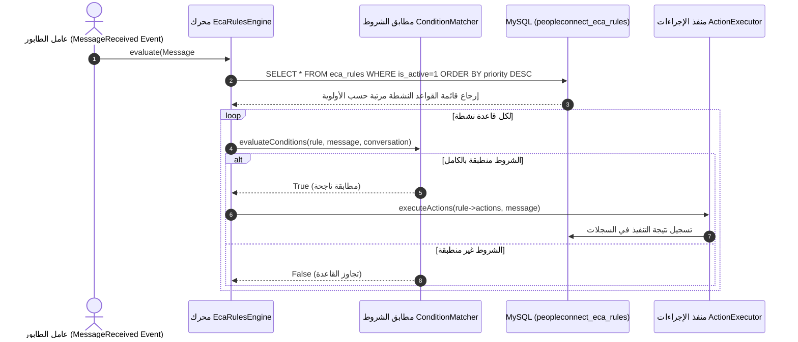

# ١٠. معمارية محرك قواعد ECA وتنسيق المحفزات

يقوم محرك **ECA (الحدث - الشرط - الإجراء / Event-Condition-Action)** في **Nexus3 PeopleConnect** بإدارة قواطع الأتمتة وقواعد التفاعل مع الرسائل الواردة والصادرة. يتأكد المحرك من تطبيق شروط الأتمتة قبل توجيه الرسالة لنموذج الذكاء الاصطناعي أو اتخاذ إجراء تلقائي.

---

## ١. تسلسل تنفيذ محرك قواعد ECA المعماري

---

## ٢. مكونات قاعدة ECA الرئيسية

١. **الحدث (Event):** وصول رسالة جديدة (`message.received`)، تغيير حالة الجلسة (`session.opened`)، أو تحديث جهة الاتصال.
٢. **الشرط (Condition):** مطابقة كلمات مفتاحية، فحص وضع الرد (`reply_mode_effective == 'autopilot'`)، أو التحقق من الوقت التشغيلي.
٣. **الإجراء (Action):** التوجيه إلى وكيل ذكاء اصطناعي، إضافة وسم (Tag)، إرسال رد تلقائي، أو إشعار المشغل البشري.

---

## ٣. جدول أنواع الإجراءات المدعومة

| نوع الإجراء (`Action Type`) | الوصف التشغيلي |
| :--- | :--- |
| `send_auto_reply` | إرسال قالب رد جاهز فورًا إلى العميل. |
| `assign_tag` | إلحاق وسم محدد بملف جهة الاتصال لتصنيفه في CRM. |
| `trigger_ai_copilot` | استدعاء الذكاء الاصطناعي لاقتراح رد مرشح للمشغل البشري. |
| `handoff_to_agent` | تعطيل الطيار الآلي وتحويل المحادثة لموظف الدعم المباشر. |
