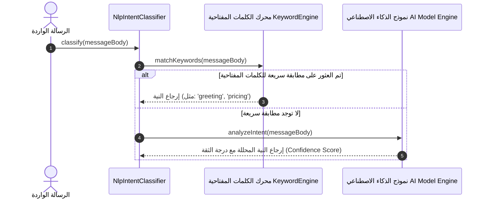

# ١١. مصنف النوايا NLP والمسار الاحتياطي للكلمات المفتاحية

يعتمد نظام **PeopleConnect** على طبقة تصنيف النوايا اللغوية (**NLP Intent Classifier**) لتحليل القصد من رسائل العملاء الواردة وتحديد المسار الأمثل لمعالجتها، سواء عبر قواعد الكلمات المفتاحية المباشرة أو عبر استدعاء نماذج الذكاء الاصطناعي.

---

## ١. تسلسل تصنيف النوايا والتوجيه

---

## ٢. جدول درجات الثقة والتوجيه

| درجة الثقة (`Confidence`) | المسار المتبع |
| :--- | :--- |
| `>= 0.85` | توجيه تلقائي مباشر للإجراء الخاص بالنية المحللة. |
| `0.50 - 0.84` | إحالة للرد المقترح عبر مساعدة المشغل (`Copilot`). |
| `< 0.50` | تحويل للمسار الاحتياطي الشامل أو التحويل للمشغل البشري. |
