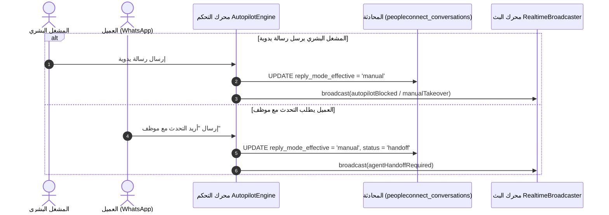

# ١٢. تسليم التحكم البشري وقاطع الأمان الذاتي

لحماية تجربة العملاء ومنع ردود الذكاء الاصطناعي غير المناسبة، يتضمن نظام **PeopleConnect** آلية **قاطع الأمان الذاتي (Autopilot Disconnect)** التي تسمح بالتسليم الفوري للتحكم إلى مشغل بشري في حالة تعقد المحادثة أو تدخل المشغل مباشرة.

---

## ١. تسلسل قطع الرد الآلي والتحويل للمشغل البشري

---

## ٢. حالات التحكم بالرد (`reply_mode_effective`)

| الوضع (`Mode`) | الوصف التشغيلي |
| :--- | :--- |
| `manual` | التحكم البشري الكامل — يتم تعطيل ردود الذكاء الاصطناعي الآلية تمامًا. |
| `copilot` | اقتراح الردود بواسطة الذكاء الاصطناعي مع التزام موافقة المشغل قبل الإرسال. |
| `autopilot` | الرد الآلي الكامل بواسطة الذكاء الاصطناعي وفقًا لقواعد وأدوار الوكيل. |
