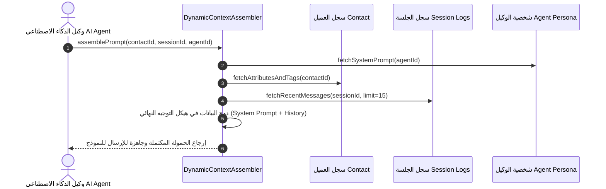

# ١٣. مجمع السياق الديناميكي وهندسة التوجيهات متعددة الجولات

يتولى **مجمع السياق الديناميكي (Dynamic AI Context Assembler)** تجميع كافة البيانات المتعلقة بالعميل، وسجل الجلسة الحالية، والتعليمات البرمجية، ومعلومات المتجر أو الخدمة لتغذية نماذج الذكاء الاصطناعي بتوجيهات دقيقة وعالية الجودة.

---

## ١. تسلسل بناء سياق النموذج المعماري



---

## ٢. هيكل حمولة التوجيه المجمعة

```json
{
  "system_prompt": "أنت مساعد خدمة العملاء لشركة Nexus...",
  "contact_context": {
    "name": "أحمد محمود",
    "phone": "20100000000",
    "type": "vip",
    "tags": ["مهتم بالاشتراكات"]
  },
  "conversation_history": [
    {"role": "user", "content": "ما هي أسعار الخدمات؟"},
    {"role": "assistant", "content": "أهلاً بك! لدينا ثلاث باقات..."}
  ]
}
```
