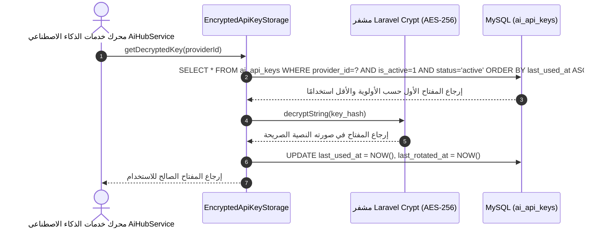

# ١٦. محرك تشفير وتدوير مفاتيح المزودين بـ AES-256

لضمان أقصى مستويات الأمان والجاهزية، يعتمد استوديو الذكاء الاصطناعي في **Nexus3** على محرك تشفير وتدوير مفاتيح API التلقائي (`EncryptedApiKeyStorage`).

---

## ١. تسلسل تدوير المفاتيح واستعادتها

---

## ٢. حالات المفتاح وطرق معالجة الأخطاء

| الحالة (`status`) | المعنى التشغيلي |
| :--- | :--- |
| `active` | المفتاح صالح وجاهز للاستخدام في الطلبات الحية. |
| `cooldown` | المفتاح تجاوز حد المعدل (Rate Limited 429) وهو في فترة تبريد مؤقتة. |
| `expired` | المفتاح منتهي الصلاحية أو تم إيقافه بسبب أخطاء متكررة. |
